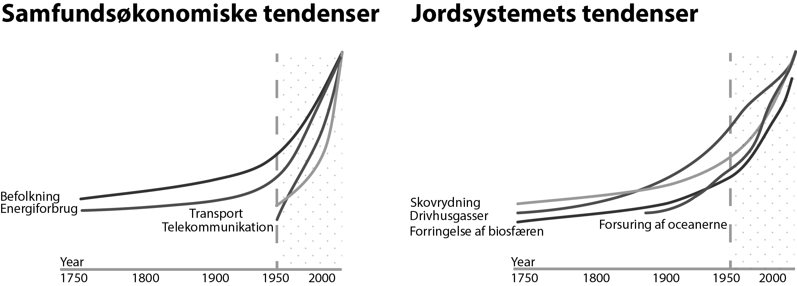

%% 

- Gennemgå hvordan du bruger *higlight* og **hoiglight**
- Krydserefer kapitler fra teori og frem 

%%
# 1. Sustainability: Basic concepts

In order to base our work on solid and proven science, we must first understand some selected sustainability concepts. This first chapter covers the key ideas and vocabulary.

The goal of this chapter is to give you a glimpse of the great complexity which we must be able to handle when working with sustainability. The concepts span many different scientific disciplines, including biology, geology, physics, chemistry, law, economics, and social sciences. 

When working with sustainability, these different disciplines are intertwined, requiring a holistic approach from those of us working with the digital aspects of sustainability.
## Why is sustainability urgently important right now?

Let's go through some weighty theories that empasize the urgency of taking action for sustainability in all areas, including the digital. Read about:

- [The Anthropocene](#anthropocene)
- [Mass extinction](#mass-extinction)
- [Great Acceleration](#great-acceleration)
- [Planetary boundaries](#planetary-boundaries)
- [Climate change](#climate-change)
- [Digital transformation](#digital-trasnformation)
- [Your responsibility](#your-responsibility)

{id: anthropocene}
### 🛣️ This is the age of the Anthropocene
The Anthropocene is the name of en epoch, beginning in the 20th century, in which human activities are affecting life on Earth to such an extent that they are causing both local and global changes in the global state of the Earth.  

In the past, geological processes had the greatest influence on life on Earth and the properties of the planet surface, but our agriculture, buildings, roads, wars, excavations and other activities are changing the landscape. 

This change is comparable to the major geological impacts on Earth in the past, such as major volcanic eruptions and meteor impacts. The Anthropocene Age heralds new times where humanity is not only responsible for its own future, but also holds the future of the entire planet in its hands.

The human emission of greenhouse gases is one example, and the consequences for soil, plant and animal life, and thus for human life, are enormous.

{id: mass-extinction} 
### Sixth  mass extinction is on the horizon 🦖
In biology and ecology, we are also witnessing a historic and global event that scientists describe as the sixth great mass extinction, a process in which a great part of the Earth's different animal species become extinct within decades or centuries. The time we live in can be compared to the time when the dinosaurs went from being the dominant species on Earth to mass extinction.

The sixth mass extinction is expected to be as pervasive for nature as the dinosaur extinction was, with the risk that a third of all animal species could disappear ([Urban 2024](https://www.science.org/doi/10.1126/science.adp4461)). As with the Anthropocene Age, human activity is also the cause of the sixth great mass extinction. This too is happening right now.

{id: great-acceleration} 
### 🏎️ We are part of the Great Acceleration 

Some scientists theorize, that a global change began with industrialization in the 1800s, and accelerated rapidly after the 1950s. Global change is accelerating and  we are accelerating the activities that are changing our planet, such as the release of greenhouse gases and the destruction of various biotopes ([Steffen et al. 2015](https://doi.org/10.1177/2053019614564785)).

This theory is called the Great Acceleration, and the researchers behind the theory see the Earth as a system where everything is interconnected and one change escalates another, as shown in Figure 1. Over the past many thousands of years, the Earth's systems have been able to balance between states that have been mostly favorable to life on Earth, but many fear that the Earth's systems will become seriously out of balance if we continue to accelerate development.

{id: planetary-boundaries} 
### We are pushing the planets boundaries 🌎 
The world's population is growing, our industrial activity and consumption is growing, and economies are also growing year after year - but the planet's size and resources limit this perpetual growth. Planetary boundaries is a concept developed by researchers from Stockholm University that describes the nine major planetary subsystems that regulate the Earth's systemic stability and resilience ([Stockholm Resilience Centre 2012](https://www.stockholmresilience.org/research/planetary-boundaries.html)).

Scientists have estimated limits for Earth's planetary subsystems in which humanity can continue to evolve and thrive for generations to come, without causing irreparable damage to Earth as we know it. If the limits are exceeded, the systems may become unbalanced, leading the planet to a new and different reality. 

Developments in recent decades show that, unfortunately, we are increasingly exceeding these limits for sustainable global development, and that there is a risk of serious global consequences if we do not begin to respect these limits as soon as possible.

{id: climate-change} 
### We are the climate change 🌪️
Current global development is neither durable nor sustainable. In the coming decades, we must turn all industrial (and digital) development in a sustainable direction to enable people to live a good life. 

We must be able to continuously improve and develop our world without fearing the long-term consequences of our actions in the form of droughts, floods, destruction of rainforests and landscapes, major political challenges, migration, and loss of life. We have an ethical obligation to protect nature, which is our origin and our future.

With the help of scientists who continuously monitor global climate change, a number of actions are underway globally that aim to change the trend to something more sustainable ([Science Based Targets initiative](https://sciencebasedtargets.org/)). But we will need every effort. That's why it's important that we incorporate sustainability into all our activities - including digital ones.

{id: digital-transformation} 
### People in information tehcnology and digital services are both the baddies and the goodies 📡
%% Citation baddies black eddar %%
Information technology and digital transformation are amazing entities that surprise us every day with the latest inventions, opportunities and challenges, shedding light on new aspects of our everyday lives - and our existence.

Social media, virtual worlds, sensor networks, autonomous agents, artificial intelligence, generative AI, machine learning, Internet of Things (IoT), data science... All of these IT concepts have emerged in recent years and are still evolving as they change our world.

Modern IT is accelerating science and research, and the computing power of processors and the efficiency of algorithms are increasing every year. It is now the speed of human cognition that limits the speed of development.

Information technology and digital transformation are two sides of the same coin. Digital transformation focuses on people, organizations and their processes, and information technology focuses on the digital technologies themselves.

- Digital transformation is the use of information technology by people and organizations.
- Information technology consists of hardware, software and networks: Electronics, algorithms and systems.

There is no digital transformation without technology, and technology also makes the most sense when viewed in the context of the people and organizations that use it. IT (like all technology) is artificial and man-made, and as such is in direct opposition to nature and the environment.

However, technology and nature must be able to coexist in mutual and positive interaction. And this is where sustainability must help create an inventive balance and exchange between technology, people, nature and the environment.

{id: your-responsibility} 
### ⛑️ Accept, embrace and live up to your digital responsibility 
As an information technology and digital professional, what is your role in this global equation? Can IT and digital development contribute to a better world and a more sustainable future if we use technology with long-term thinking?

You may not be able to solve the sixth mass extinction event and balance nature in the Anthropocene era overnight, but many small steps - including your professional contribution to the sustainability agenda - will contribute to positive change in the world.
## Fundamental sustainability concepts
Let's continue by reviewing some key concepts that form the basis for working with sustainable digital development. You may already be familiar with some of the concepts, but hopefully you can also read up on something new and exciting.

- [Definition of sustainability](#definition-of-sustainability)
- [Unsustainability](#unsustainability)
- [The hurdles to sustainability](#hurdles-to-sustainability)
- [Uncertainty for a sustainable future](#uncertainty)
- [Green sustainability](#green-sustainability)
- [Greenwashing and greenhushing](#greenwashing-greenhushing)
- [Ecology and ecosystems](#ecology-ecosystems)

{id: definition-of-sustainability}
### Definition of sustainability
We can see sustainability as a path towards a brighter and more stable world both on an individual, societal and environmental level. Sustainability is a kind of long-term development where nature and the environment are respected and thrive.

Sustainable development helps us avoid major disasters in the future by addressing problems in the present. That's why sustainability requires action from us today, both for the future, for ourselves and for the world around us.

There are different definitions of sustainability, but one of the newer and more recognized definitions comes from the UN, which in 1983 established a World Commission on Environment and Development headed by the then Norwegian Prime Minister Gro Harlem Brundtland. The Commission's work resulted in a publication entitled Our Common Future - The Brundtland Commission Report on Environment and Development. 

The report defines sustainable development as *development that meets the needs of the present without compromising the ability of future generations to meet their own needs*. This definition is a good starting point for our work, but in the following we will also look at sustainable development from other angles. If sustainability is something that protects the possibilities of future generations, what is the opposite? Let's take a look at "unsustainability".

{id: unsustainability}
### Unsustainability
Unsustainable products and services are defined by the fact that, despite their good value, they often have serious, unintended and far-reaching negative impacts in the long term.

|                                      | **Short-term (here and now) gain**                       | **Serious problems in the long term**                                                                                   |
| ------------------------------------ | -------------------------------------------------------- | ----------------------------------------------------------------------------------------------------------------------- |
| **Pesticides such as glyphosate**    | Weed-free areas                                          | Poisoned drinking water, destroyed biodiversity                                                                         |
| **Fossil fuels**                     | Efficient and cheap energy source                        | Climate change, natural disasters                                                                                       |
| **Plastic materials**                | Inexpensive and versatile material for many applications | Plastic waste and microplastics are flooding the world's ecosystems                                                     |
| **Cryptocurrencies such as Bitcoin** | Decentralized, international digital currency            | Huge energy consumption and emissions, and available for criminal application                                           |
| **Smartphones**                      | Effective and entertaining communication tool            | Environmental and social issues related to the extraction and recycling of materials; addiction-like problems for users |
The table above provides some examples of unsustainable products that may create great value in the short term, but have serious negative consequences in the long term, a.i. they are unsustainable (as for now).

For example, herbicides are effective in controlling weeds, but over the years they can leak into the groundwater and poison our drinking water. It may not happen immediately, but over decades they can poison the water we depend on as people and as a society (Faartoft 2024).

The use of fossil fuels is another example of an unsustainable product, partly because we will run out of them at some point in the future, and also because their use contributes to climate change. Climate change does not happen immediately, but over many decades. We may already be feeling the effects, not least as we experience record high temperatures, record rainfall and record wind speeds (Jungersen & Stiesdal 2024). Other examples of unsustainable practices are:

- Using more energy than necessary
- Consuming the earth's resources such as water and minerals without considering alternatives
- Draining nature's resources without ensuring that the equivalent is returned to nature.

Short-term solutions are like taking painkillers for a broken leg without addressing the fracture - they relieve the discomfort for the moment, but the underlying problem remains and may get worse over time. So from a holistic point of view, it's better to make long-term efforts to ensure a good future than to gain short-term benefits. Overall, it is unsustainable to create short-term solutions that have undesirable long-term effects, even if those effects occur much later or in places other than where the solutions work (e.g., smartphone use in Europe leads to pollution in Africa and Asia).

{id: hurdles-to-sustainability}
### The hurdles to sustainability
But why aren't we all working sustainably if it's so smart? There are several reasons - here are four selected examples of obstacles to sustainable development:

1. **It is difficult to predict the long-term and far-reaching consequences of our actions.** 
   Many of the behaviors we have developed throughout history are proving to be fundamentally unsustainable. Innovations that seem groundbreaking and beneficial on the surface - such as pesticides or materials like asbestos - have turned out to be seriously harmful in the long run. Over time, however, we can become better at taking the long view and learning from past mistakes. This accumulated knowledge is valuable and can be actively used and integrated into decision-making processes to promote a sustainable future.
   
2.  **In the short term, working sustainably is more cost-effective than not working sustainably.** For example, IT companies can choose to build data centers together with renewable energy sources, which means the data center doesn't have any direct greenhouse gas emissions. That's a great solution, but it's initially more expensive than connecting the data center to the regular power grid, which doesn't require an investment in its own power plant. Conversely, if the renewable energy plant works well, the data center will get cheap electricity in the future, and the data center's profit will increase over the years as its own wind turbines, solar panels or other renewable sources manage to produce electricity cheaper than the market price.
   
3. **There are a record number of people on the planet and everyone wants a better standard of living.** This is leading to unprecedented growth in production and consumption, which we can only manage if we can reduce this increased (and still growing) environmental footprint.
   
4. **It is more altruistic to work sustainably**, i.e. it requires respect and consideration for the benefit of the planet, but unfortunately not everyone cares equally about the planet, fellow humans, future generations - or the environment. The negative impacts of a company's operations are often far removed from the everyday life of the organization, both in terms of time and place, making them easy to overlook or neglect.
   
Let's look at an example from the digital world where the above comes to life: a smartphone. Using a smartphone has become an everyday occurrence for most people, and this simple everyday action has far-reaching global consequences, as smartphones are made from naturally occurring minerals (see Figure 3).

 extracted from nature and powered by energy from nature. Ultimately, all technology is a collection of minerals and energy. The more circular the production and use of technology becomes, the more sustainable the future can be.")

The extraction of minerals used in smartphones involves pollution, child labor, deforestation, and health problems associated with working in mines in Africa. Assembly line work in Asia may involve poor working conditions. Last but not least, the applications that run on smartphones can have a bad impact on smartphone users. But this is not something we often think about. When owning a smartphone has become commonplace, it's hard to think about the long-term consequences because it's relatively vague and far removed from your own reality. So it's easier not to think about it.

In an ideal world, manufacturers and legislators would try to make the resulting problems explicit and do something about them. The Dutch smartphone manufacturer Fairphone, for example, does this by visiting the cobalt mines in Congo and launching a program to improve working conditions in the mines based on their experiences during the visit ([Angela 2023](https://www.fairphone.com/en/2023/03/02/sticking-with-cobalt-blue/)). Are they obligated to do this? No, they are not. They are doing it first and foremost for the Congolese people, and in return Fairphone can position its smartphone as a greener and fairer phone. However, these actions do not come for free and their phones are therefore relatively expensive compared to the competition.

{id: embracing-uncertainty}
### Embracing uncertainty for a sustainable future
It is clear that we cannot fully guard against all unintended future consequences when developing new solutions. By its very nature, it is impossible to design and develop measures for risks that cannot be foreseen.

However, when it comes to the long-term risks we can identify, we have a moral obligation to act. This is especially true in the area of sustainability, where we must accept that we can never fully control the future. Even if we plan and execute our activities carefully, there will always be unforeseen difficulties - such as environmental, social or economic challenges - that can negatively impact the sustainability of our projects.

We must be able to live with the realization that the world around us can be influenced and shaped to some degree, but never completely controlled. This unpredictability should not be seen as an obstacle, but as a fundamental premise for working toward sustainable solutions. Despite our best efforts, the real world can always surprise us - both positively and negatively.

%% Harmuth Rosa reference? %%

{id: green-sustainability}
### Green sustainability
Sustainability has many facetts, e.g technical, economical, social, individual or environmental. Environmental sustainability can also be referred to as *green sustainability*, and because of the climate crisis, this is clearly the most urgent dimension of the overall sustainability field.

It is also the most visible aspect of sustainability at the moment, as climate change is on the aganda in many parts of the world. An example of a company actively working with green sustainability is the Danish window manufacturer Velux. Like most responsible companies, Velux is focused on making its operations greener and more sustainable in the long term. 

They announced in 2023 that they will fund forestry projects to capture carbon equivalent to its emissions from its founding in 1941 until 2041 ([Petersson 2023](https://sustainability.velux.com/Governance-and-reporting/Sustainability-reporting)). The company also plans to reduce its operational carbon emissions by 100% by improving energy efficiency and switching to renewable electricity.

Velux's plan is both forward-thinking and compassionate. There is no law requiring companies to compensate for their past emissions or to become carbon neutral by 2031, but Velux is devoting resources to support this development. Velux is working with external partners to estimate past greenhouse gas emissions and offset equivalent amounts of CO2 in forests in countries such as Uganda, Madagascar and Vietnam.

While the Velux example is not directly related to IT and digital development, the company demonstrates an action that digital companies can also benefit from adopting. For example can a digital hosting company compensate for the greenhouse gas emissions they have emitted over time - since their startup.

Are Velux's initiatives really having an impact on a global scale or are they just a drop in the ocean? Velux's initiatives can be seen as an ambitious contribution in the right direction, and altough they represent a minor change in the global clime, if all contributed as much, it could change the global course.

If Velux really succeeds in eliminating 100% of its future greenhouse gas emissions, then the window manufacturer is definitely a climate-friendly company. But that doesn't mean it has become a truly "sustainable company". In order to achieve that, the company needs to go full circular on their activities, and address other dimensions of sustainability before they can call themself truly sustainable.

{id: greenwashing-greenhushing}
### Greenwashing and greenhushing
When a company sends out marketing communications about its green initiatives, there is always a chance that the company's brand will be portrayed as more green than it actually is. It is not always easy to distinguish between real sustainability achievements and greenwashing, i.e. empty green promises with little to no substance behind the communication.

In the case of Velux, is this a genuine environmental initiative with significant impact, or is it greenwashing? We can hope for the first, but only time will tell.

There is no clear line between greenwashing and green marketing, and it can be difficult to tell the difference in practice. The European Comission is working on regulation which should hinder companies from making misleading claims about environmental merits of their products and services ([Green Claims 2025](https://environment.ec.europa.eu/topics/circular-economy/green-claims_en)). There are also companies that deliberately avoid talking about their environmental improvement activities for fear of being perceived as greenwashers. This behavior is called greenhushing.
#### How to avoid greenwashing?
Fortunately, there are some benchmarks that can help us determine if a company or product is truly green or if it is simply "greenwashed". One of these indicators is a company's (manufacturer's) documentation of environmental and social considerations, such as an ESG report. 

Every year, in an ESG report, companies publish information on how they apply up-to-date (and not outdated) sustainability measures in their operations and development. When reading ESG reports, it's essential to examine whether the company's environmental actions are in proportion to its activities or products. Does the scale of the company's sustainability initiatives match the environmental problems caused by the company's operations? If the initiatives are too vague, frivolous and disproportionate, it is greenwashing.

A good example of greenwashing is "biogasoline ", which you can buy at gas stations in Denmark. Here, 5% or 10% ethanol (alcohol) is mixed into the gasoline and called "biogasoline" (biodiesel), even though it is still 90-95% fossil, black gasoline. There is a lack of proportionality between the measure (mixing gasoline with ethanol) and the claim the product makes (i.e. that it is "bio", better than regular, black basoline). "Biofuel" sounds like some kind of environmentally friendly gasoline, but it's not. In reality, it's black, fossil gasoline that has been "masked" with the addition of ethanol.

Detecting and avoiding greenwashing is not easy, and the beformentioned proposals at EU level will eventually regulate green marketing. We hope that by the time you read this book, this work will have progressed so that greenwashing becomes less of a problem when consumers want to choose green products over "black" ones.

{id: ecology-ecosystems}
### Ecology and ecosystems
One of the most important concepts in sustainability is ***ecology*** and ***ecosystems***. The word ecology denotes a branch of science that studies "the relationships between living organisms and their environment" (Madsen 2021). Ecology is concerned with systems of living organisms, their interplay, and their surroundings, called *ecosystems*.

Ecosystems are the basis of all life on Earth, and without them we as humans cannot survive. We are part of the ecosystem whether we like it or not. Without the biosphere we cannot exist as humans. Every place on earth has it's more or less unique ecosystem, and we have an obligation to protect it for future generations. 

We ourselves are ecosystems: We are hosts for the bacteria that live on us, in us, and without which we cannot live well (if we can live at all). It is essential to be able to think in systems, especially ecological systems, when working with digital sustainability, because ecology and understanding the interconnectedness of ecosystems provides useful knowledge about how our actions affect the environment on a systemic level.

Some of the systemic principles of ecology can be paralleled in information technology as both ecosystems and IT systems can be understood with a systemic approach. Also in the IT business, we sometimes talk about digital ecosystems, where an intertwined network of technology, companies and people thrive together in lously cuopled networks. 

Just as some plants cannot reproduce without the insects that pollinate them, there are technologies that require cross-pollination. For example, the Android smartphone operating system cannot thrive without its own digital ecosystem. What this means is that Android would not be the same without the many types of phones, phone manufacturers, networks, applications, and users that make up the product's unique ecosystem. Android smartphones would lose essential features without the many developers who provide millions of applications for the phones.

But ecosystems are not unique to Android - the concept can be found in many other successful IT-based products and in many other digital contexts. These include information ecosystems, software ecosystems, knowledge ecosystems, product ecosystems, and media ecosystems. And just as high biodiversity is a sign of a healthy ecosystem in nature, high diversity in a digital ecosystem is a sign of a successful product. Digital ecosystems function as open and dynamic systems that, through self-organization and diversity, can ensure innovation and long-term success for the parts of the system involved.
## Environmental aspects of sustainability: energy and materials
If only we had an infinite amount of clean energy at our disposal, we could be more relaxed about the climate. We can for example already build machines, that pull CO2 out of the air, but as we lack clean energy to operate them, their usage is not feasible at a large scale. 

As nothing is infinite on earth, we have to innovate circular uses of energy and resources, so instead of continously ingesting "new" energy and "new" materials into our businesses, we have to learn to circulate energy and materials in a sustainable flow. Digital technology paves the way for such a transformation, because it enables us to document, model and undestand the complex systemic consequences of our flows of energy and materials.

- [Energy and materials](#energy-and-materials)
- [Fossil vs renewable energy](#fossil-vs-renewable)
- [Circular processes](#circular-processes)
- [Greenhouse gases](#greenhouse-gases)
- [Emissions (scope 1-3)](#emissions)
- [Climate optimisim and pessimism](#climate-optimisim-pessimism)
- [Environmental challenges](#environmental-challenges)

{id: energy-and-materials}
### The flow of energy and materials
Although our society has access to plenty of energy and materials from many different sources on the planet, all our resources are finite and we are reaching our planetary limits. In the future, we will have no more to extract from the planet, nor can we afford to pollute more. Therefore, in the name of sustainability, we must be efficient and sustainable when using the resources available to us.

But how can it be done? Let's identify some concepts about energy and materials that are essential to our approach to sustainable digital.

Energy cannot appear out of nothing, nor can it disappear on its own. However, the energy that exists in the world can be transformed from one form to another. This is one of the fundamental laws of physics: energy cannot disappear—it can only be transformed.

See Figure 4, which illustrates how energy from the sun’s rays is transformed into different types of energy that eventually power your computer:

1. The sun’s energy heats the air in the atmosphere.
2. This thermal energy causes the air to move, creating wind (kinetic energy or motion energy)
3. The kinetic energy of the wind turns the blades of a wind turbine, which converts it into electrical energy.
4. When you charge your computer’s battery, the electrical energy is stored as chemical energy.
5. The stored energy powers the computer’s processor—and as a byproduct, releases heat (thermal energy again).

The amount of energy originally provided by the sun is equal to the amount of heat your computer gives off, because energy does not disappear—it is only transformed. _(This simplified example ignores the fact that, in practice, we always lose some usable energy at various points in the chain—such as in power lines or generators.)_ This loss should not be understood as energy disappearing, but rather as energy being transformed into less useful forms (like heat) before it reaches its final destination: your computer.

{id: fossil-vs-renewable}
### Fossil energy sources versus renewable energy
The use of fossil fuels such as oil and coal has brought wealth to our society, but the emission of greenhouse gases causes climate change - an unbearable cost in the long run. In addition, we are running out of fossil fuels because they are not renewable.

Renewable energy comes from sources that replenish themselves and do not diminish over time. They include solar, wind, hydro, geothermal, and wave energy. In contrast, fossil fuels such as gas, oil, and coal, which are extracted from the ground, immediately pollute the atmosphere as soon as they are burned, causing irreparable damage to the environment.

Nuclear power does not produce the same greenhouse gas emissions as fossil fuels, but it is expensive to build and maintain. It also poses radiation hazards and produces waste that is difficult to manage and impossible to dispose of. While many countries are investing in nuclear power in the coming years as an alternative to coal and gas, it remains controversial. In the longer term, scientists hope to develop power plants based on fusion energy - a form of nuclear power that promises "inexhaustible" amounts of clean energy without the radiation risks associated with current nuclear technologies. But working fusion reactors may be decades away.

Therefore, when working with sustainability, it is important to remember that the energy and materials we put into a system are transformed-and that transformation creates byproducts. Sustainable companies must take responsibility for these byproducts, for example, by creating circular systems that minimize and recycle waste without damaging the environment. Operating sustainably also means prioritizing renewable energy sources to power digital technologies and infrastructure.

{id: circular-processes}
### Circularity and circular processes
Nature teaches us that sustainable systems are built on different cycles: cycles of water, cycles of energy and cycles of different elements and materials. One of the most familiar and simple cycles in nature is the water cycle. Water falls from the sky as precipitation and hits the ground. Here it collects in rivers and lakes and organisms absorb the water - and later release it in the form of vapor. Some of the water also seeps underground, only to emerge later in rivers, lakes or the sea. 

The amount of water is essentially the same in the system - no new water is added and no water is lost from the system, as vapor forms solid crystals in the cold, higher layers of the atmosphere and falls back to the earth's surface as rain. There is a continuous flow in the global cycle. So when we experience more water in one location than we are used to (e.g. flooding), then there is correspondingly less water elsewhere in the world.

 
 
Life on Earth is based on circular processes, as shown in Figure 5. For thousands of years, our ancestors followed the rhythm of nature: planting, fertilizing, harvesting, and beginning the cycle again year after year. Not all production was circular, but with fewer people on the planet, natural resources such as water, forests, oil, and iron seemed inexhaustible. New supplies could always be found. Today, however, those supplies are under serious pressure. The human population has grown, and we are consuming more of the Earth's resources at a rate that is pushing us toward planetary boundaries.

We have good reason to fear that we will run out of more and more resources if we do not improve our ability to develop new technologies and business models based on circular processes, where energy and materials are reused and recycled from raw materials. In digital practice, this could be as simple as using renewable energy or ensuring that all e-waste is sent to companies that can effectively recycle it. In theory, the vast majority of e-waste can be recycled.

Look to nature for inspiration when designing digital products. One of the most effective ways to create sustainable solutions is to design cyclical systems where energy and materials are repeatedly recycled without being lost or discarded. In other words, sustainable processes are circular, -they can be repeated many times without generating significant amounts of waste or wasted energy. Working with sustainability means designing the best possible circular processes.

{id: greenhouse-gases}
### Greenhouse gases (GHG) and climate change
Fossil fuels (coal, oil, and gas) cannot be considered sustainable energy sources because they are not part of a circular cycle and because they pollute the atmosphere with greenhouse gases. Even before the turn of the millennium, scientists began warning of global warming caused by greenhouse gas emissions from fossil fuels.

Unfortunately, despite these warnings, we continue to extract fossil fuels from the Earth's crust and burn them for energy. This process releases CO2 and other greenhouse gases as a kind of waste that we leave behind in nature. More specifically, we leave CO2 in the air, where it will remain for millennia, forming a kind of "blanket" that warms the Earth. CO2 itself is not toxic - the problem is the increasing volume of emissions that are heating up the planet. If we could simply recycle greenhouse gases and store them underground, we wouldn't be facing the climate crisis we are today. (But we may face new problems underground.) 

You may have noticed how water starts to swirl, bubble, and move when it boils. A similar phenomenon occurs in our atmosphere as it heats up-the air behaves differently, moving faster and more violently. The same is true of the oceans.
 

Unfortunately, all the evidence points to global warming as a serious threat to the potential for a good life in the future - for everyone on the planet, including humans, plants and animals. Figure 6 illustrates the extent to which climate change is driven by human actions, and the consequences that these changes have already had or may have in the future.

Global warming doesn't just mean higher average temperatures; it also means that weather is becoming more extreme, unpredictable, and unstable. We're already experiencing more frequent and intense weather events because of the excess CO2 we've already released into the atmosphere. If we are to prevent this from getting worse, we must drastically reduce emissions - ideally within the next decade ([IPCC, 2023](https://www.ipcc.ch/report/ar6/syr/)). This urgent goal must influence development in all sectors - including IT.

Fortunately, there is hope and progress on the horizon. Many countries have recognized the problem, and governments and organizations from around the world meet annually under the umbrella of the United Nations at the COP conferences to address climate issues. Work is progressing, albeit slowly, and the UN  in 2023 formally recognized greenhouse gas emissions as a global problem requiring global solutions.

{id: emissions}
### Direct and indirect emissions (scope 1, 2 and 3.)
Eliminating the use of fossil fuels and the resulting greenhouse gas emissions is in everyone's best interest. However, this is a difficult task because modern society is built on these energy sources. To understand the green transition, we need a detailed understanding of the processes that emit greenhouse gases, both directly and indirectly.

Take a gasoline-powered car as an example. We can easily observe its direct emissions: we fill the car with fossil fuel, it burns, and CO2 is released along with other gases through the exhaust pipe. But the car is responsible for far more emissions than just those from combustion. Its indirect emissions include those generated during the production, transportation and eventual disposal of the vehicle. In fact, these indirect emissions can account for a significant portion of the car's total environmental impact.

When calculating the CO2 emissions of a product, service, or company, we can categorize the emissions using the Greenhouse Gas Protocol (GHG Protocol). This framework helps quantify both direct and indirect emissions resulting from a company's activities. The GHG Protocol distinguishes between three types of CO2 emissions (Confederation of Danish Industry, 2022), as shown in Figure 7: 

- Scope 1 refers to direct operational emissions that occur at the organization's site. Examples include emissions from buildings, vehicles and machinery.

- Scope 2 covers indirect emissions that result from the organization's consumption of energy resources such as electricity and heat. Although these emissions are not directly produced by the organization, the organization can influence them by managing its energy consumption.

- Scope 3 includes indirect value chain emissions that result from the company's consumption of goods and services throughout its supply chains. These are often the largest contributors to a company's total emissions.

The three scopes of the GHG Protocol are used by organizations and companies to assess and report their direct and indirect contributions to greenhouse gas emissions. These emissions can be tracked over time, and ideally, as shown in Figure 8, there should be a steady decline in emissions year after year.

The ultimate goal is to reach zero CO2 emissions within a few decades, and even than we might have to bind additional CO2 from the atmosphere. The Europes growth strategy, the European Green Deal has a goal of becoming climate neutral by 2050 ([European Commission 2024b](https://reform-support.ec.europa.eu/what-we-do/green-transition_en)), but global ambitions are generally lower. It is worth recalling that the global community has previously succeeded in stopping a global environmental disaster when holes were discovered in the ozone layer around the Earth. This showed the possibility of establishing strong international cooperation.

{id: climate-optimisim-pessimism}
### Climate pessimism and climate optimism
More than 92% of the Danish population use the internet, computers and smartphones (Jacobsen et al. 2024), but there is far less support for working towards sustainability and solving the climate crisis. 

A study from 2023 shows that most Danes are "cautious" in their approach to climate change (Jensen 2024). They perceive climate change as a significant threat, but find it difficult to assess how much the climate will affect their own lives and everyday life, and what role they should play in the transition. As a result, they are less willing to make concessions in favor of the climate than the most concerned segments in the survey.

Danes want to maintain their standard of living as much as possible, but they are happy to support climate-friendly and environmentally friendly initiatives. According to a study by behavioral economist Peter Andre and his colleagues, "69 percent of the world's population is willing to sacrifice one percent of their income for climate action" [(Andre et al. 2024](https://doi.org/10.1038/s41558-024-01925-3)). In Denmark, the figure is 72%, while Myanmar tops the list with 92.80%. Most people are willing to act to combat climate change, but there is uncertainty about what to do.

It is also difficult to point to single actions that can combat the climate crisis, but climate optimists would say that it is possible to change the world and implement the green transition for the benefit of most people (Kirkegaard 2024). This would involve phasing out fossil fuels in favor of renewable energy sources and reducing greenhouse gases in the atmosphere to an acceptable level.

The climate pessimists, on the other hand, would expect that society as we know it today will collapse within a few decades, and that radical global changes will be needed to best weather the catastrophe. Jem Bendell has presented a theory about this scenario, which he calls *deep adaptation* ([Bendell 2017](https://jembendell.com/2019/05/15/deep-adaptation-versions/)). He believes that the global response to climate change is insufficient and that we are heading towards a collapse of society as we know it today. The theory of deep adaptation describes how we should manage the transition from our current society to the one that follows. He points to four key themes:

- **Resilience:** Focusing on preserving what we value despite climate change; developing communities that are self-sufficient in energy, food and health.
- **Relinquishment:** Encourages us to give up aspects of our lives that are unsustainable. For example, giving up fossil fuel-dependent lifestyles, abandoning vulnerable coastal infrastructure.
- **Restoration:** Proposing to revive sustainable practices and systems from the past and contribute to more nature and more resilient ecosystems.
- **Reconciliation:** We must be ready to make peace with the changes and losses that climate collapse brings.

Although we cannot predict the future with certainty, Bendell's "deep adaptation" scenario seems a plausible possibility. Whether Bendell's theory is pessimistic or realistic is debatable, but the implication is the same as that of climate optimists: we need to create rapid, fundamental systemic changes in society and the way we live and work.

Perhaps it is less important to talk about optimism and pessimism than it is to find ways to connect the Danes' climate commitment with Bendell's concrete proposals. This linkage can broaden the scope for action and create the basis for more effective action. But there is still a gap between Bendell's call for profound change and the limited transition that Danes are willing to accept so far.

Bendell's work also provides food for thought about digital development and the great risks associated with our dependence on digital systems. These systems are vulnerable to power outages, software failures and cyberattacks, and can be compromised during crises. Therefore, the theory calls for the development of more robust and less technology-dependent solutions, which can also guide the development of new digital technologies.

{id: environmental-challenges}
### Environmental challenges in extraction and industry
Whether you are a climate optimist or a climate pessimist, it is essential to keep in mind that environment cannot be reduced to climate only. To achieve truly sustainable information technology and digital services, it's not enough to focus on greenhouse gases alone; we need to address the surrounding environmental challenges as well:

- Air, water and soil pollution (by other contaminants than greenhouse gases)
- Microplastic pollution
- Pollution in space
- (Electronic) waste management
- Protection of ecosystems
- Working and environmental conditions for workers
- The consumers well-being 
- And more...

These challenges can often fade into the background because climate is a top priority on a global scale, but businesses should also address the environment in a broader sense. As we'll see in the coming chapters, working with employees in companies, organizations, and voting citizens in democracies, we can effectively work together to reduce these problems.

****
## 3. Organizations shape our sustainable future
It's important to recognize that while sustainability clearly has activistic dimensions - such as Greta Thunberg's work for the climate - it is often the economy and companies that act as the primary driving force in our society. Economic considerations shape the strategies and actions of organizations. Although other dimensions of sustainability - such as environmental, social, and cultural concerns - also play a role, they can be difficult to fully integrate into practice. How can organizations ensure that their financial sustainability is aligned with broader sustainability goals?

In the following sections, we explore a range of perspectives and methodologies which aim to reconcile economic priorities with long-term responsibility. We examine alternative ways of measuring performance that go beyond the traditional bottom line, and we highlight principles that emphasize the reuse of resources rather than their depletion. We will also look at mechanisms that show how even well-intentioned actions can sometimes lead to unintended negative consequences.

- [Economic growth and sustainability](#growth-sustainability)
- [Financial and non-financial indicators](#financial-non-financial-indicators)
- [ESG and CSR](#esg-csr)
- [Circular economy](#circular-economy)
- [Rebound effect](#rebound-effect)

{id: growth-sustainability}
### Economic growth and sustainability
It is a guiding principle of economics that growth is good. Companies can make more profit, more jobs are created and more taxes are collected when the economy grows. If there is no economic growth in a country, alarm bells go off. It's time to tighten belts, make cuts and shed jobs for lack of funding - and hurry to get out of the downward spiral of recession. And the danger is real, there are many examples in history where a sustained recession has caused countries to go bankrupt, resulting in severe social problems.

Most countries' economic policies aim for the highest possible economic growth year after year, because then the country will be richer and there will be more money to run society. The problem is that if you only think about next year's or next quarter's growth, you're not thinking long-term - and you're not thinking sustainably at all. Instead, you are only amplifying the great acceleration, which leads to us outgrowing the planetary boundaries.

It could be said that the traditional understanding of economic growth stands in the way of sustainable development in society. In a 2021 briefing, the European Environment Agency writes that: *"It is unlikely that a long-lasting, absolute decoupling of economic growth from environmental pressures and impacts can be achieved at the global scale; therefore, societies need to rethink what is meant by growth and progress and their meaning for global sustainability".* ([European Environment Agency 2021](https://www.eea.europa.eu/highlights/sustainability-what-are-the-alternatives))

In recent years, digital companies have shown that they can generate huge economic growth. In a relatively short time, software companies like Google, Facebook, and Microsoft were able to grow into some of the world’s largest companies by developing powerful software once and generating enormous profits of selling it millions of times over, with minimal additional cost. 

A>It’s interesting to consider that people (including the authors) are willing to pay for software licenses for Microsoft Office, even though similar open-source alternatives are freely available. This illustrates a powerful business opportunity: once a company manages to create software with a **high perceived value**, it can sell the same product repeatedly at virtually no additional cost, generating enormous profits. The success of companies like Microsoft shows how perceived value, rather than actual cost or uniqueness, often drives successful software and digital solutions .

However, this also highlights the important role that open source software can play in challenging this model. By offering free, transparent, and community-driven alternatives, open-source projects have the potential to disrupt traditional software markets—especially if they can match or exceed perceived value i.e. the quality, usability, or ethical appeal of proprietary solutions. In this sense, open source not only democratizes access to digital tools but also forces commercial vendors to continuously innovate, justify their pricing, and demonstrate real, ongoing value to users.

{id: financial-non-financial-indicators}
### Financial and non-financial indicators: The triple bottom line
In a holistic approach to business, it's not enough to focus solely on financial metrics; business operations also need to be viewed through a broader sustainability lens. *How does the company interact with the environment and society? How will its activities affect future generations?*

In order to promote more sustainable practices, companies would be wise to adopt a comprehensive approach to their operations, one that integrates financial performance with broader sustainability objectives. Most organizations are required to summarize their key financial figures and produce an annual report once a year, which outlines the year's financial performance, including revenues, expenses, and the overall performance of the business. Conventionally, the narrative in an annual report is based on financial figures such as profit, return, solvency, liquidity, and employment. The vast majority of data in these reports are financial figures, describing how capital and financial values flow in and out of the company.

It is imperative for companies to shift their focus beyond **profit** to prioritize **people** and the **planet**. Consequently, sustainable business must consider metrics that cannot be *directly* measured in money. These non-financial indicators provide insight into how energy, materials and human resources flow in and out of a company. These indicators offer insights into aspects of value creation that are not fully captured by traditional financial metrics. Such aspects include, but are not limited to, customer satisfaction, employee well-being, energy efficiency, waste recycling, speed of innovation, and carbon emissions.

As companies endeavor to accentuate the sustainability facets of their operations and disclose information regarding their environmental and social impacts, non-financial indicators assume particular significance. 

The concept of the **triple bottom** line refers to a business practice in which performance is evaluated not only in financial terms, but also in terms of social and environmental outcomes. This approach underscores the significance of exerting a beneficial influence on people, the planet, and the bottom line. The triple bottom line can function as a management instrument and is closely aligned with the principles of ESG (environmental, social, and governance).

Modern companies can no longer focus solely on financial performance; they must also demonstrate positive results across all three dimensions of the triple bottom line: economic, environmental, and social. Adopting a holistic business approach means that financial indicators can no longer stand alone. Instead, companies are increasingly expected, and in some cases legally required, to provide annual reports that document their efforts and progress in achieving a balanced and responsible triple bottom line.

{id: esg-csr}
### ESG and CSR

 is a collective term for a company's environmental, social and governance initiatives.")

The figure is a collection of examples of concrete themes under each topic that can be used in ESG reports to document the development of sustainability in a company's activities. The reports should contain comparable indicators that make it possible to monitor and analyze the development over time.

The non-financial indicators measure the "soft" values of a company, which are often put under the umbrella term ESG (Environment, Social, Governance). The concept of ESG has emerged as we recognize that companies have obligations to society beyond profit, growth and jobs. In figure 9 you can see which areas are referred to as ESG.

Companies are increasingly being held accountable for their direct and indirect climate and environmental impact, their efforts in relation to working conditions, gender equality and community relations. Not only are their customers making stricter demands, but there is also more and more sustainability legislation both nationally and from the EU. A company's ESG efforts must ensure that the company can live up to the expectations of the outside world in relation to the environment, society and corporate governance.

- "Environment" in ESG covers the company's actions in relation to the environment and climate.
- "Social" refers to social aspects such as gender equality, working conditions and human rights.
- "Governance refers to responsible, legal and ethical corporate governance, where the company's top management must demonstrate that they can not only manage the company's finances, but also its business ethics, risk management and benefit to society.
-
Another term that often comes into play in this context is CSR (corporate social responsibility). The term CSR can be used to describe how a company takes responsibility for the society it is part of. It is not only legislation or economic interests that guide a company's actions. CSR can also be motivated by ethical or philanthropic considerations. Interestingly, this is a kind of self-regulation of the company, because it is the company itself that identifies the areas it wants to take responsibility for. What ESG and CSR have in common is that they are often part of the company's overall management and operations, and as such these sustainability initiatives are reported annually.

{is: circular-economy}
### Circular economy: from cradle to grave cradle

As you read earlier in this chapter, sustainability is often linked to various cycles of materials and energy, for example. If we want sustainable organizations, it is necessary to view organizational processes as circular processes. As shown in figure 10, the traditional linear business model will take resources from nature and use them in production, and the resources will eventually end up as waste. Unfortunately, this business model is responsible for many of the environmental problems we see today. We can no longer afford this 'use and throw away' mentality, but must instead aim for a circular economy.

According to the Ellen MacArthur Foundation, circular economy can be defined as a system where materials never become waste and nature is regenerated. 

In a circular economy, products and materials are kept in circulation through processes such as maintenance, reuse, refurbishment, remanufacturing, recycling and composting. The circular economy tackles climate change and other global challenges, such as biodiversity loss, waste and pollution, by decoupling economic activity from the consumption of finite resources. (Ellen MacArthur Foundation 2024)

The coming decades call for the production of information technology to become so circular that the use and reuse of, for example, a mobile phone has no greater environmental impact than picking a fruit from a tree. The life cycle of our IT equipment must be carefully designed to follow the "cradle to cradle " (cradle to cradle) principle. The cradle to cradle concept is that end-of-life products should form the basis for new ones, without becoming waste (Hauschild 2021). While a life cycle in the traditional sense refers to a cradle-to-grave process, the cradle-to-cradle concept is without a "grave" because the end of one product becomes the beginning of a new one. In other words, the materials that go into the production of our hardware in digital systems must be reused all the way to the creation of new products.

{id: rebound-effect}
### Beware of the rebound effect
digital development often creates a lot of value because it can streamline many processes. Something that takes a long time to complete manually can be done in a snap with the right IT solutions. But not all streamlining can pay off.

The rebound effect is the name given to the phenomenon that efficiency improvements can lead to increased consumption. In other words, making a technology more efficient, for example, is not sustainable in itself - as long as this efficiency improvement leads to increased consumption. You can see this phenomenon play out in many contexts: For example, the dramatic increase in access to storage space has not led to us using less memory to store our images, videos and texts - but to us increasing the resolution of the images we take, filming more and saving more documents.

The rebound effect is also known as Jevon's Paradox. William Stanley Jevon (1835-82) studied energy economics during his time and it was with the increasing availability of coal that he observed that the presence of coal increased energy consumption - instead of replacing previously inefficient energy sources (fires). "It is wrong to assume that efficient use of fuel leads to reduced consumption. The opposite is the truth," he wrote in The Coal Question in 1865. It's a somewhat frustrating fact that our prowess in developing new sustainable forms of energy has added our consumption instead of replacing less sustainable energy sources. Jevon's paradox or the rebound effect can be a powerful key to interpreting the lack of sustainability effects, even in the face of impressive digital innovations.

## Societal - and individual - aspects of sustainability
We have now covered a wide range of sustainability concepts and touched on different aspects of sustainable development. We have looked at the scientific basis for sustainability in terms of cycles of energy and materials, and we have touched on the sustainable work of companies and organizations, such as ESG and CSR. We will now look at the societal and individual aspects of sustainability. The environment and climate are so complex that they must be addressed at all levels of society.

It is not enough for individuals to live sustainably or for companies to show consideration for society and the environment. Governments and international partnerships must also ensure the framework for sustainable development through effective legislation and environmental programs, while companies and individuals must comply with these rules in order to achieve the goals.

It is precisely the collaboration between companies and international organizations that will take responsibility for the UN 's Sustainable Development Goals. This applies to production conditions and the distribution of goods and services - also digitally. In the Western world, it is primarily companies' activities that have the greatest impact on climate and society.

### UN 's Global Goals
The United Nations (UN) serves as an umbrella organization for all countries in the world, and in recent decades the UN has begun to focus on various sustainability issues. The 17 Sustainable Development Goals (SDGs) adopted by the UN in 2015 commit all UN member states to work on concrete actions to achieve a better and more sustainable modern world, and the SDGs define a good framework for what we now consider to be sustainable development on a global scale:
1.	Abolish poverty. Abolish all forms of poverty and ensure access to basic resources for all.
2.	Stop hunger. End hunger, improve nutrition and sustainable food production.
3.	Health and well-being. Reduce maternal and child mortality, fight epidemics and promote health.
4.	Quality education. Ensure equal access to free basic education and access to higher education.
5.	Gender equality. Empower women's rights and end discrimination against women and girls.
6.	Clean water and sanitation. Work for good water quality and access to clean drinking water and proper sanitation for all.
7.	Sustainable energy. Ensure access to affordable renewable energy for all.
8.	Decent jobs. Work on economic growth, productivity and decent work for all.
9.	Industry, innovation and infrastructure. Develop sustainable industry and infrastructure by investing in scientific research and innovation.
10.	Less inequality. Reducing inequality and promoting economic inclusion across all social groups.
11.	Sustainable cities and communities. Everyone should have access to safe and affordable housing rather than slums, through better urban management, public transportation and urban planning.
12.	Responsible consumption and production. Promote sustainable resource management and reduce waste and pollution.
13.	Climate action. Limit global warming and strengthen resilience to climate change.
14.	Life in the sea. Protect the oceans and work for the sustainable use of maritime resources.
15.	Life on land. Preserve Earth's ecosystems, and work for sustainable agriculture and forest management.
16.	Peace, justice and strong institutions. Support peaceful societies and the rule of law, and build accountable institutions.
17.	Partnerships. Strengthen global cooperation that promotes international trade and support developing countries' exports.
(UN Sustainable Development Goals 2020)

National governments and their authorities are basically responsible for providing the framework for achieving the SDGs, but both companies and individuals can also work towards these specific goals. The motivation for companies to work with the SDGs can be ethical, for example if they want to work for a better future, but working with the SDGs can also benefit the company: It can give the company a better image and a more solid ESG foundation if selected and relevant specific goals and targets are included in the company's operations and development.

It is probably impossible for most companies to work towards all the SDGs at once, but it is a good sustainability practice to identify a few selected SDGs and specific targets where the company can make a real difference. Here, the company can examine which specific and measurable targets are relevant to the company's sustainability strategy and focus on these targets.

The latest evaluations of the achievement of the UN 's SDGs unfortunately show that, although many have started working with the SDGs, there is still a long way to go to achieve them globally. Nevertheless, the SDGs provide a guideline for what is meant by sustainable development on a global level.

### Policy, legislation and regulation
Individuals and companies already have good opportunities to work with more or less effective sustainability practices, but if we really want a lasting and effective change to a more sustainable society, we need policy and legislation that obliges everyone to follow the necessary sustainability practices.

A concrete example of legislation that promotes sustainability is the Waste Order, which obliges all Danish municipalities to sort waste into nine different categories (Danish EPA 2024). As a result, waste sorting is now everyday practice for most people. The rationale behind waste sorting is easy to see: Plastic, metal and glass waste should be recycled and turned into new products - so we don't run out of raw materials. Food waste becomes energy (biogas) that can replace fossil fuels and the residual product is used as fertilizer. Still, there is some resistance to waste sorting, which shows how difficult it can be to convince everyone to do the right thing.

Denmark has a long tradition of being at the forefront of soft sustainability values such as education, health, decent working conditions and food safety. In addition, there are a wide range of regulations from the EU to promote sustainable development (Erhvervsstyrelsen 2024 b). For example, all major EU companies must comply with the CSRD (Corporate Sustainability Reporting Directive), which is a set of rules on corporate sustainability reporting. The purpose of the legislation is to make it visible how companies live up to their ESG commitments and how they are continuously creating positive change. Other examples of regulation at EU level include EcoDesign (Danish Standard 2024), which sets requirements for environmentally friendly design of products, and the Green Claims Directive, which attempts to standardize what can be marketed as green products to help companies and consumers avoid greenwashing. 

The introduction of sustainability regulation at both national and EU level is positive because it provides safe guidelines and creates incentives for all companies to embrace more sustainable practices. On the other hand, regulation can feel slow and cumbersome as it is associated with more bureaucracy and takes a long time to comply with.

And we must not forget that even in the very best scenario, where the regulations work as intended and the EU becomes both sustainable and climate neutral over a number of years, we are "only" 448 million Europeans and thus make up only a small part of the world's total population of eight billion people. We can hope that we can inspire the rest of the world - or learn from the rest of the world, should they overtake us in sustainability efforts.

### Working conditions, including work-life balance
Sustainability is not just about the environment and society, it also has many lesser known facets. Individual factors can also have an impact on the sustainability agenda, such as making people (individuals) feel good about their work. "Human resources" is a capitalist approach to business, where people are considered a resource on par with energy, materials and finances. In an unsustainable company where there is no focus on circular processes, human resources can be overexploited, with sad consequences for individuals. Low wages and/or poor working conditions with negative consequences for the individuals who work for the company.

In the spirit of sustainability, it is therefore essential that companies also focus on the well-being of their employees, both on a day-to-day basis, but also in the long run. A sustainable labor market is characterized by parameters such as:

- Wages allow you to lead a good life
- there is a work-life balance (work-life balance)
- there are no negative health effects of the work itself
- work is meaningful to individual workers
- There are opportunities to develop your professionalism with ongoing education and training.

There can be large geographical differences in what constitutes fair pay in each country or what counts as good working conditions, so these must be defined based on local conditions (Eurofound 2024). While a 37-hour work week with flexitime, fruit schemes and meditation at work is not uncommon in Danish IT companies, wages, working hours and perks vary widely outside Denmark.

Gender equality is also an important factor in sustainability because it is important that the most suitable people perform the given tasks regardless of gender, ethnicity, religion or age. Discriminating against population groups, either negatively or positively, can lead to tensions and imbalances that can be detrimental to long-term development.

### Health of the users
Digital products are becoming more and more a part of everyday life for most people, and this places a responsibility on those who develop these products. They must ensure that the use of the products does not compromise the health and well-being of the users.
Around the turn of the millennium, when technology was new, we were riding a wave of technological fascination because suddenly impossible things could be done. You could exchange messages, pictures and videos with old acquaintances through social media, and almost everyone had a smartphone from which they could access all the information in the world.

We have discovered more and more dark sides of digital technologies, for example, that too much screen use has harmful consequences for our health and that social media can distort our self-perception and understanding of the world around us. On the other hand, there are also many achievements: digital technology can improve our health and promote self-development - just think of the popular running apps and other digital health products that directly promote health.

From a sustainability perspective, it is essential that we recognize that the interaction with the digital products and solutions we bring into play will affect their users in multiple ways. We need to be mindful that the interactions promote wellbeing for individual users, rather than creating bad patterns or habits. We can use techniques such as nudging to influence user behavior in the desired, positive directions, while there are also techniques for designing truly evil and harmful user behavior, such as dark patterns. In chapter 4, we will explore these topics in depth.

## Sustainable digital 
Information technology has both dark sides, such as environmental impact and dependence on social media, and good sides in the form of the opportunities that information technology opens up.

Information technology as such cannot be called sustainable. There is no such thing as sustainable IT or sustainable digital development. Modern digital technology is not circular, so far we have to constantly add new resources such as minerals and fossil energy to keep the internet running. However, we can see positive changes and more and more IT can run on renewable energy, and the material cycle hardware manufacturing and recycling is also improving. We already recycle a small portion of hardware components, but not yet in ways that ensure the reuse of materials year after year.

The extent to which digital development can become a driving force and key component in solving the current climate crisis is an ongoing discussion, but we, the authors of this book, are optimists because we believe that digital development can make a positive difference. The following three ideas permeate our (and the book's) approach to sustainable digital development: the Karlskrona Manifesto, twin transition and digitainability.

### Thought experiment
Here is a thought experiment. You work on a digital product promoting food recepies, and you are tasked with developing a recommendation engine for your users, which should offer customized recommendations for the user. In this particular case, on one way, your developing a software solution, but on the other hand, you have the power to affect the gut biom of your users. It is believed, that vegetables are more sustainable as meet, because of many reasons. So if you tweak the algorithm in a way, so it both delivers good recommendations to 

### The Karlskrona Manifesto
Sustainable digital development is about developing modern technological solutions and products without compromising the living conditions of future generations. It's a complicated issue that we can better address if we can break this goal down into some concrete areas of action.
The Karlskrona Manifesto's sustainable system design guidelines set out five different dimensions of sustainability (Becker et al. 2015):

1.	Individual sustainability refers to positive impact on human capital (e.g. health, education, skills, knowledge, leadership and access to services).
2.	Social sustainability should help preserve and develop social communities.
3.	Financial sustainability intends to maintain capital and economic value.
4.	Environmental sustainability refers to improving human well-being by protecting natural resources: water, soil, air, minerals and ecosystems.
5.	Technical sustainability refers to the lifespan of information, systems and infrastructure and the continuous technical development in relation to changing environments.

The Karlskrona Manifesto is a collaboration between researchers and practitioners to inspire both academics and practitioners to include sustainability in information technology development processes.

The Karlskrona Manifesto's definition of sustainable information technology is that IT solutions must create value for many people and contribute to long-term and positive development for the environment, climate, society, working conditions and the welfare of individual users. Sustainable IT solutions do not pollute soil, water and air - and they respect and benefit both the people who work in the development and production of IT and the people who use the technology.

The manifesto (which can be read in full online) outlines a set of sustainable design guidelines for software developers, researchers, users and buyers. Developing, procuring and operating sustainable IT solutions is an imperative but also difficult task, as we do not yet have a precise and widespread understanding of how to account for sustainability in the IT industry.

The ESG criteria and the Karlskrona Manifesto dimensions overlap in their focus on environmental sustainability and social issues, but the Karlskrona Manifesto broadens the ESG perspective by including technical and individual sustainability. The ESG "Governance" element of ESG relates in part to the Karlskrona dimension "Economic Sustainability," especially in relation to responsible governance and long-term economic viability. The Karlskrona Manifesto is broader and is more applicable in digital contexts as it focuses on both technological implications and individual accountability - concepts not directly addressed by the ESG criteria.
While the ESG concept targets all kinds of organizations regardless of what they do, the Karlskrona Manifesto guidelines are specifically aimed at the development of digital systems. You can see a comparison between the focus areas of the two concepts in Figure 1.11. In the coming chapters, we will mainly rely on the sustainability dimensions of the Manifesto because they are more specific to the digital domain.

%% - Digital transition vs transformation %%

### Twin transition
The connection between sustainability and IT can be described as a kind of twin transition. Henrik Skaug Sætra, a researcher at the University of Oslo, is working to explore the connection between digital development and green development (Sætra 2023). According to Sætra, we are "in the middle of two different but simultaneous transitions: The digital transition and the green transition". The green transition describes the process of trying to combat environmental issues on a global scale. The digital transition refers to the development that is pulling our society in an increasingly digital direction.

The idea that digital development can help us solve our sustainability challenges in a simultaneous and dual transition is gaining traction both in the EU and internationally. "Twin transition" is thought to have the potential to create positive synergies between digital and green development. For example, a district heating plant can retrieve automatic forecasts for weather, energy prices and heat consumption and can, through digital control, optimize the operation of production so that district heating can be produced in the most efficient way (Danish District Heating 2023).

The big challenge with the "twin transition" is that all digital development also has a negative climate footprint from the hardware and energy used. So in digital projects with a positive sustainability aim, the positive impact of the project must be significantly greater than the negative effects of the technology used. In the case of the district heating plant, the optimization gains must be significantly greater than the derived negative environmental effects of the new digital control system. In addition, it is also important to take into account the rebound effect and make it likely that increased efficiency will not ultimately lead to even higher consumption.

### Digitainability
While "twin transition" focuses on exploring the connection between green and digital development, the concept of "digitainability" goes further by presenting the idea that we can combine the development of sustainability and digital development in practice and, in this way, contribute to a more sustainable future.

The term digitainability is a contraction of the words digital development and sustainability. The concept was developed by Shivam Gupta et al. in order to support the UN 's Sustainable Development Goals with digital tools (Gupta et al. 2020). The concept of digitainability combines digital innovation and sustainability principles as a tool to create technological solutions that not only promote economic growth, but also protect the environment and support social responsibility.

Gupta is also a climate optimist, arguing, among other things, that the "cross-fertilization" of digital and sustainability strategies can revolutionize the way we develop and use technology. He has presented a simple tool called DSM (digital development-Sustainability Matrix) that can be used by interdisciplinary groups to explore the digitainability potential of different development scenarios (Gupta et al. 2020).

## Summary: What can you take away from this chapter?
We've reached the end of the first chapter and you can breathe a sigh of relief. You've been introduced to the broad outlines of sustainable development and hopefully learned some new concepts and refreshed some others.

You should also have gotten the impression that sustainability has many different layers (from geology, biology and ecology to economics and social sciences) and that there are many aspects to consider if you want to work with sustainability with a holistic approach.
Your role in the green digital transformation

It is impossible for an individual to understand all the factors that play a role in digital and sustainable development. Fortunately, there are many smart minds who, through international collaboration, are able to combine the latest knowledge and come up with advice and recommendations that the rest of us can incorporate into our work.

As individuals, we cannot avert the pressing threats of our time, but with the right attitude in lifestyle and behavior, we can help change global developments and long-term decisions. As Gandhi said: "If we could change ourselves, the trends in the world would also change. As a man changes his own nature, the world's attitude towards him also changes" (josephranseth 2015).

For example, you can choose to work with suppliers who base their production on renewable energy instead of fossil fuels. You can prioritize the right hardware solutions, namely those that reduce electronic waste. And you can choose to work for some of the SDGs that are relevant to your profession. Focus on what you do best - whether it's software development, UX design, project management, digital communication or network technology. Most importantly, integrate a long-term, sustainable mindset into everything you do in your professional life.

Ask yourself questions like:

- Is my work sustainable?
- Does my work have a positive effect on the environment, climate, society, working conditions and the individual user's health and well-being ?
- How do my decisions affect future generations?
- How can I improve what I do today to make it climate neutral and/or ethically sound?
- How can my activity support the criteria of the Karlskrona Manifesto or some relevant UN Global Goals?

The upcoming chapters will provide you with knowledge and tools that you can bring into play in your daily work. In the next chapter, we will look at theories on how systems work in general and how we can model, understand and influence systems in a desired direction. This is the final theory chapter, after which we will focus more on the professional practice digital development and information technology.