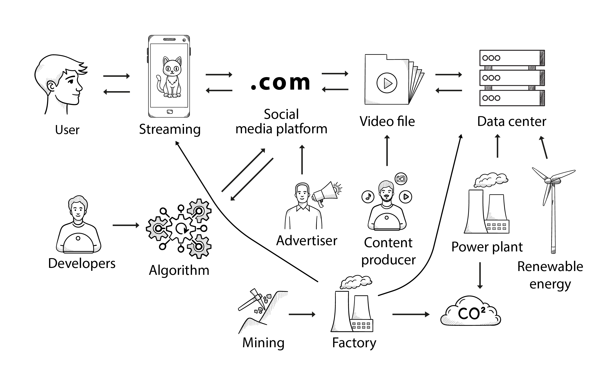
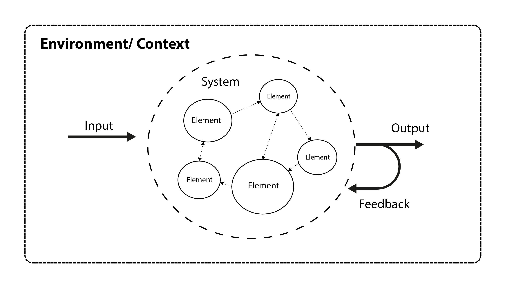
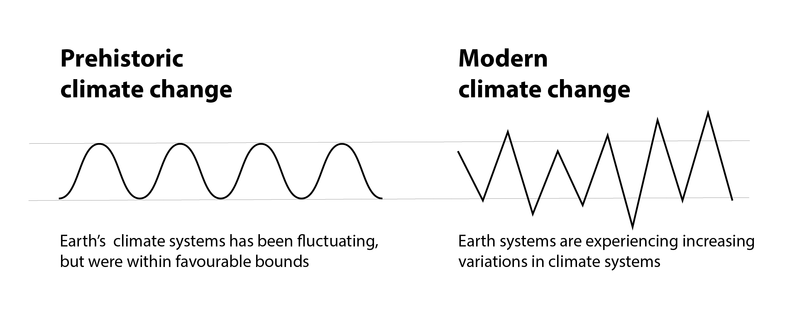
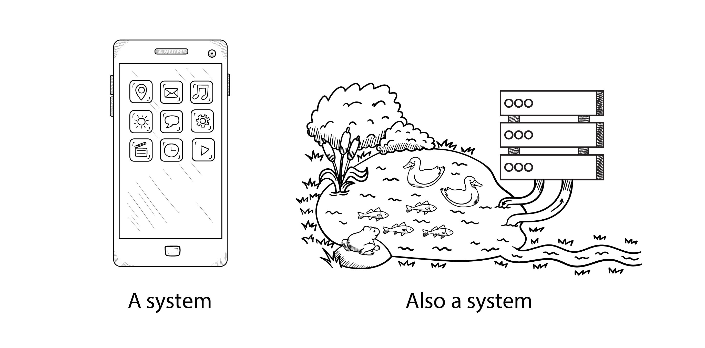
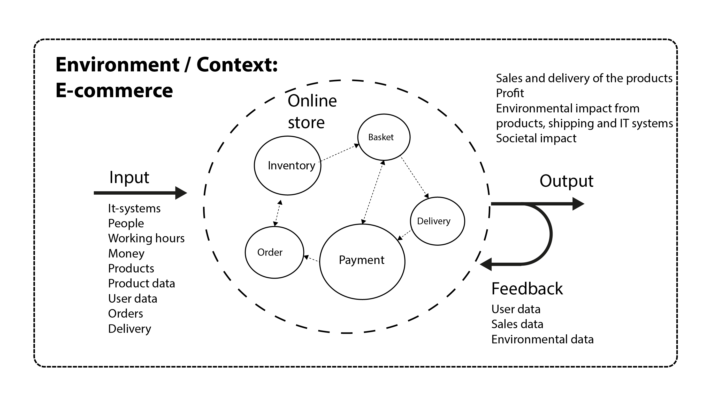

{book: false, sample: false} 
# TODO

# 2. Critical thinking and systems theory

## In this chapter
In this chapter, we will spend time with systems thinking and network theory. Both information technology and sustainability theories are based on systems thinking, which is why we want to prepare you a bit more for working with systems. 

Systems thinking and network theory help us to think holistically and include the most important sustainability aspects when developing digital technologies. Critical thinking helps us reducing noise and validating the details in our work, and finding essential relationhsips between cause and effect in the systems.

Let's go through some selected and general aspects of both systems theory and network theory to give you tools that you can use in your work with digital sustainability. At the same time, we invite you to bring your intellect into play by thinking critically, analytically and systemically in relation to your practice with digital and sustainability issues.

## Systems theory

> "Sustainability is systemic. Sustainability is never an isolated attribute. **Systems thinking must be the starting point for the interdisciplinary foundation of sustainability.**" (from the Karlskrona Manifesto)

*Systems theory* can be used as a meta-theory (overarching theory) to both understand, model and predict different concepts and relations within sustainability and digitalization. Systems theory can be applied to many different things that can be considered systems, such as:

- weather and climate systems  
- ecosystems  
- social systems as political systems  
- biological systems such as the human nervous system  
- digital systems such as operating systems, web systems, social media  
- design systems  

The word *system* comes from the Greek and means something like "a whole composed of several coordinated elements". Systems theory and systems thinking are concerned with understanding the world based on this basic idea. Throughout history, systems theory has been gradually expanded with contributions from many different disciplines such as physics, chemistry, biology, social science and information science, and this development continues to this day.

A *general systems theory* seeks to understand the rules and dynamics that apply to all systems across different domains. It involves the study of how elements of a system are connected and how they interact to create wholes with new properties.

Decades ago, systems modeling was limited by the fact that we could only model with pen and paper, but new and fast computers and computer networks are contributing to a paradigm shift where we can build huge models and perform simulations and calculations faster than ever before. Technological developments are pushing systems science closer to network science, and both are trying to find fundamental relationships that can be observed in different large systems.

These approaches help analyze and understand everything from natural ecosystems to multifaceted social and digital networks, where the relationships between parts and wholes are crucial. By understanding how these relationships work, we can gain deeper insights into both simple and complex contexts.

*Systems thinking* focuses on the connection and interaction between parts of a system and its environment. Systems thinking can zoom in and out to understand a given problem. For example, within the context of this book, systems thinking can be used to analyze the complex relationships between software development, energy consumption and environmental impact. By considering the involved systems and the interplay of their elements, we can analyse, how software can be optimized to reduce the energy consumption of the IT system and thereby reduce the environmental impact of the technology.

Systems thinking is a scientific approach that is particularly well suited to working with both IT and sustainability because it sees the world as a mosaic of interconnected systems that constantly interact and influence each other over time.

## System interactions: video streaming as an example

When we click on a link and play a video, we set off a chain reaction and thus an interaction between the many subsystems that together make it possible to watch the video. As shown in the figure below, a streaming video connects to different websites, APIs, algorithms, hardware systems, data centers, operating systems, energy systems, supply chains, organizations and individuals. If a single subsystem is missing, you probably wouldn't be able to watch the video.

At the same time, each view of the video has concrete and measurable consequences for the environment, society and individuals, such as:

- Energy used for running the streaming service emits measurable amounts of CO₂, which contributes to global warming. 
- The hardware used to stream leaves an enironmental footprint across the globe – from mining in Africa to hardware manufacturing in Asia and Europe.  
- The algorithms that control a video feed can contribute to problematic social media overuse and related mental health issues for it's users.  
- The content in the video may be created with hidden intentions, for example as propaganda that can be spread on social media.  
- Content can influence users' moods and actions.  
- If the video is free, it's likely that the user himself / herself is the product. That is, the user's data or attention is sold to the highest bidder to fund the playback.
- User information can be exploited by hackers or threat actors to make harm. 

These connections are not always obvious, but through a systemic analysis we can discover them by holding the systems behind the streaming against the five dimensions of the Karlskrona Manifesto. In the following figure, you can  see how different things *flow* from one system to another:

- The user's user data is sent all the way to the advertisers  
- The algorithm targets and sends the message content back to the user  
- Minerals from Africa become computer hardware in Asia  
- Various energy sources are transformed into electricity to power the systems  
- Financial transactions occur, e.g., advertisers paying to access user data  

We can't discuss *all* the interrelationships in the interaction between the many subsystems, but the example can illustrate how we should think holistically and include different systems and their sustainability contexts in our own work in order to give a true picture of the context of our digital products.

## What exactly is a system?
If you're new to systems thinking, don't worry. In general, thinking in systems is quite simple. A system is a whole that consists of several interconnected parts (which can also be called *elements*, *components* or *members*) that interact with each other.

The illustration below shows a simple model of a system consisting of several elements. The elements of a system can also be considered as independent systems, or subsystems that can be further analyzed.

The figure hows a *system*, which has both an *input* and an *output*, meaning that it is an *open system* that exchanges something with the outside world. An input can be many things, such as energy, information or materials, and the same goes for an output. Some of the output can also be used as *feedback* to the system, which in turn can be used in system processes.

The components of the system interact with each other and the system also interacts with its *environment*, hence this is an *open system*. There are also *closed systems* that do not exchange anything with the outside world, that have no input or output, but these are rare. 

The diagram also shows that the *elements of the system are interconnected*, and that certain *processes or interactions* take place inside the system that transform input into output.

It is important that you pay attention to the dotted lines on the drawing that surround the system itself – the environment. The system's environment, or *system context*, plays as big a role for the system as the components themselves. Context is important: A fish's gills are a perfect system for breathing in water but are completely useless on dry land. A key is a flawless system for opening its matching lock but is just a useless piece of metal for any other door. The systems can only make sense in the right environment and in the right context.

In systems theory we can distinguish between:

- Emergent systems  
- Designed systems

## Emergent systems
A key insight from systems thinking is that systems are often *more than the sum of their parts*. New properties can emerge when the components interact in ways that create something unprecedented or complex. This phenomenon is called emergence and is central to understanding how systems evolve.

Emergent systems arise spontaneously through the interactions between their components without a central control. A good example of emergence is an ant colony, where each ant follows its own simple rules, while the colony as a whole can be seen as a complex system that forms patterns without any single ant having an overview of the overall system.

These emergent phenomena not only occur in biological systems, but also in all other systems and organizations. In a company, informal cross-departmental collaborations emerge where ideas, methods and experiences flow freely. New digital tools gain traction, not through official channels, but through the mutual recommendations and experimentation of colleagues. Over time, these spontaneous communities and practices lead to different ways of working merging into a pattern that no single person designed.

Think of a social media platform, for example: although it is designed with specific functions and purposes in mind, the individual contributions, routines and communication patterns of users can create new, unforeseen structures over time. This creates a spontaneous, self-organizing order that was not originally intended.

## Designed systems
Designed systems are man-made, they often have a specific purpose, and we know the components of the system and the relationship between them. Engineering can create technological systems such as a spaceship, but it is also possible to create organizational systems such as a company.

Designed systems are often easier to understand if we only know the thinking behind them, but they can also have a certain emergence over time. For example, a company founded with a specific business plan may change its activities over time as the market changes. The systems in an unmanned spaceship sent on a specific space mission will rarely change, but there are examples where, during a mission, the space operation center have to improvise and let the systems work in new and different ways to fulfill the mission.

In the digital world, we often see a mix of designed and emergent systems. Consider a social media platform, where the developers have designed the underlying infrastructure, but users decide what topics emerge and how the debate unfolds. In some cases, organic development can go off the rails - such as when comment sections are flooded with hateful or harassing posts. In these situations, the platform can chose to change the system's design by introducing stricter moderation rules, improved reporting features and the ability to ban users or close problematic forums. In this way, the emergent developments could be kept within designed certain limits.

## Digital twins
There are also examples of digital systems mirroring physical systems one-to-one. Digital twins is an approach to digitization where physical systems have a digital counterpart.

Imagine a cargo ship that has a digital twin. The real ship is sailing on the sea, and it's digital twin is a real time simulation of the ships current properties. This digital version can, through thousands of data points, provide an accurate and real time picture of the ship:

- where it is sailing  
- the captain's view  
- engine performance  
- detailed cargo information
- a 3D model of the ship with all its components  
- CAD drawings and part numbers for easy replacement of spare parts  
- and more... 

Digital twins represent applied systems theory. A digital twin is an accurate and real time updated digital system model of a given physical system, which can be used for modeling, analysis and prediction.
## Systems thinking and critical thinking
*Systems thinking* is a valuable tool for grasping the complexity of digital projects. These projects involve various digital systems, such as operating systems, versioning systems, design systems, and a range of associated roles, including system developers, system integrators, system owners, and system administrators. If you work on the technical side of information technology, you are likely already familiar with systems, as modern IT is built on networks of interconnected systems.

Most information technology programs include system development and design in their curricula, where students learn to model systems using diagrams to better understand their structure and behavior. This foundation is especially crucial for promoting sustainable information technology. Because sustainability itself is inherently systemic, applying systems thinking is essential to effectively address its challenges within the IT field.

System thinking is often supported by handdrawn nodes and whiteboard sketches, as drawing system elements, it's boundaries and environment, and the connections and interactions between elements is a good way of thinking about and communicating systems. 

### Systems thinking: understanding the big picture
Systems thinking can help us to think sustainably,  because it enables us to think systemically and view systems from multiple angles. We can analyze a system on different levels, focusing on one level at a time while temporarily ignoring the underlying layers.

It's a bit like looking at a new car. A buyer might examine the layout, the engine, or the level of equipment, but rarely considers how the different sub-components interact, such as how the brakes are constructed or how the electrical components are wired.

Yet these hidden components are just as important for the car’s functionality. A systems analyst must be able to *zoom in and out* on these properties as needed to understand the system as a whole.

Systems thinking is about seeing the big picture, understanding a system's internal and external relationships, and identifying patterns within systems. 

That said, when it comes to sustainability and digitalization, we often need to dive deeper into the analysis of specific subsystems to gain an accurate understanding. Once we comprehend the system at a given level, we can zoom in and out on its subsystems to be able to see some details, but also maintain perspective on the bigger picture.

At a basic level, system models can be sketched by hand or using digital drawing tools. While it's possible to create system models using hand drawings, documents, and spreadsheets, system modelling software tools make the process more efficient. The advantage of specialized system modeling software is that it is tailored for this specific task, and is capable of handling large volumes of data with visualizations. Recent system modelling software can even identify patterns and correlations using AI and machine learning.

### An example of systems thinking
An example of pervasive systems thinking from the world of sustainability is our understanding of the climate crisis. Scientists had to examine multiple meteorological, engineering, and geological systems to determine that man-made climate change is a reality. They had to analyze historical data on greenhouse gases, atmospheric composition, and calculate the contribution of human activities to understand how it affects global temperatures. This would have been impossible adnavnced it-systems and system modelling software. 

After decades of work, scientists have developed models that identify trends and possible climate scenarios, though precise predictions remain difficult. What they have found, however, is that man-made climate change is not only causing warmer temperatures, but also greater variability in weather systems, leading to increasing rates of rare or extreme weather events, an emergent feature of gloabl warming. 

Systems thinking makes this research possible by allowing researchers to examine systems and subsystems holistically and contextually, understanding their elements and interactions.

Modeling weather systems, as shown in the previous figure, helps us understand how global warming not only means warmer temperatures across the board, but also more frequent fluctuations in temperatures. Systems thinking can guide us toward a climate-neutral future, where we address the emissions that cause warming and ensure that weather phenomena stay within reasonable limits.

## Ask questions and think critically
Systems thinking is a solid starting point for working with sustainability and digital systems, but it should always be complemented with a critical approach. *Critical thinking* acts as a filter that challenges our preconceived assumptions and improves the quality of our work. 

By asking ourselves a series of questions about our preconceptions, our ability to think systemically, and how each system relates to the outside world and other systems, we can take a critical look at how we work:

- Which pitfalls can we expect in our work with digital development?  
- How confident are we in our assumptions about the effects of our actions, and what goes against our assumptions?  
- What do we do, if our assumptions turn out to be wrong?  
- Is there a sound logical connection between all our assumptions?  
- How do our digital systems interact with the outside world?  
- Is digitization even necessary or can the problem be solved without digital systems?

By integrating critical systems thinking into our work, we can improve, model and predict how our development actions will affect the world in the long term. 

This involves not only understanding the direct consequences of our actions, but also being able to identify and mitigate potential negative spin-off effects. For example, through critical evaluation, we can avoid pitfalls such as overconsumption of resources or unintended environmental impacts and thus ensure more sustainable development.

### Good intentions, less good results
There are numerous examples where eco-friendly initiatives have had the opposite effect and resulted in greenwashing instead of real sustainability, and this is where critical thinking could avert the problems. For example, reusing clean packaging from everyday products may seem environmentally friendly, but if it requires disproportionate amounts of energy and water to reuse the packaging, the net effect is negative. Therefore, it is essential to look critically at the different recycling options and look systemically at the environmental costs and benefits of the different scenarios. 

An example from the digital world could be recycling systems for used electronics, such as a trade-in program. Here, the producer takes the back old products and offers gift cards for the return. The electronics contain plastic, metal and more or less recyclable materials, and it makes sense, that a manufacturer has a program for recycling electronics. From a more critical angle, it is important to ask whether the consumers  really have the incentive and opportunity to return the products? 

- Is it easy and feasable to return the electronics?  
- Is there a chance, that users won't return the electronics and it will end up as e-waste anyway?  
- Is the trade-in program a marketing act, or does the company actually manage to recycle the electronics properly?

By asking critical questions about the recycling subsystems in the trade-in domain and its context, we can be more precise in our estimations of the environmental benefits of the trade-in program.

### Efficiency improvements = additional consumption?
The rebound effect is another key aspect of critical thinking in digitalization, as efficiency improvements can reduce consumption in the short term but increase it in the long term. For example, electric cars reduce direct CO2 emissions if they are charged with renewable energy, but it can also increase overall energy consumption if more means of transportation are electrified. When autonomous electric vehicles become affordable, both consumption and total energy consumption can increase. Critical systems thinking helps us navigate such complex contexts and understand which systems and mechanisms influence development.

A critical approach to digitalization is also about assessing the benefits and risks of digital systems for the business. Business processes that rely heavily on IT systems can become vulnerable if the systems fail. Should an airport's control systems be directly connected to the internet or is it too insecure? There are now many examples of how reliance on specific IT systems can cripple entire sectors in transportation, commerce or finance. Critical thinking can help prevent these situations by asking questions like: What do we do if an IT system fails? How do we ensure continued operation without a given IT system?
## Digital systems vs. ecosystems: Differences, similarities and synergies
We can consider all digital solutions as systems. For example, a smartphone is also a system, composed of screen, processor, camera, battery and many other components. These components receive input in the form of energy (electricity) and information (software, data from the internet and data from the phone's sensors), and produce output such as calls or messages to other phones or heat from the battery.

As digital solution developers, we can see the system as a whole – turning on the phone and using its apps – but we can also zoom in on individual subsystems. For example, we can focus on the phones camera system and develop software to optimize its functions in new ways. The context or environment of the system is the usage situation in which the phone is used. Zooming out to a broader perspective, the smartphone can contribute to societal systems by spreading messages on social media. Systems thinking helps us to zoom in and out of systems to understand information technology at different levels.

From a sustainability perspective, there are many non-digital systems that also need to be considered. For example, a lake can also be considered as a system, an ecosystem, which is affected if the lake water is used to cool a data center. The lake as a system consists not only of water, but also of organisms that live in and around the water. In addition, the lake is part of various cycles of energy and materials and has an impact on other systems through them. Without systems thinking, ill-considered use of freshwater can lead to environmental problems in the lake and thus sustainability issues.

Data center water consumption, which affects the lake system, can thus have unintended negative effects if we are not aware of the subsystems and their interactions. By understanding the lake as an (eco)system with subcomponents and interactions, biologists can better anticipate and prevent negative consequences by taking a regenerative approach. In an optimistic scenario, we can design a data center whose water consumption is part of the lake's existing cycle without harming the ecosystem (or even improving it). We can use systems thinking to create innovative and sustainable solutions that both improve our technology and protect our environment.

Systems theory and systems thinking give us a framework in which to think, and this framework can be used both for understanding ecosystems, like a lake, and digital systems, like a smartphone.

## E-commerce as an example of a system model
To give an example of how a *system model* can be brought into play in a digital project, let's imagine that we are working on the development of an e-commerce solution. Our work has a dual purpose, where we both want to develop the best possible webshop, but also want to push development in a more sustainable direction.

We can think of this webshop as a system with inputs and outputs. In the system diagram in the next figure, you can see a very simplified version of a webshop understood as a system. The system handles customers, orders, stock, deliveries and payments. Note that in traditional IT development you wouldn't consider environmental impact and societal effects as outputs of the system, but that's what makes our work different - that we include sustainability aspects in our system model.

In addition to developing a webshop and the processes that make it work, we also need to look at the five sustainability dimensions of the system that we know from the Karlskrona Manifesto.

 **1\. Financial sustainability**
Most (if not all) online stores are designed to generate profit through sales. In many cases, the store earns revenue day after day, month after month, and year after year, a form of cyclical value creation. This ongoing profitability makes the store financially sustainable, as it can continuously support its operations and growth. Without financial sustainability, the store would eventually go bankrupt and cease to exist. It is therefore clear that the company actively makes decisions to maintain and strengthen its financial sustainability. However, other dimensions of sustainability, such as environmental and social responsibility, are far less obvious. These require different kinds of reflection and consideration that go beyond profit and business continuity.

**2\. Technical sustainability**  
On the technical side, we want to build a solution with up-to-date technology that will last for many years and not become obsolete too quickly (we don't want to get into technical debt at the start of the project). It's a tough nut to crack because technology is developing so fast that we can only guess what e-commerce will look like in 5–10–15 years. Nevertheless, we need to make educated and informed assumptions about the future and build the store so that the technology can be expanded and upgraded for many years to come. Can we design elements into the store that promote sustainable behavior among users, such as recycling or downsizing?

**3\. Environmental sustainability** 
The environmental aspect requires us to develop the webshop, which is first and foremost climate neutral and secondly that it has the least possible environmental impact, in terms of both direct and indirect environmental effects from the hardware and facilities used. The IT systems must run on renewable energy, and the derived emissions from goods and transportation must be also as close to climate neutral as possible. Likewise, we must consider how the environmental impacts of the trade process can be minimized.

**4\. Social sustainability**  
Social sustainability can be brought into play in the webshop in several ways. As you can see, people and labor hours are inputs to the system. Here, it is primarily the skills and work of employees that are transformed into output in the webshop system, but secondarily it is also the webshop customers who provide input to the system (orders, payments).

**5\. Individual sustainability**  
It is important to identify the stakeholders that come into contact with the webshop and find out how to ensure that they have a long-lasting and good relationship with the webshop. The webshop may want to retain their good employees and they also want their customers to return. The project can aim to develop or cultivate fruitful communities at multiple levels of the system, taking into account both the individuals and the communities connected to the system.
### Feedback loops: The system is fed with its own output
In the previous figure you can see that user data, sales data and environmental data are fed back into the system as a feedback loop. This gives us a unique opportunity to learn how the system (store) is actually performing and make adjustments along the way to make the system better. In addition to optimizing revenue, you can also detect if you are selling too much of an environmentally harmful product and change the shop layout to highlight and suggest environmentally friendly alternatives instead.

At the same time, this data collection also has ethical and legal implications. The GDPR protects users by setting limits on what personal data is collected and how it is used. It may also be unethical to collect certain types of user data, even if we have the ability to do so. It is therefore important to think broadly when making adjustments to digital systems so that long-term considerations are taken into account when developing instead of one-off solutions.
### Systems thinking helps you get all the way around
As you can see, there are many considerations to take into account when developing systems that take into account the different dimensions of sustainability in the long run. It requires more work up front than unsustainable digital development, and there are many considerations to balance against each other.

As with all IT projects, there is always a risk that development will fail. But by considering the five dimensions of sustainability, we can help develop more robust systems and actually reduce risks for the future. Although this example was a digitization project, the sustainability implications of such an analysis would extend beyond the digital. In this case, for example, it would make sense to also review the shop's product range in terms of sustainability dimensions. Questions we can also ask are: 

- What is the webshop's sustainability responsibility? 
- Where is the boundary between what the shop can influence and what is their sphere of interest?

Here again, we can analyze the system to get good insights – especially in relation to the boundaries of the system.
## Network theory can complement systems theory
In recent times, with access to vast amounts of data and increased computational capacity, researchers have analyzed systems of unprecedented size and discovered new, universal relationships in the networks that connect systems and their components. Physicist Barabási (2016) and his colleagues have proposed, that many things int he world can be seen as networks and can be modeled as networks of connected elements. By examining the properties of the network, such as size, density and connectedness, we can better understand complex systems. In other words, systems can also be seen as networks that are connected by different parts.

Network theory describes the whole world as a network, where the *connections between elements* are as important as the *quality of the elements*. A good example of this is "being in the right place at the right time and doing the right thing", as was the case with the global succes of Facebook. Social media had existed in many forms before Facebook was born, but Facebook was the first company which made the right  connections in terms of technology, content and capital.

There were plenty of social media sites with better design and better functionality before Facebook, but Facebook ended to be winner on a global scale because they built a network that connected people, technology and business. Facebook's success is not only due to its objective technical qualities, but also to the contexts in which it was born (good university, growing needs, technological know-how, good timing, good investment). From a network theory perspective, it is the interaction between Facebook, its users, investors and competitors that has contributed to its success, not only the technical system.
## Systems were traditionally compared to machines
Thinkers of the last century, inspired by the ideas of Frederick Winslow Taylor (1856–1915), often compared systems to the machines of the time (known as Taylorism). In this way, systems were understood as entities with well-defined components, fixed frameworks, clear purposes and unambiguous contexts, while today, network theory gives us different perspectives on how the world can be understood. An industrial machine had to be fueled, and through its' work, the machine could use the fuel to produce concrete outputs with various concrete well-defined purposes. 

A car has an engine, wheels, steering, etc. and it can drive from A to B if we simply add fuel and steer it. This thinking provides a good starting point for understanding systems. Parallels could also be drawn to other kinds of systems, both biological and societal: A bee is a honey production system, and a government is a system that produces the laws of a country. While the simplicity of these analogies is appealing and provides a quick shortcut to understanding some of the overall relationships, this kind of thinking is insufficient to understand the complexity of systems.

### Today, systems can also be viewed as complex networks
*Network science* is not about the individual parts of a system. Instead, it focuses on understanding the network of systems themselves, the connections between the elements of the systems and their interaction with the outside world. Network sciences advances as computers grow faster, and recent advancements in computing enables network science to seek general rules and relationships that are common to all kinds of networks, such as social media, financial networks or ecological systems. 

Network science can be used to investigate how, for example, information spreads in a network or how the structure of the network affects the properties of the system. Today, this is possible because we are able to collect huge amounts of data, analyze it with advanced statistical analysis, and perform calculations and simulations with high-speed computers. 

By understanding how systems are connected, we can better predict, manage and mitigate the unintended consequences that occur when complex networks interact. Examples of applications of network science are numerous. By analyzing social media data, we can gain insight into how information and trends spread among social network users. With data from online job portals, we can analyze how career paths spread through professional networks. We can also better understand ecology and diversity through network thinking by focusing on interactions between species and their environment.

Similarly, by mapping the connections between companies, industries and markets, we can better understand the dynamics of the economy and thus optimize business operations. Network theory can thus complement systems theory by shedding light on the relational aspects of complex systems that cannot necessarily be captured through a more traditional, linear understanding of systems.

### Thinking in networks can shed light on cascade effects
*Cascade effects* are the chain reactions in a network that occur when a small change in one part of a system propagates through connected elements and creates far-reaching consequences. Just as a single falling domino can trigger a whole series of falling dominoes, even a small change or disruption in one part of a network can create far-reaching consequences in other parts.

In economics and supply chains, a missing component can disrupt entire production, affecting both prices and jobs. In ecology, changes in populations of a single species can disrupt established food chains and affect people's food base. A power outage paralyzes communication and emergency response systems, which can lead to further effects throughout society. In the digital sphere, propaganda, misinformation and disinformation can change consumption patterns, influence political priorities and reshape information flows.

## Bringing it together: Key insights from this chapter
We will often need to apply systems thinking to your work with digital sustainability. When a company prepares ESG or CSRD reports or calculates scope 3 emissions, it is crucial to understand how the company's activities affect other systems.

For example, we can analyze how a company's energy consumption affects the climate and contributes to global temperature increases. We can develop models of the company's supply chains to better understand scope 3 emissions or the sourcing of components for the company's digital activities. And it may also be relevant to analyze the organization's effects on a local community or on users to demonstrate social responsibility. In all cases, critical and analytical system thinking is necessary. By bringing system models or network diagrams into play, we can better understand the complex relationships that shape your organization. 

Ask yourself the following questions and work systemically and critically within your field:

- Which systems are part of a given problem?  
- How are the systems connected? (Input, output, elements, interactions, feedback loop, context)  
- Can some parts of the problem be modeled as a network? If so, what are the connections in the network?  
- How are the individual subsystems structured?  
- How does the system and network change over time? (How do systems evolve over time, managed or emergent?)  
- Which cascade effects are there between systems?  
- Which synergies can be found between the systems?  
- How can systems be made more sustainable and resilient in the long term?

By answering these questions, you are well on your way to applying systems thinking to your work with digitalization and sustainability.

