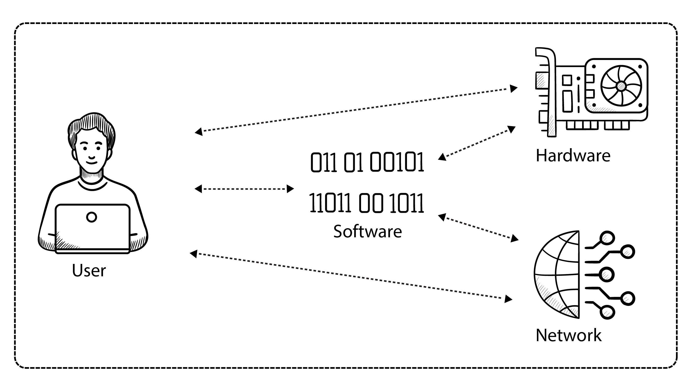
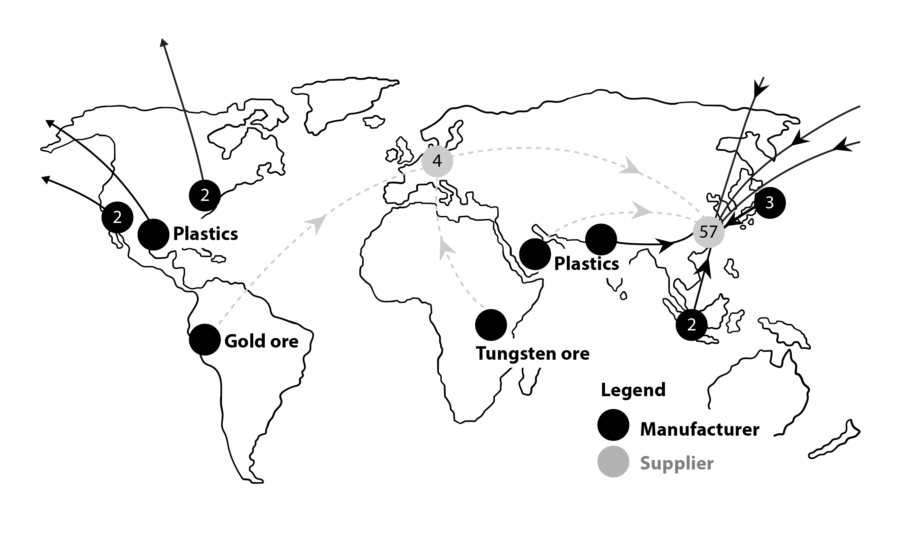
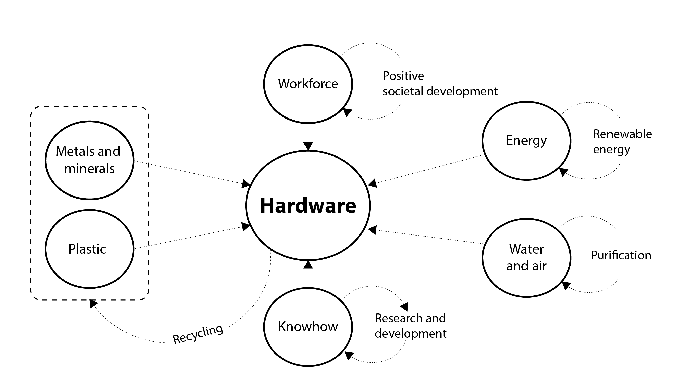
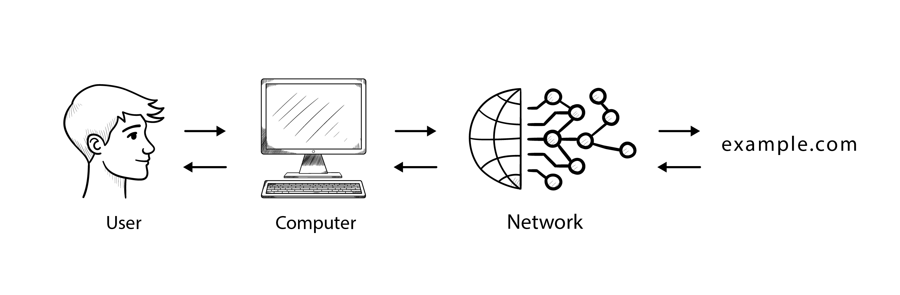
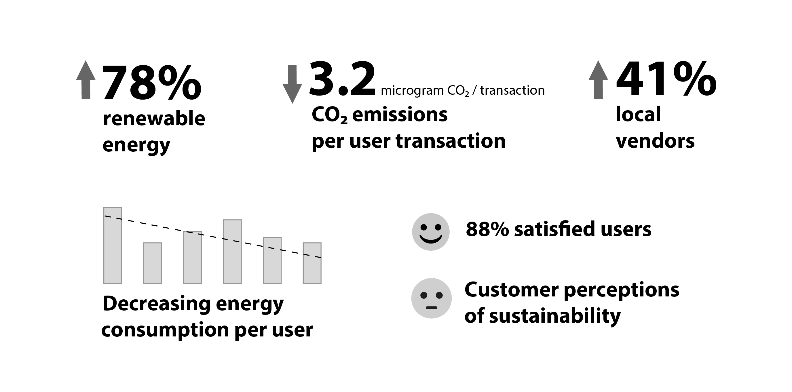
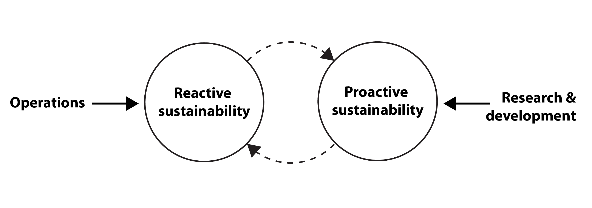

{book: false, sample: false} 
# TODO
- [ ] ...

# 3. The impact of information technology on environment and society

This chapter discusses the tension between the negative impacts of digitalization and its benefits to society. It provides insight into how IT and digitalization affect the environment and today's society.

The chapter first discusses sustainability in relation to hardware, then networks, and finally software's relationship to sustainability. As an introduction to the chapter, we invite you to consider a concrete example of how modern technology can cause pollution with unprecedented global consequences. Let's look at the story of how space technology has transformed Earth's orbit from a pristine area to an explosive dumping ground in just a few decades.

## How earth's orbit became polluted so fast
We are increasingly learning that when new technologies surge onto the global stage, the consequences of neglecting long-term thinking can manifest quickly. Consider the pollution of space around Earth – a potent illustration of how rapid technological growth, pursued without adequate environmental foresight, can breed global problems.

For eons, the space above Earth was pristine. Then came the Space Age in the 1950s. Tragically, within just a few decades, human activity turned Earth's orbit into a dangerous dumping ground. From the late 1950s through the 1980s, satellites were launched with minimal consideration for end-of-life disposal or the orbital environment. Expired satellites and mission-related fragments were left adrift, creating a growing cloud of hazardous "space junk."

Currently, more than 8,000 satellites circle our planet, enabling modern communication, observation, and navigation, and this number is rapidly increasing. At the same time, this orbital infrastructure, along with future space endeavors, is increasingly endangered by debris from past missions. Hurtling around Earth at immense speeds, even small pieces of debris can cause devastating collisions.

The most alarming possibility is a runaway chain reaction: collisions creating more debris, leading to more collisions, and so on. Such a cascade could potentially cripple essential services like GPS and global communications, and close off access to space for future generations ([Kelvey 2024](https://aerospaceamerica.aiaa.org/features/understanding-the-misunderstood-kessler-syndrome/)). Yet, hope remains that a shift towards more sustainable, long-view practices can help us manage this orbital challenge.

### Towards sustainable operations in space
Recognizing the threat posed by space debris, the space industry has increasingly focused on sustainable, long-term solutions in recent years. The goal is to mitigate orbital hazards and ensure the continued safe use of space for satellite deployment (Frank 2023).

Several different initiatives are underway to address this challenge and secure the future availability of satellite technologies:

* _Lifecycle management_: Satellites are now being designed with their entire lifecycle in mind. The satellites are now designed to prevent them from ending up as space debris at the end of their mission.

* _Downsizing_: We use smaller and cheaper micro- and nanosatellites, which are small and compact, use fewer resources overall, and are generally easier to manage.

* _Iterative Development_: Historically, satellites often had long development cycles (10-15 years) followed by equally long service lives (10-15 years), resulting in operational technology potentially being decades old. Given the rapid pace of technological advancement, the industry is moving towards shorter lifecycles. This approach allows deployed satellites to incorporate more current and efficient technologies, improving performance and potentially reducing mission duration.

But what is the connection between satellites and sustainable IT? Satellites are crucial for numerous functions underpinning our digital world. These include enabling global data transfer, global positioning (GPS), facilitating Earth observation (including imaging), and supporting vital scientific research, among other key applications. Key global communication services depend on this orbital infrastructure. Therefore, the destruction of satellites by space debris doesn't just affect space exploration; it could severely disrupt vital digital communication systems worldwide, highlighting a critical sustainability vulnerability.

### What can we learn from the recent developments in satellite technology?
The story of satellite pollution powerfully illustrates how rapidly new technologies can generate problems on a planetary scale. Yet, it also offers a crucial lesson: sustainable pathways become possible when we commit to addressing the long-term consequences of innovation. Core sustainability principles highlighted by the space debris challenge – including *Lifecycle Management*, *Downsizing*, and *Iterative Development* – offer valuable frameworks applicable across the entire information technology landscape.

Space industry can inspire us in informatics to integrate these (and similar other) principles into the design and management of product lifecycles. Research and development must be grounded in sustainable, holistic and long term goals, emphasizing circular economy approaches like cradle-to-cradle recycling.  Ultimately, we must actively mitigate the unintended negative consequences of IT by designing solutions with lifecycles, that deliver lasting benefits for users, the environment, and society.

Fundamentally, all IT systems consist of three core components: hardware, software, and network infrastructure. Crucially, there is also the human factor, the users, who interact with these systems. As depicted in the following figure, data flows and transforms within this ecosystem of components, ultimately facilitating information exchange with the user.

All three parts have a crucial role to play in the impact of digital solutions. Digital systems work in the interaction between hardware, network, software and users, but sustainability can also be assessed for each component individually. The next sections review the sustainability aspects of hardware, network and software separately.

---
## The physical side of information technology

Hardware and electronics form the physical foundation of all digital solutions. Devices such as computers, smartphones, and networking gear are built from many different parts like printed circuit boards, microchips, plastics, and integrated circuits, each with its own manufacturing footprint.

The production of this hardware requires advanced manufacturing lines and a wide variety of materials, including plastics, metals, and critical rare earth elements. Global trade and cooperation are essential for creating cutting-edge systems, resulting in complex, planet-spanning supply chains.

Let's look at a concrete example of such a global supply network, which is required for manufacturing a smartphone. The figure below shows, how a smartphone sold in Europe is built from minerals and raw materials extracted in several parts of the world, which are then processed and assembled in China. 

Choosing sustainably developed and produced hardware is crucial for sustainable IT projects, given the significant negative environmental footprint associated with manufacturing complex devices like smartphones. The Dutch smartphone manufacturer, Fairphone, provides a notable example of striving for greater sustainability. For its Fairphone, it tracks specific material origins like gold from Peru, plastics from the EU/USA, and tungsten from Rwanda (see the previous figure), actively working to map its supply chains and use more sustainable materials. Furthermore, the company undertakes initiatives to improve related mining practices in Africa and working conditions in Asia, taking responsibility for producing devices more sustainable than the industry standard – even while acknowledging truly sustainable smartphones are not yet achievable.

Unfortunately, such comprehensive sustainable approaches remain relatively rare among hardware manufacturers, although the trend is growing. This landscape is further complicated by broader geopolitical and economic factors. Recent experiences with supply chain fragility have starkly highlighted the risks of concentrating production geographically and relying on a few key manufacturers. This vulnerability is prompting many nations to prioritize developing domestic hardware production and to find alternative supply chains (especially for critical components like chips) to bolster technological sovereignty and resilience.

Regardless of where hardware is produced, however, a fundamental prerequisite for it to be genuinely sustainable lies in the ability to *source materials and components responsibly*. This means systematically evaluating and mitigating their impacts on ecosystems, the broader environment, and the surrounding community.
## Hardware: A sustainable lifecycle?

Typically, business computer equipment is renewed roughly every five years, with companies often planning to purchase new hardware after this period. While the hardware itself can often remain functional for longer, potentially aided by repairs, rapid technological advancements can create compelling reasons for replacement. Newer hardware can offer significant improvements in performance, lower power consumption, and enhanced reliability, making upgrades economically or operationally attractive.

Addressing the sustainability of hardware requires looking beyond these refresh cycles. To encourage more sustainable practices throughout the hardware lifecycle, IT projects must consider a broad range of factors – encompassing environmental, societal, human, and economic dimensions. Key strategies and best practices for integrating these considerations into hardware procurement and end-of-life management (recycling) are summarized in the figure below.

Broadly speaking, manufacturing IT equipment (hardware) relies on four key inputs:

* *Raw Materials:* This includes metals, minerals, plastics, and other basic materials, as well as essential resources like water and clean air consumed during production.
* *Labor:* The human effort required throughout the manufacturing process.
* *Expertise:* The technical knowledge and skills needed to design, manufacture, and assemble the intricate parts (often referred to as know-how).
* *Energy:* The power required to operate machinery, facilities, and processes.

These four elements – materials, labor, expertise, and energy – are inextricably linked in the production of IT hardware. Managing them sustainably across intricate global supply chains presents a significant challenge. 

Optimizing one area, such as energy efficiency through advanced expertise, may still be undermined by unsustainable raw material sourcing or poor labor practices. Therefore, a comprehensive view acknowledging the interdependence of these inputs is necessary to foster genuinely sustainable hardware development, and addressing digital sustainability requires a holistic approach that considers the impact of each factor.
### Electronic waste and recycling

A holistic and circular approach to hardware begins with sourcing and producing raw materials and components as sustainably as possible, preferaly from recycled sources. When hardware reaches the end of its initial use phase, extending its life through direct reuse via refurbishment (cleaning, refreshing, repairing) should be a priority.

Materials from devices that cannot be refurbished should then enter responsible recycling streams. The aim is maximum material recovery, ideally reclaiming close to 100% of raw materials for reintegration into manufacturing cycles, either for new hardware or other products. Manufacturers can foster this circularity by encouraging product returns and guaranteeing effective disassembly and material recovery processes.

The potential for circularity in computing hardware is high – most materials are technically recoverable through component reuse or raw material recycling. However, current practices lag significantly behind this potential. Globally, a mere 17.4% of e-waste is estimated to be collected and appropriately recycled. This stark figure underscores the urgent need for action: improving collection and recycling infrastructure for electronics and minimizing the generation of electronic waste are critical steps toward a more sustainable digital world ([United Nations University 2024](https://unu.edu/press-release/global-e-waste-surging-21-5-years)).

### Longevity: extended lifespan

The amount of electronic waste can be reduced by extending the lifetime of the hardware through e.g. repair. At a European level, various legislative proposals are being worked on to make electronics more sustainable, including obliging manufacturers to provide better opportunities to repair products ([Repair.eu 2025](https://repair.eu/whats-my-right-to-repair/)).

In this context, the fact that microchips are getting faster every year is a problem. While it's generally a good idea to keep a computer alive for longer by repairing it, this is not necessarily the case for all types of computers. For example, it can be more sustainable to scrap old power-hungry servers for a newer model that is significantly more efficient.

In terms of energy consumption, hardware manufacturing should strive to reduce energy consumption and use renewable energy in all stages of both production and recycling to eliminate the use of fossil fuels (and thus reduce greenhouse gas emissions). It should be remembered that water and air used in production must also be cleaned before it is released from the factory.

Proactive design choices also offer substantial opportunities for improving hardware sustainability. Leveraging the latest knowledge and integrating sustainable design principles can yield significant environmental benefits. Processor technology provides a compelling example. Different processor architectures can perform equivalent calculations with varying energy demands. Notably, _ARM processors_ are designed for high energy efficiency, consuming less power for their computations compared to many traditional processor types. This hardware efficiency can, in turn, enable software running on these devices to operate more sustainably.

### Consideration for people and communities

Responsible business practices are a critical aspect of hardware production, extending into social and ethical dimensions. Recent years have brought shocking examples of worker exploitation by electronics manufacturers, particularly among subcontractors in countries with less stringent labor regulations. In extreme cases, this has led to tragic events like factory suicides ([Foxconn suicides / Wikipedia](https://en.wikipedia.org/wiki/Foxconn_suicides)). Documented abuses include excessively long working hours, extremely low wages, denial of basic rights, and intense pressure to meet high production quotas. These conditions stand in stark contrast to the labor standards expected in regions with strong worker protections, such as much of Western Europe, highlighting the potential brutality of global competition when ethical standards are not rigorously enforced.

Therefore, hardware manufacturers must strive to ensure fair and considerate treatment of the workforce throughout all production stages. Key measures include implementing ethical sourcing policies for components, demanding supply chain transparency, and continuously monitoring the working environment within their own facilities and those of their suppliers. 

Beyond direct labor concerns, companies should also assess and manage the impacts of their operations on the local communities surrounding their factories. This broader responsibility extends beyond merely avoiding scandals, it is about contributing positively to a more equitable and sustainable global division of labor.
### Hardware manufacturers' green promises

- *By focusing on recycled and renewable materials, clean electricity, and low-carbon shipping, we’re working to bring our net emissions to zero across our entire carbon footprint.* ([Apple 2024](https://www.apple.com/environment/))

- *We consider energy efficiency and resource circularity for our products throughout their entire life cycle. This involves implementing various measures during the stages of sourcing, production, distribution, use, and recycling to reduce our impact on the environment.* ([Samsung 2024]())
  
- *For ourselves, we have a bold goal to reach net-zero emissions across all of our operations and value chain, which includes running on 24/7 carbon-free energy (CFE) on every grid where we operate. A sustainable future requires systems-level change, strong government policies, and new technologies. We know that AI has the potential to help solve some of climate’s biggest challenges.* ([Google 2025](https://sustainability.google/))

The above quotes are examples of hardware manufacturers increasing their focus on sustainability. It is positive that hardware manufacturers are making such environmental promises, but it can be difficult to determine whether this is a genuine green agenda or some degree of greenwashing. 

The fact that companies choose to focus on sustainability is important because with our current technological capabilities it is close to impossible to develop truly sustainable hardware products. It will take several decades of research and development to develop a fully circular information technology and this can only be achieved if manufacturers continuously show progress and improvements year after year. 

Integrating clear sustainability criteria into the hardware sourcing and procurement process is a direct mechanism for driving positive change. When organizations prioritize factors like energy efficiency, material circularity, and ethical labor practices in their purchasing decisions, they compel manufacturers to improve performance in these critical areas.

As long as new minerals have to be mined for every product, we'll continue to put pressure on the earth's limited resources. Without a circular approach, we could run out of minerals such as lithium or rare earth elements, just as we run out of fossil fuels. Conversely, if we succeed in recycling raw materials so that a new hardware product consists of 99.99% recycled materials, we can talk about sustainable hardware production, because in principle we can continue to produce new hardware for almost as long as we want.

While it is unfortunately impossible with our current technology to develop completely sustainable hardware, you can still advance your organization's overall sustainability by considering the aforementioned hardware aspects in your IT projects. You can further the sustainability agenda in your practical work by asking questions about the hardware part of the projects you are involved in. The checklists in the book's appendix can help you with this.

---
## Network and cloud: Challenges and opportunities

Modern digital technology consists not only of computers, smartphones and printers, but also of the (data) network itself, which forms a large part of the technology. After all, what can you do with a computer, smartphone, or server without a network connection? You can't share information with others or get data from other devices. That's why it's important to consider the network when talking about sustainability and IT.

The following figure illustrates how regular use of a computer (e.g. browsing or chatting) sends data out into the world and gets data back. Every click in a browser will typically send data out into the world in this way and retrieve a response back. To understand the environmental impact of your information technology, you also need to consider the network's part in the carbon footprint.

As depicted in the previous figure, data networks are composed of interconnected devices like computers, routers, and switches. These devices communicate and exchange data using various media, including physical connections (copper cables, fiber optics) and wireless signals (like Wi-Fi and Bluetooth). While the Internet represents the largest global network, other types exist, such as mobile networks and private enterprise networks.

The ease with which networks, particularly the Internet, allow us to transfer and process data digitally – replacing older methods like physical media (e.g., USB drives, optical discs) – has led to continuous, high-volume data traffic worldwide. This constant activity, supported by vast infrastructure, carries a significant environmental footprint. 

Central to this infrastructure are *data centers*, ranging from small facilities to massive installations globally. These centers house large quantities of electronics and consume substantial amounts of electrical energy, primarily for two purposes: powering the servers and networking equipment that store, process, and transmit data, and running cooling systems to manage the significant heat generated by this hardware.

### Network energy consumption and CO2 emissions

While large data centers and ISPs are economically motivated to pursue energy efficiency – as lower energy use directly reduces operational costs – understanding the true environmental impact of data networks is complex. As a rule of thumb, every dollar saved on electricity improves profitability, driving investment in efficiency measures.

Technological upgrades, such as the gradual replacement of copper cables with more energy-efficient fiber optics (now increasingly common, see [Europacapable 2022](https://europacable.eu/news/europacable-whitepaper-on-energy-efficiency/)), contribute to reducing energy per bit transferred. However, the distributed and heterogeneous nature of the internet – with data flowing through countless nodes, diverse hardware, and geographically dispersed services – makes calculating the precise environmental cost of any given data transfer extremely difficult.

Recognizing this challenge, researchers and engineers are developing methods to estimate the energy consumption and carbon footprint attributable to specific online activities and software services. A notable example is the proposal by French innovator Bertrand Martin for a new HTTP Response Header ("Carbon-Emissions-Scope-2"). This mechanism is designed to enable web services to communicate an estimated CO2 emission value for data transfers they handle ([Martin 2023](https://datatracker.ietf.org/doc/draft-martin-http-carbon-emissions-scope-2/00/)). While not widely accepted or implemented, Martin's proposal highlights a growing push for greater transparency and accountability regarding the environmental impact of digital services.

Other examples of optimizing network energy consumption and CO2 emissions focus on areas such as reducing data transport distances through CDNs and edge computing, transitioning to renewable energy sources for operations, and minimizing energy waste in data center cooling systems.

### The cloud can lead the way for good climate solutions

Another key concept deeply intertwined with networking _is cloud computing_.

Consider this example: When you take a picture with your smartphone, it's initially stored locally on the device. You might also manually back it up to a specific server in a known data center location. In both scenarios, the data's physical location is relatively clear.

Cloud storage, often enabled by default on modern devices, works differently. The "cloud" refers to a vast, globally distributed network of servers. When your photo is uploaded to the cloud, you typically don't know, nor need to manage, the specific server holding the file. Instead, you entrust the cloud provider with storing the data appropriately. Their complex systems automatically decide the optimal geographic location (perhaps Frankfurt, Singapore, or elsewhere) and storage medium (balancing cost, speed, and durability) for your data.

This abstraction and centralized control by cloud providers offers significant potential for environmental sustainability optimization. Providers with deep technological expertise can automate decisions about resource allocation, energy use, and data placement to improve efficiency across their massive infrastructure. Indeed, the trend towards more sustainable data centers, driven by major market players, has been underway for years (highlighted in reports such as Greenpeace's 2017 Clicking Clean report). Current examples of this ongoing effort include strategically locating new data centers near renewable energy sources, investing heavily in energy efficiency, and forming partnerships focused on achieving ambitious sustainability targets. 

On the other hand, cloud storage also raises sustainability concerns, such as its contribution to massive aggregate energy consumption, the resource depletion and e-waste from data center hardware, inducing potentially unnecessary data generation and transfer (rebound effect), and limited user visibility into the actual environmental footprint of their cloud usage. Also, the fact that the cloud is not bound to specific locations or countries can pose challenges regarding e.g., privacy and GDPR rules on data transfers, wider issues of data sovereignty, regulatory compliance across borders, and jurisdictional uncertainties. 

Moreover, it's important to note that cloud computing may not represent the optimal economic path for all organizations. Critical analyses highlight that, particularly at scale, cloud costs can become prohibitive for certain workloads compared to alternatives like on-premises infrastructure or dedicated hosting ([Hansson 2023](https://world.hey.com/dhh/we-have-left-the-cloud-251760fb)).
### Societal aspects of networking

A small network connecting a few computers is a _LAN_ (Local Area Network), while connecting multiple networks creates a _WAN_ (Wide Area Network). The internet stands as the largest realization of this concept, linking billions of devices worldwide. You might get the impression that the internet never goes out and that everyone can always access all sources of information on demand. However, it is important to note that this is not always the case.

Indeed, internet restrictions exist globally. A prominent example is China's Great Firewall, which filters China's internet traffic, blocks access to numerous foreign services, and serves as a tool for state censorship and information control. Blocking capabilities are also employed elsewhere, even within the Western world, for similar reasons mandated by law, such as restricting access to websites distributing illegal materials (Strarup 2022).

Historically, much of the Internet's core infrastructure and protocols developed within a US-centric environment. However, its global reach now necessitates international cooperation for governance. Organizations like ICANN and regional internet registries coordinate essential resources like domain names and IP addresses, while the W3C develops web standards through global consensus. These international bodies, though often headquartered in the US, facilitate worldwide participation in managing these foundational elements.

There is broad international interest in preserving the Internet as a neutral, open, and universally accessible platform, preventing dominance by any single entity (or a few dominant entities). Furthermore, from a viewpoint emphasizing democratic principles and fundamental rights – values strongly held within the Western world – ensuring citizens' ability to access and share diverse online information, and fostering trust in the reliability of that information, are considered essential goals.
#### When the network connects us - or separates us

But networks are also vulnerable. Denial of service attacks are very common. This can put certain parts of the network out of action for a period of time. Fortunately, the internet is designed to be robust and resilient to outages. This feature makes it possible to be connected almost all the time, both at home and at work. The network makes remote working possible, changing people's lives for better and for worse. Some thrive in the home office, while others need a physical presence for effective collaboration.

Areas without internet connectivity can suffer from being cut off from the global information highway, while others seek the same off-grid areas where they can be cut off from the connected world. So the very development and deployment of networking technologies can have knock-on effects that affect both society and individuals.

Finally, it should be mentioned, that computer networks are also built on hardware, and therefore we should also consider a network's own hardware-related sustainability issues, as discussed earlier in the chapter.

---
## Software: Key sustainability aspects 

Software refers collectively to the programs and applications that operate on computer hardware, ranging from common applications like word processors, websites, and smartphone apps, to specialized systems including databases, AI, machine learning, server management, electric car controls, and factory automation software.

As the critical layer controlling the interactions between hardware and network elements, software is fundamental to every digital project. The quality of software is paramount: effective and efficient programs deliver substantial advantages, while inefficient or flawed software can directly undermine digitalization goals.

Specifically, high-quality software streamlines work processes, improves user interactions, increases productivity and creates value on different level. Poorly developed software, however, can result in system malfunctions, security breaches, and wasted resources, thereby impeding progress and innovation. Therefore, a dedicated focus on software quality is indispensable for successful digitalization.

### The software has some impact on power consumption and emissions

The software running on hardware significantly influences the overall electricity consumption of IT systems. Efficient, well-designed software utilizes only the necessary computing resources, whereas poorly optimized software can demand excessive processing power, directly increasing a device's energy use.

Globally, researchers are actively developing methods to measure and optimize software's energy footprint, yet standardized metrics or labels for software energy consumption are still lacking. A general principle holds true: software typically consumes less power if it requires less computational effort and processes smaller amounts of data to achieve a specific task. However, it's crucial to recognize that hardware itself has a substantial baseline power draw whenever active, independent of the software's efficiency.

This baseline consumption complicates efforts to precisely measure the energy attributed solely to a specific software application. Furthermore, as mentioned in Chapter 2, many common digital activities involve hidden, distributed energy use. Streaming an online video, for example, consumes energy not just on the user's device, but also on the server hosting the video and across the network infrastructure transmitting it.

Artificial intelligence (AI) provides another example of software-driven energy demand. Training large AI models, which involves processing vast datasets using potentially thousands of GPUs concurrently, is extremely energy-intensive (Olifent 2024). Even AI inference – using a trained model – has a notable cost; Raghavendra Selvan (DTU) estimated that a single ChatGPT prompt uses approximately 0.1938 kWh, comparable to charging a smartphone about 40 times ([Kristensen 2024](https://di.ku.dk/english/news/2023/what-can-we-do-about-the-increasing-carbon-footprint-of-ai/)).

Looking ahead, there are concerns that emerging complex algorithms could become even more energy-intensive. Technologies like blockchain and large-scale AI debuted with substantial energy demands, sometimes compared to the consumption of entire medium-sized European nations. While subsequent optimization often improves the energy efficiency per operation for such technologies, the "rebound effect" remains a critical factor: increased adoption and usage, driven by improved performance or new applications, can lead to a rise in *total* energy consumption despite unit efficiencies.

Finally, the tools used for software development also matter. Research indicates that the choice of programming language and associated frameworks can significantly impact resource usage. Generally, minimalist, specialized languages and frameworks tend to require fewer computational resources compared to large, generic ones, influencing the final software's energy profile.

### Technical debt and code optimization

An often overlooked sustainability issue in software development is technical debt. Technical debt can be described as the accumulation of consequences from taking quick, expedient, but ultimately unsustainable shortcuts during the development process. These shortcuts result in significant additional costs later – impacting maintenance, security, performance, and environmental footprint. The concept is analogous to constructing a building: laying a weak foundation saves time initially, but the entire structure relies upon it, making later fundamental changes extremely difficult and costly.

Consider an example in software development where an algorithm must process large datasets. A developer under pressure might quickly adopt an easily found code snippet (perhaps from Stack Overflow) to solve the immediate problem. However, this solution is unlikely to be the most computationally efficient. By choosing this shortcut, the developer incurs technical debt: the application will consume more processing power, memory, and thus energy than necessary throughout its operational life. This inefficiency translates into higher costs related to environmental impact (energy consumption, carbon footprint), operational expenses, and potentially security vulnerabilities.

Conversely, the same algorithm, developed with due diligence and applying sound knowledge of algorithmic efficiency, employing refactoring techniques, and conducting thorough testing, could be programmed for far more efficiency, requiring only a fraction of the computational resources. Developers can leverage various analysis and profiling tools to identify bottlenecks and further optimize code according to the best practices of the chosen programming language. The advent of AI-powered development environments brings promises towards software development pipelines, where AI is being capable of automatically optimizing code in order to counter technical debt. 

An example from reallife evolves around a company managing large fleets of connected vehicles, transmitting vast amounts of real-time data to central servers. This data transfer incurs significant costs based on volume (paying per gigabyte). The development team implemented standard compression to reduce data size and lower costs. However, this standard compression wasn't optimal for their specific data type. Analysis revealed that developing a customized data compression algorithm, tailored to car data, could drastically improve efficiency. 

By investing in this more efficient software solution, the company could not only save millions annually in data transfer fees but also significantly reduce the network bandwidth and associated energy consumption required for transmission. Implementing the optimized compression would effectively eliminate this specific instance of technical debt, yielding both economic and environmental benefits.

### Choose software packages wisely

Technical debt can also manifest through the initial choice of frameworks or software packages used as a project's foundation. It is common practice to utilize open-source systems or libraries as the core of a final solution. The popular content management system (CMS) WordPress serves as a pertinent example of such a foundational platform.

WordPress is renowned for its ease of setup, often marketed with a "five-minute install," allowing users to quickly deploy a functional website with many features. Being open-source and free, it offers an excellent starting point for relatively simple websites and web applications. Its extensibility through plugins allows many organizations to use it for diverse purposes like blogs, content management, or e-commerce shops.

Challenges typically emerge when a project's requirements evolve beyond the platform's core design, effectively "outgrowing WordPress." Custom functionalities or high-performance demands might require optimizations that are difficult to achieve within the generalized architecture of WordPress and its plugin ecosystem. While adept at many common tasks, WordPress, like most generic platforms, may struggle with performance and efficiency when pushed towards highly specific use cases it wasn't originally built for. Generic systems inherently face difficulties achieving peak optimization for specialized, demanding operations.

Similar challenges can be observed with AI-assisted software development tools or vibe coding. As the AI-assisted coding helpers get better and better all the time, but these not always generate the most efficient or suitable code for a given problem. If the developers chose the right context and right prompts for the projects, AI can yield high quality code - but if not used properly, it can also create sustainable technical debt as  resource-hungry or ill structured solutions. On the other hand, AI-assisted coded is also for the rescue: AI can assist in optimizing and / or migrating legacy solutions. 

When driving digital development, we must keep in mind, that technical debt can accumulate when foundational systems, frameworks, libraries or IDE's are not well-suited or optimized for the specific tasks they are ultimately required to perform. Consequently, selecting software components with careful consideration of performance requirements, scalability, and long-term sustainability is a crucial early decision.

For systems already burdened with significant technical debt, remediation often involves optimizing existing code and architecture – essentially "paying down" the debt. However, sometimes the *symptoms* of technical debt, like poor performance, can be mitigated through external tools. Varnish Cache is one such tool; it's a web accelerator that can dramatically improve the response time of web solutions (potentially by orders of magnitude, though specific gains vary greatly depending on architecture and workload) by caching content.

By effectively caching responses, Varnish can reduce the load on backend systems, allowing companies to potentially decrease their server count and associated resource consumption. This translates into substantial financial savings and, importantly, environmental benefits through reduced energy use. 

Nevertheless, it's crucial to recognize the limitations of optimizing poorly architected solutions. There's a point where attempting to enhance a fundamentally flawed system yields diminishing returns, akin to trying to renovate a building with irreparable foundations. Persistent underlying issues will continue to impede optimal performance, maintainability, and sustainability. In such cases, migrating to a new, well-designed solution built for durability and efficiency may prove more effective and sustainable in the long run.

### Individual and societal aspects of software

The impact of software extends far beyond its direct influence on power consumption and CO2 emissions. While it's crucial that software be designed efficiently to minimize the resource demands placed on hardware and networks, software also presents tremendous opportunities to actively contribute to a more sustainable world.

Indeed, thoughtfully applied software can drive optimization across numerous domains. For instance, intelligent software managing heating and ventilation can dramatically cut building energy use. Engineers rely on sophisticated software tools to model and devise more resource-efficient solutions to complex problems. Furthermore, emerging AI capabilities offer powerful assistance in designing entirely novel sustainable products and processes. Software can even play a role in shaping user behavior, potentially guiding individuals towards more sustainable practices through education and feedback mechanisms.

Beyond the environmental dimensions, software profoundly impacts the people and societies that use it. Many of these effects are beneficial, enhancing efficiency and connectivity; social media platforms, for example, facilitate rapid communication across vast distances. However, significant downsides exist. Excessive engagement with digital media is increasingly linked to negative mental health outcomes. This duality underscores that software is a powerful tool: capable of fostering positive change when used responsibly, but also susceptible to misuse for harmful or negligent purposes. 

Critically, software design itself carries ethical weight, as it can incorporate persuasive or manipulative techniques (dark patterns) intended to influence user behavior – sometimes for beneficial ends, but often purely for commercial gain or other motives.

A trick often used in web design is to present options in a way that emphasizes the desired choice - also called _visual weighting_ or _choice architecture_ ([Sobolev & Lesic 2022](https://www.pymnts.com/cpi-posts/online-choice-architecture-the-good-the-bad-and-the-complicated/)). The figure shows, how this trick both can be used to get users to either buy more (where the cheap alternatives appear less appealing) or choose a sustainable option (which seems like the obvious right choice compared to pure consumption). This illustrates how design both can be used to highlight the most profitable choices for the business, but also to promote sustainable choices.

So, it is possible to build sustainability aspects into existing software and it is also possible to develop various new software solutions that can help advance the sustainability agenda. Examples could be:

- Apps that help shift electricity consumption from fossil fuel power plants to renewable energy sources by predicting when green power is available (from wind or sun).

- Calculators, that can compare products or solutions from a sustainability perspective.

- Interactive soliutions, which nudge the users in sustainable directions.

- Solutions, that optimize processes to reduce resource consumption (e.g., food waste or energy waste).

A further opportunity presented by digitalization and software lies in continuously monitoring sustainability performance. Organizations can implement systems to track specific *performance indicators* in near real-time, visualizing this data through dashboards (as shown in the figure below) for ongoing assessment.

These dashboards are instrumental not just for monitoring performance indicators, but also for fostering accountability and motivating action by making performance transparent – showcasing both successes and opportunities for enhancement.

The functionality relies on algorithms processing continuous data streams from sensors and other inputs. These algorithms automatically detect significant trends and deviations, flagging areas requiring attention for effective sustainability management. Beyond operational monitoring, this data infrastructure serves a crucial reporting function. At the end of reporting periods, the aggregated data and identified trends can be readily transformed into compelling visualizations and infographics, essential both for internal review and also for external communications, aligning with modern corporate sustainability disclosure practices.

### Problematic digital use: a sustainability challenge

As society increasingly integrates digital devices into daily life, this pervasive digitalization fosters greater dependency at the individual level. This dependency, often escalating to addiction, impacts habits, mental well-being, work, and social relationships. 

The scale of this issue extends beyond extreme cases; the routine interactions many people have with smartphones, social platforms, and the constant influx of information frequently lead to negative experiences. This relentless stream of digital stimuli fosters distraction and diminishes our capacity for deep focus and immersion. Across all age groups, there's a growing difficulty in maintaining concentration, exercising critical thought, and engaging meaningfully with complex political and cultural matters. Consequently, digital dependency is not merely an individual affliction but a force actively reshaping contemporary culture and ways of life.

A key driver of this phenomenon is "Attention theft" – a concept explored by Danish author Camilla Mehlsen (2024). She describes it as the deliberate exploitation by digital companies of innate human urges and reaction patterns to capture and retain user attention. These companies often employ dark patterns and manipulative design techniques, including sophisticated user retention algorithms, psychological tricks in interface design, and emotionally charged content. These tactics are designed to continuously pull users towards fleeting, immediate rewards (like notifications or likes), often at the expense of deeper engagement, critical reflection, and meaningful community interaction. Such attention-capturing algorithms and designs can trap users in cycles of behavior that are unbeneficial or even detrimental to their well-being.

Therefore, broadening the scope of digital sustainability requires us to recognize and address these impacts. Just as we evaluate environmental effects, individual user well-being and cognitive health must also be considered fundamental sustainability criteria in the design and development of all digital projects and services.
### Sustainable pathways: repairability, longevity and low-tech

Digital development, while bringing innovation, can inadvertently fuel consumerism. New software applications, often demanding greater resources, may perform poorly on older hardware. This incentivizes users to purchase new devices simply to access the latest features, even when those features offer marginal improvements or don't address genuine needs, contributing to shorter device replacement cycles.

Furthermore, manufacturers often have a strong commercial interest in continuous sales, which can lead to products being designed with limited durability. The practice of planned obsolescence involves intentionally designing products in ways that hinder repair and upgrades, thereby encouraging replacement rather than extended use.

Counteracting these trends requires prioritizing design for longevity and repairability – key principles of the circular economy and central to initiatives like the "Right to Repair" movement gaining traction in Europe. Extending hardware life also depends heavily on software. The duration for which software supports specific hardware configurations is critical; longer support translates directly to longer potential hardware usability. Within software development, particularly in open source, versioning strategies like _STS_ (short-term support) and _LTS_ (long-term support) signal the intended support lifespan.

STS versions typically introduce newer, potentially experimental features requiring broad user testing to assess their long-term stability and viability. In contrast, LTS versions prioritize stability and extended support, incorporating only well-tested, established features. Consequently, an LTS version might offer fewer cutting-edge features than its STS counterpart, but it is designed for reliability over a much longer period – sometimes exceeding ten years. While one might view LTS as representing a less advanced technological state compared to STS (akin to a "lower tech" option in some respects), this very stability makes it highly suitable for dependable, long-term deployment.

This relates to a broader societal debate: should we pursue more radically "low-tech" IT solutions focused purely on minimizing consumption through simplicity and extremely long lifespans, or should we focus on making our current, complex technologies more sustainable through enhanced circularity, repair, and upgradability? 

This book advocates for the latter approach. Promoting designs that allow existing hardware and software to be easily repaired and upgraded empowers users to extend the useful life of their devices, reducing the frequency of new purchases and mitigating the environmental impact associated with manufacturing and disposal.

### Activism, politics and war in cyberspace

As we strive toward sustainability in the technology industry, we confront complex challenges in cyberspace, where activism, politics, and cyberwar increasingly dominate the agenda. The internet serves as a powerful communication platform where anyone can engage with anyone else—even confidentially, through encrypted channels, if the right services are chosen. While secure communication opens new opportunities for digital activism, most activism and political engagement still occur openly on accessible platforms.

Free and open information systems are essential in democratic societies, enabling citizens to communicate freely and exchange ideas without restriction. An illustration of online self-organization was the Arab Spring of 2010-2011. The protests were largely driven and amplified through social media and online channels ([The National, 2012](https://web.archive.org/web/20120516161234/http://www.thenational.ae/news/uae-news/facebook-and-twitter-key-to-arab-spring-uprisings-report)), demonstrating how digital platforms can facilitate political mobilization. Governments attempted to suppress or restrict these platforms, with varying degrees of success.

Totalitarian regimes have since recognized the threat posed by uncontrolled digital media, especially the internet. Some countries have chosen isolation, disconnecting themselves from the global internet to exert tighter control within their borders. China’s Great Firewall filters international traffic, preventing its citizens from freely accessing foreign content. Similarly, Russia has recently experimented with disconnecting its national internet infrastructure from the global network, aiming for digital self-sufficiency and control (Andersen, 2021).

Dictatorial governments increasingly exploit advanced technologies such as surveillance, facial recognition, and autonomous systems to oppress populations and consolidate power. Information systems play a critical role in armed conflicts and social media platforms are misused globally for spreading propaganda and disinformation.

Most major global powers now possess sophisticated cyber defense systems and offensive capabilities, capable of executing destructive cyberattacks worldwide. Consequently, the internet is evolving beyond an information resource, becoming a key battlefield in global hybrid warfare. Sustainable information systems must therefore prioritize digital resilience, effectively safeguarding against misuse and cyber threats. Information security thus emerges as a fundamental pillar of digital sustainability efforts.

---
## How can we make information technology more sustainable?

We outline two fundamental strategies for driving sustainability improvements: the reactive and the proactive approaches. Reactive strategies focus on optimizing what already exists, whereas proactive measures aim to embed sustainability into new developments from the outset.

*Reactive strategies* function somewhat like emergency responses; their goal is to minimize the harmful effects of IT technologies already in use. They typically come into play when sustainability problems are identified or unintended negative consequences emerge, serving to mitigate existing issues. 

*Proactive strategies*, conversely, resemble a gardener meticulously planning a landscape for long-term value and resilience. This approach involves developing new technologies and processes with sustainability embedded from the start, thereby preparing for future challenges.

By effectively combining reactive and proactive strategies, organizations can significantly strengthen their overall sustainability performance. As illustrated in the previous figure, utilizing both approaches concurrently is crucial, as they complement each other to form a coherent and comprehensive sustainability strategy.

In essence, reactive strategies address the negative impacts of current technologies, while proactive strategies integrate sustainability principles from inception to prevent future problems. This means new processes and products should be designed with sustainability at their core, even as continuous efforts are made to improve existing systems. 

Balancing these complementary approaches allows organizations to tackle today's challenges effectively while building a more sustainable foundation for the future.

---
## Summary: What can you take away from this chapter?

This chapter explored the multifaceted impacts of information technology – hardware, networks, and software – on our environment, society, and individual well-being. We examined how digitalization presents both significant sustainability challenges and also powerful opportunities for positive change. Through examples like satellite pollution, we illustrated the potential long-term consequences of unchecked technological expansion, while also discussing strategies like lifecycle management and circular processes that foster more sustainable IT practices.

Key takeaways include:

* Hardware: Sustainability demands responsible material sourcing, extended product lifespans through repair and reuse, and effective e-waste management and recycling.
  
* Networks: Improving network sustainability involves reducing energy consumption and emissions, primarily from data centers and data transmission, through efficiency measures, transitioning to technologies like fiber optics, and utilizing renewable energy sources.
  
* Software: Efficient software minimizes resource demands on hardware and networks. Furthermore, software can be a tool for sustainability by optimizing processes, guiding user behavior, and requiring design that prioritizes both environmental performance and user well-being, mitigating issues like digital addiction.

While the goal of achieving fully sustainable digitalization is desirable, with the current technology and practices it is impossible to achieve 100% sustainable information technology. This journey requires ongoing effort on multiple fronts, transforming technologies laden with environmental and social side effects into "greener," more just and more responsible alternatives. There is significant progress being made, and a  substantial amount of work is ahead of us.

Moving forward requires embracing both reactive and proactive sustainability strategies. We must address the impacts of existing systems (reactive) while simultaneously embedding sustainability principles into the design of new technologies, processes, and products (proactive). As highlighted in the previous figure, these approaches are complementary and essential for building a coherent path towards sustainability.

The following chapters will delve into the concrete actions and practical steps that individuals, organizations, and society can take to navigate this path towards a more sustainable digital future.