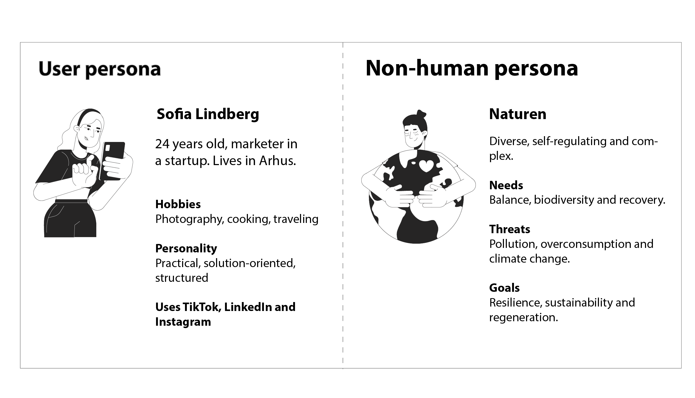
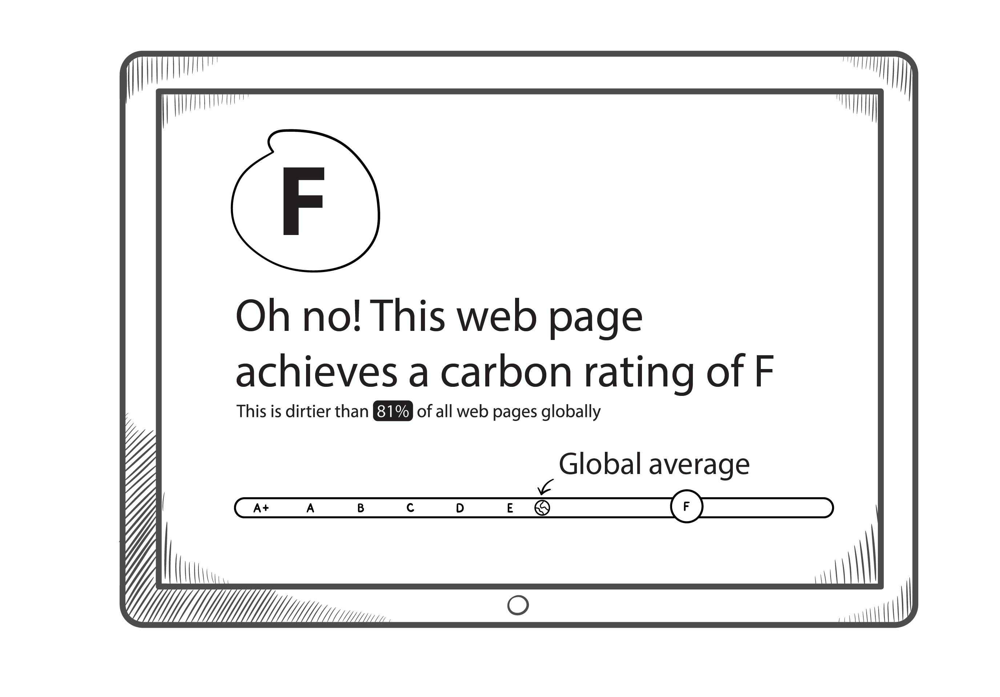

{book: false, sample: false} 
# TODO
- [ ] ...

# 4. Digital design with sustainability

This chapter explores, how to design digital solutions that effectively fulfill their intended purpose while also achieving long-term sustainability, guided by the five dimensions of the Karlskrona Manifesto.

## Design that does good – in the long term

Digital projects typically originate from an idea, evolving through design, engineering, and innovation into tangible solutions or products. 

The design phase offers a unique opportunity to establish many of a product's fundamental characteristics and lay out the groundwork for a digital products entire lifecycle. 

Consequently, integrating sustainability considerations, framed here by the Karlskrona Manifesto's five dimensions, during this early stage is essential. (The five dimensions are: environment, economy, technology, society and individual.)

We have to ensure, that sustainability is an inherent, deeply embedded quality, not merely a superficial layer added retrospectively. It's also often cheaper and more efficient to design a digital product with sustainability built in from the start, than trying to rebuild and retrofit the product with sustainability add-ons later.

When designing and developing new digital products, it is easy to be lost in the technology and be fascinated by the technical possibilities that the project is based, but digital projects are ultimately created for people and with people!

Therefore, the design phase must remain focused on the intended users and their experiences. 

How do people actually interact with the prototypes? Does the solution evoke a sense of genuine value and usefulness ("Wow, that's clever!"), or does it feel like yet another cumbersome system adding friction or monotony ("Oh, another unnecessary system...")? 

Beyond first impressions, designers must ask: Is the initial fascination of the user a lasting value, or can the design produce positive results in the long run? And which side effects would the solution have in the long run?
## Approaches for sustainable design

Digital transformation is the process of integrating digital technologies into all aspects of a business to improve efficiency, customer experiences and innovation. Digital transformation involves a fundamental evolution of business processes, corporate culture and customer interactions in order to gain and maintain competitive advantage. 

Digital transformation can go hand in hand with the green transition, because if we manage to combine the two development approaches, significant synergies can emerge between them. Consequently, the design process for new digital solutions must strive for a dual objective: fulfilling the primary user or business needs effectively while simultaneously ensuring that the solution itself operates sustainably, and that it actively contributes to positive environmental or social outcomes.

Digital design is often "user-centric" and focuses on the users, for whom digital technology can offer great user experiences and better productivity. But when we exclusively focus on the needs of the users in design, we tend to forget about nature, the environment, society and the other dimensions of sustainability. Truly sustainable digital design, therefore, adopts a more *holistic* perspective. 

To explore how we can expand our approach beyond user-centric thinking, let's examine sustainable design frameworks such as _Design for the New World_, _Life Centered Design_ and *Regenerative digital design*.

### Design for the New World: thinking generations ahead

In the first chapter of the book, you could read about the planetary boundaries that human activities are feared to exceed. As a response to this threat, designer Ida Engholm in her book _Design for the New World_ has defined a sustainable approach to design that can change the way we design products - analog and digital (Engholm 2023).

Engholm's sustainable design approach adds an extra, planetary dimension  to the design work, taking into account the earth's ecosystems and future generations. The design approach can lead the way for more sustainable digital development projects, projects that help bring planetary systems into balance. 

However, thinking on a planetary scale can seem overwhelming for us humans, when our task is simply to develop new digital solutions for a company. Nevertheless, it is the way forward, says Engholm. The following figure shows how simple design decisions on a micro level can contribute to the bigger, planetary perspective, with the overall aim of looking after the planet.

 with permission from Ida Engholm.")

In this case, it's a single person (maybe you?) or an organization that replaces a non-degradable plastic component in a product with a degradable one. The difference this single action makes is not easy to understand in the big picture - but it still contributes to "global sustainability" because this plastic component does not end up as waste like many others, but biodegrades and re-enters nature's own cycle. 

The figure makes it possible to understand both the overall context of the planet (e.g. that plastic does not belong in the ocean, as it does not just magically disappear from the oceans), and it is also possible to understand sustainability on a micro level (that we need to use plastic components that can be degraded).

If you think back to the Brundtland Report's definition of sustainability, it is about acting in a way that does not compromise the opportunities of future generations. This mindset is found in Engholm's work, where she is inspired by Native Americans, who have a tradition of considering decisions from a seven-generation perspective. Engholm believes, that we should do the same: design products from a long-term perspective. By zooming out in time and space, we can better understand our product lifecycle and create more circular designs.

While Engholm's comprehensive design approach involves many details beyond the scope of this chapter, several core principles offer valuable guidance for sustainable digital design:

* **Evaluate long-term generational impact:** Consider the potential consequences your product might have for future generations.
* **Adopt a planetary perspective:** Assess how your digital design choices could affect ecological systems at a macro level.
* **Embrace full lifecycle design:** Design with the entire product journey in mind, from resource extraction to end-of-life, aiming for circularity (inspired by concepts like cradle-to-cradle).

While deeply understanding user needs remains fundamental to successful design, integrating these broader generational, planetary, and lifecycle perspectives is what elevates user-centricity into truly responsible and sustainable practice. This holistic approach ensures solutions are not only usable and desirable but also viable in the long term.
### Life-centered design

Another inspiring design approach can be found in the work of Australian designer Damien Lutz. Lutz is an advocate of Life-centered design , which is a design philosophy that, in addition to the needs of users, puts all living things in focus. 

Life-centered design aims to care for all living things and for more biodiversity and more nature as a result of the design process. Lutz's take on a Life-centered digital design practice is to alternate between many different design approaches, depending on the qualities of the design task, in order to truly deliver sustainable results.

In the article "10 life-centred design approaches" ([Lutz 2023](https://uxdesign.cc/10-Life-centered-design-approaches-b0f60ba0e002)) he presents a selection of different approaches that you can have in your toolbox when designing Life-centered. Common to all approaches is that they include the living environment in their design considerations. For example, _circular design_ can be used if you want to take responsibility for a product's life cycle , while _inclusive design_ is the solution if the challenge is to involve as many users as possible in the product, including user groups that are traditionally excluded from using the product.

Building upon these diverse methodologies, Lutz also offers a specific Life-centered Design Framework ([Life-centered Design Lab 2024](https://lifecentred.design/framework/)). At its core, this framework mandates extending design considerations to all affected life and systems, including human users, animals, plants, and overall planetary health, and thereby setting an ambitious and ethically compelling standard. 

Lutz argues that working towards Life-centered design involves grounding the process in three core pillars. The resulting design should strive to be:

* _Inclusive and Pluriversal_
* _Responsible and Aligned_
* _Sustainable and Regenerative_

_Pluriversal_ is a term inspired by the concept of _cultural pluralism_, where different social or cultural groups develop their own tradition within the framework of a common civilization. _Pluriversal_ is Damien Lutz's expression for expanding the traditionally Western-oriented design perspective to include the diversity of the entire planet. The _Inclusive and Pluriversal_ pillar emphasizes creating designs accessible to diverse users, considering varied backgrounds, needs, and cultural contexts. It advocates for reflecting multiple perspectives and worldviews, moving beyond a single dominant viewpoint.

_Responsible and Aligned_ design centers on ethical responsibility. This involves critically assessing the potential social and environmental consequences of design choices throughout the development process and ensuring alignment with broader ethical principles.

Finally, the _Sustainable and Regenerative_ pillar pushes beyond merely minimizing environmental harm. It aims for designs and systems that actively contribute to restoring and regenerating the ecosystems and communities they interact with.

Achieving this broad perspective, Lutz suggests, requires designers to continuously shift their focus — zooming in and out — across three critical scales:

* Local impacts ←→ Global systems
* Immediate user experience ←→ Full product lifecycle
* Historical context ←→ Future consequences

Effective Life-centered design involves balancing these perspectives. It seeks solutions that function appropriately within their local context while considering global implications. Similarly, it requires navigating the potential trade-offs between optimizing immediate user experience and ensuring long-term sustainability across the product's entire lifecycle. This also involves learning from past precedents while explicitly designing for future resilience and adaptation.

While this specific framework is just one model among others, it effectively illustrates key capabilities required of a sustainable digital designer: 

- systemic thinking, 
- a long-term orientation, 
- commitment to circularity, 
- and the ability to consider both individual user needs and broader community or ecological well-being.

By integrating such principles and adopting wider perspectives, we can move towards creating digital solutions that not only address contemporary needs but also contribute positively to a sustainable future for generations to come.

### Regenerative design

The principle of regeneration takes the Life-centered approach further by explicitly adopting regenerative design practices, often inspired by the dynamics of living systems. Regenerative design is about creating solutions that protect, strengthen and regenerate resources rather than simply utilize them.

The goal here moves beyond simply sustaining existing conditions or minimizing harm (doing less bad). Instead, regenerative design actively seeks to create solutions that contributes to the health and flourishing of the interconnected ecological and social systems they are part of, aiming to restore, renew, and revitalize their context. Just like the Japanese football fans leave stadiums almost cleaner after the football matches than before, regenerative design seeks not to spoil, but to intentionally restore and enhance the vitality of the living systems within which it operates.

This philosophy involves understanding and working *with* the principles of living systems, fostering co-evolution between human activities and the natural world, and striving for a net-positive impact – leaving ecosystems and communities healthier and more resilient. 

Applying these principles in the digital realm requires innovative thinking beyond typical efficiency measures. Potential examples where regenerative design could play a role include:
    
- **Data centers as ecosystem contributors:** Designing data centers that actively regenerate native habitats, enhance biodiversity, and reuse waste heat for local community agriculture.
    
- **Software for ecological restoration:** Apps empowering communities and researchers with AI and sensor data to support reforestation, wildlife monitoring, and regenerative agriculture practices.
    
- **Platforms for community resilience:** Digital platforms that strengthen local resilience through sharing economies, mutual aid networks, and preservation of vital indigenous knowledge.
  
- **Regenerative digital architecture:** Explores how architects can use advanced digital tools to embed regenerative principles, creating holistically sustainable buildings ([Naboni & Havinga 2019](https://kglakademi.dk/da/regenerative-design-digital-practice)).

Understanding this potential for digital solutions to actively contribute to regeneration sets a high ambition. With this broader context of potential system impacts in mind, we can now turn to examine how the crucial interface between users and these digital solutions is shaped through User Experience (UX) design.
## User experience (UX) design

User experience (UX) design focuses on creating digital products that provide meaningful and relevant experiences for their users. Working with UX involves gaining insight into user needs and behaviors through empathic analysis, experimentation, and user testing. 

The goal of UX is to make product experiences intuitive, efficient, and satisfying on a technological, economic, and individual level. UX is an effective method for increasing user satisfaction, but it also has the inherent weakness that it can focus one-sidedly on the (selfish) needs of the individual and downplay the sustainability dimensions (e.g. social, economic, or technical) of the product.

UX design uses tools such as *wireframes, prototypes, user testing, personas, user journeys* and other similar tools to understand and improve the users experience. These tools are used to try to predict and model what experiences users expects and appreciates from a product or product portfolio.

"Personas" are fictional characters, that represent typical users and their needs, goals and behavioral patterns, as shown in the left side of above figure. The creation of personas is based on user research and data. These fictional people are described very specifically with name, age, occupation, hobbies and preferences, with the goal of giving the designer an indication of who will interact with the products. Decisions in the design process are continuously weighed up against these personas to assess how the different design initiatives will affect the customers' user experiences.

According to UX designer Sandy Dähnert from the company Green the Web, the basic work with personas can be extended by creating non-human and non-user personas that can represent the sustainability aspects of the product (as exemplified on the right side of the previous figure).  Dähnert has added Mother Earth, a metaphor for the globe, as a persona in his design process ([Dähnert 2021a](https://greentheweb.com/mother-nature-as-a-persona-for-more-sustainability-in-user-research-incl-template/)). The purpose of the exercise is for the designer to test the impact of their design ideas on nature. 

Lutz provides further examples of non-human personas, such as the bees (in danger of extinction), the trees or a child laborer from the third world, exemplified by the persona of Poonam, a 12-year-old child worker ([Lifecentred.org](https://lifecentred.design/non-human-personas/non-human-and-non-user-personas/)).

### Sustainable user journeys
Both Dähnert and Lutz are working to develop, apply and disseminate eco-centered UX methods, another example being sustainable user journeys. The "user journey" is a common tool in the UX designer's toolbox, because it helps to view user behavior from a more holistic perspective and helps to understand how the user interacts with a digital product or a brand through many different touchpoints.

An example of a user journey can take place around an application that a user first sees on a social media (first touchpoint). Then the user will discover the app in ads, after which the user chooses to buy the app from an app store (further touchpoints). The user actively uses the app for some time, after which it is forgotten. After a year of inactivity, the app is automatically uninstalled, and the user journey ends, unless the digital designer adds additional touchpoints to the user journey.

By mapping the user journey through the digital and also analog landscape, designers can gain a better understanding of the user's situation, motivation and needs. Dähnert's innovative idea is to expand the common user journeys with sustainability aspects ([Dähnert 2021b](https://greentheweb.com/environment-centered-user-journey-maps-incl-example-and-template/)). This is done by further analyzing the user's different touchpoints from an ESG perspective and looking at how a given touchpoint affects the environment and society. Dähnert focuses on positive and negative impacts in relation to the environment and society, but we can also extend the analysis to include the sustainability dimensions of the Karlskrona Manifesto.

UX design is about creating meaningful and engaging experiences by deeply understanding user needs and behavior. Sustainable UX design goes a step further and focuses not only on the user, but also on the sustainability aspects of the digital product. 

By extending the UX designer's tools such as personas and user journeys to include sustainability aspects, we open up for a more holistic design process. Although we have only presented sustainable versions of personas and user journeys in this context, the other tools in the designer's toolbox can also have sustainability aspects. These could be wireframes and templates that have inclusive and energy-saving defaults, or user testing that takes into account the entire product lifecycle from cradle to cradle.

These innovative UX approaches show, how common UX tools can be extended to drive user-friendly and eco-friendly solutions and inspire the creation of products that make a difference for both people and the planet.
### Designing with data

Data can be a catalyst for digital sustainability projects. The designers of a project can consider, what data already exists, what data can be collected and what data is not yet available about a project. The more detailed an overview a designer has access to, the more innovatively data can be brought into play. Designing with data can both create economic value, and it can also drive sustainability.

In some contexts, a designer can draw on enormous data sources, which with advanced algorithms and machine learning can provide features to a digital product that would be unthinkable without the designer's in-depth knowledge of relevant data sources. That's why it's beneficial in the design phase of digital products to focus on topics such as:

- _Data discovery_, where we find pre-existing datasets and analyze their relevance to the design project.

- _Data integration_, involving different data sources to get a holistic picture of user behavior and preferences, as well as sustainability aspects of the product.

- _Data wishlist_, describing wishes for new data sources, that can improve the digital product.

- _Data collection_, building mechanisms into the product for continuous (but of course ethical) data collection to continuously improve the product.

- _Internet of Things (IoT_) , which allows large amounts of data to be collected with various digital sensors to improve the product.

Keep in mind, that data collection inherently involves sensitive ethical and practical considerations that demand careful attention in any digital project. Compliance with relevant legislation, such as the EU's General Data Protection Regulation (GDPR) which governs the use of collected personal data, is an important aspect. 

Beyond legal requirements, designers and organizations should adhere to the principle of data minimization, ensuring that only data strictly necessary for the project's goals, is collected.  In addition, the ethical dimensions of data handling must be a priority, with the aim of using data for the benefit of present and future generations, while actively preventing negative consequences. While data analysis is a specialized field, all UX designers have a role to play. They should critically consider how both new and existing data sources can be leveraged responsibly to enhance user experience and advance sustainability outcomes.
## User interfaces and interaction design 

While UX is about understanding user behavior and creating good user experiences, interaction design is about designing good and effective user interfaces (UI). A good user interface makes the experience of a digital product intuitive, useful and engaging. Interaction design incorporates elements of graphic design and adds interaction techniques such as nudging to guide users towards desired actions. 

UX and UI are disciplines that together can create coherent and effective user experiences, combining an understanding of the user with design principles that promote desired behavior. There are several approaches to interaction design that also consider sustainability in design, such as sustainable *interaction design (SID)* or *sustainable HCI (sustainable human computer interaction)*. These directions focus on developing interactive solutions with consideration for environmental and social impacts. 

It's not just about reducing energy consumption or waste, but also about creating systems that support long-term responsible use, promote positive behavioral patterns and contribute to a more sustainable future. What these approaches have in common is that they examine the interaction between people, software and hardware and try to make the interaction as sustainable as possible. 

An example of thinking about sustainable HCI can be found in Eli Blevis' article ([Blevis 2007](https://dl.acm.org/doi/10.1145/1240624.1240705)), in which he discusses sustainable interaction design with a focus on the development, disposal, renewal and reuse of technology. For Blevis, sustainable interaction design must take responsibility for the full life cycle of products , from creation to disposal. This approach is though most relevant if the interaction has a materiality, such as a technological gadget or a touchscreen, that needs to be disposed of, and the approach can only be applied to pure software products to a limited extent.
### Design patterns for web solutions and apps
It's not immediately obvious, how graphical user interface design can be made more sustainable, but this is certainly an area that can benefit from sustainability initiatives. 

First and foremost, designers must be aware of the existence of "dark patterns", which are user interactions that are inappropriate or downright bad. Unfortunately, it is a common practice for digital products to more or less mislead users in order to achieve company goals such as conversions. You would think that this practice is reserved for the most commercial companies, but we have also seen dark patterns in government and non-profit organizations.

Dark patterns, or deceptive patterns, are design patterns that have been developed and reused in many digital products over the years to coerce or incite users into certain situations with certain psychological tricks. Many of these techniques are described in the book _Evil by design_ ([Nodder 2013](https://evilbydesign.info/book/)), which contains a series of dark patterns that can effectively influence user behavior "in the dark", i.e. without the user realizing that he or she is being manipulated. We know many of these sales tricks from the commercial world, but digital products can make the deception even stronger. In the name of sustainability, we must avoid dark patterns - or at least use them ethically.

A concrete example of (sometimes) deceptive design is *infinity scrolling*, which is when a webpage or an app keeps loading more content elements as a user scrolls on the screen. This way, the user can keep scrolling forever - never reaching the end or end of a web page. This can create additional consumption of the given media. That said, the same function can also be used ethically. For example, if you need to browse through many products in a webshop, it's a good feature that you don't have to click "Show more" after every tenth product. It will also make the process clearer if you make the user aware of how many items there are in the feed in total.

Another dark pattern you may have come across in (e.g. in chapter 3) is visual weighting or choice architecture , which many websites use, when the user has to accept their cookies. Here, the website often has an interest in imposing more cookies on the user than is strictly necessary because it serves the company's interests. Therefore, accepting cookies is often graphically designed in such a way that it is cognitively "cheap" to choose the dominant, color-saturated "Allow all" button, while the "Only necessary cookies" option appears as a weaker choice - with smaller font size and less contrast between text and background. However, the same graphical trick can be used sustainably, for example by making the sustainable choice the most visually appealing and easiest option, designers can effectively nudge users towards better decisions for the environment or society.
### Web design and greenhouse gas emissions
Many digital designers are actively exploring how to make their web design more sustainable. It's a significant challenge, and much industry focus centers on reducing the greenhouse gas emissions associated with digital products and services.

While numerous methods for calculating the carbon footprint of digital designs have emerged recently, their results can sometimes conflict, and standardized measurement remains an evolving field. Amidst this complexity, it's crucial to understand where the bulk of energy consumption typically lies. 

Evidence suggests that the energy directly consumed by rendering and interacting with the user interface (frontend) often represents only a fraction of the total energy used by the entire digital solution delivery chain. Significant optimization potential frequently resides within the underlying infrastructure and systems.

Consider visiting a website: data is retrieved from a server, which consumes substantial energy simply by being operational 24/7, regardless of request volume. Added to this is the energy consumed by the network infrastructure (routers, switches, cables) transmitting the data, and the always-on devices at the user's end (like modems and routers). The website appearing on the user's screen is the final step. The user's device (computer, smartphone) also has its own baseline energy consumption, independent of the specific website visited. 

A large portion of the energy consumed during a web request stems from the *backend infrastructure*, network transfer, and device operation – factors largely independent of the frontend's visual design or interactive elements. This means, that while optimizing frontend performance and data transfer is valuable, it likely influences only a minor portion of the total system-wide energy consumption. Understanding the energy consumption in complex systems is key to prioritizing sustainability efforts effectively. 

#### Web Sustainability Guidelines (WSG)
The interconnections between design, development, infrastructure, and sustainability are detailed comprehensively in the [Web Sustainability Guidelines (WSG)](https://w3c.github.io/sustainableweb-wsg/) developed by the World Wide Web Consortium (W3C)[^WSG]. 

[^WSG]: Version 1.0 of this document is still only a draft in 2025 , but the draft already shows good examples of work on sustainability and web design. Find a link to the document at https://github.com/andracs/Sustainable-Digital.

The WSG provides extensive advice and best practices for creating web solutions that are both environmentally sound and socially responsible, aiming to minimize carbon footprints, optimize resource use, and ensure the long-term sustainability of web projects (W3C WSG). 

The specification (still in draft) includes over 90 distinct guidelines covering user experience, web development, hosting, and business practices. While many align with the principles discussed throughout this book, space permits highlighting only key areas addressed by the WSG:

**UX Design**
* Prioritize lightweight designs and concise, well-crafted content.
* Provide clear, intuitive navigation using established, ethical patterns (avoiding dark patterns).
* Utilize design systems to maintain consistency and reduce redundant effort.
* Ensure accessibility (a11y) so that diverse user groups can have positive experiences.
* Implement regular review and usability testing cycles.

**Web Development**
* Optimize codebases by eliminating unnecessary or duplicated code and dependencies.
* Ensure content is accessible, performs well, and provides genuine value to users.
* Critically evaluate the impact and necessity of third-party services and libraries.
* Maintain code quality by addressing errors promptly.
* Develop responsive layouts adaptable to various devices (mobile, desktop, etc.).
* Provide standard metadata files expected by browsers and search engines (e.g., `robots.txt`, `sitemap.xml`).
* Stay current with updated versions of development tools and libraries.

**Hosting, Infrastructure, and Systems**
* Practice resource frugality: choose energy-efficient green hosting and scale resources dynamically based on actual need.
* Optimize all assets (images, scripts, fonts) for efficient delivery. Implement robust error handling.
* Automate repetitive tasks like testing and deployment where feasible.
* Manage data processing and storage thoughtfully, minimizing retention where possible.

**Business Strategy and Product Management**
* Embed sustainability organisationally: designate responsible individuals/teams and provide training.
* Measure impact, set clear sustainability goals, and transparently report progress.
* Foster fair labor practices and consider broader stakeholder benefits. Involve diverse voices in decision-making.
* Apply ethical principles rigorously to data handling and emerging technologies like AI.
* Cultivate an inclusive workplace culture and consider contributing back to open source or relevant causes.

The WSG elaborates extensively on guidelines like these, offering concrete techniques to reduce energy consumption and adopt more sustainable web practices. As web technologies and best practices evolve rapidly, staying informed about current developments is crucial for anyone aiming to make a positive difference through sustainable web design and development. This need for ongoing learning also applies to the topic of the next section: "Tools for optimizing user interfaces".

### Tools for optimizing webdesign
A growing number of online tools allow digital designers and developers to estimate the environmental impact of web designs ([climateaction.tech 2021](https://climateaction.tech/actions/reduce-the-carbon-emissions-of-your-website/)). These tools typically provide automated calculations of factors like CO2 emissions per visit, but it's crucial to understand their limitations: Because standardized methodologies are still emerging, different tools often yield conflicting results for the same website. 

They rely on varying assumptions, data sources (like grid carbon intensity), and proxy metrics (such as data transfer size) which may not perfectly capture real-world energy consumption across servers, networks, and end-user devices. Despite these inconsistencies, several tools offer valuable insights and benchmarks. Some notable examples include:

* [Website Carbon Calculator](https://www.websitecarbon.com/): Estimates CO2 emissions per page view based on data transfer, grid intensity, and hosting type (see Figure 4.3). Useful for quick comparisons and raising awareness.
  
* [Ecograder](https://ecograder.com/): Provides an overall score based on performance (using Google Lighthouse metrics), page weight, user experience factors, and green hosting verification (using CO2.js).
  
* [SiteBeacon](https://sitebeacon.io/) : Offers monitoring to track carbon, accessibility, and performance metrics across all pages of a site based on actual user interactions.
  
* [The Green Web Foundation](https://www.thegreenwebfoundation.org/green-web-check/): Maintains a widely used database to verify if websites are hosted on servers powered by renewable energy.
  
* [Greenspector](greenspector.com): A French solution offering detailed measurement and analysis focused on reducing the energy and resource consumption of web and mobile applications.
  
* [Are my third parties green?](https://aremythirdpartiesgreen.com/): Specifically checks if third-party resources loaded by a page (scripts, fonts, images) are hosted greenly.

Given that these tools employ different methodologies and scopes, their outputs should be seen as *estimates and conversation starters rather than precise measurements* (which we will discuss further in the next chapter). The same website will likely receive different scores depending on the tool used. However, familiarizing oneself with these tools remains valuable for digital professionals. They help cultivate an *optimization mindset* and *identify potential performance bottlenecks or resource-heavy components*, encouraging more sustainable design and development practices.

Some projects take these principles further by implementing carbon-aware design, where demanding UI elements or features might be conditionally loaded based on the real-time carbon intensity of the power grid (using techniques sometimes called graceful degradation under high-carbon conditions). Others are experimenting with off-grid powered websites that run entirely on their own solar or wind power, accepting that they might be offline when renewable energy isn't available.

While exploring these tools and techniques, it's vital to maintain perspective on proportionality. Digital products are complex systems. While optimizing the frontend user interface (UI/UX) is important for user experience, performance, device battery life, and reducing data transfer, its impact on the *total* system-wide energy consumption (including servers, networks, manufacturing) is often proportionally smaller than optimizations made to backend architecture, infrastructure choices, or data management strategies. 

So optimizing UX, UI and web design is part of the green digitalization puzzle, even if it's not where we find the biggest energy savings. However, every small change can contribute to an overall more sustainable digital future. Website accessibility can also be considered as a sustainability metric, and there are also useful online tools, which can help improving the UI for accessibility, such as:

* [WAVE (WAVE Web Accessibility Evaluation Tools)](https://wave.webaim.org/): Scan a website for making it more accessible to individuals with disabilities
  
* [Web Accessibility Evaluation Tools List](https://www.w3.org/WAI/test-evaluate/tools/list/): Online services that help you determine if web content meets accessibility guidelines.

## Nudging: Guiding sustainable user behavior

A prominent user-centered technique in digital design, rooted in behavioral science, is _nudging_ ([DaSilva et al. 2022](https://www.bcg.com/publications/2022/nudging-consumers-to-make-sustainable-choices)). Nudging involves subtly influencing user choices and behaviors through carefully crafted interface elements and interaction patterns, without restricting freedom of choice. By strategically designing user experiences, it's possible to encourage actions aligned with specific goals, including promoting more sustainable or responsible decisions.

Ideally, nudging can function as a positive feedback mechanism, reinforcing beneficial behaviors related to health, finance, or public policy – for instance, by showing comparative energy usage data to incentivize conservation or by making healthier food options more prominent. *However, caution is warranted.* As a discipline derived from behavioral economics, nudging is frequently employed in commercial contexts specifically to steer users towards purchases or behaviors that primarily benefit the business, sometimes encouraging unnecessary consumption. As with dark patterns, this particular technique is not inherently good or bad; its impact depends entirely on how it is applied.

Despite its potential for misuse, nudging can be an ethically justifiable tool when applied transparently to promote genuine sustainability goals. This requires clear communication and ensuring the nudge aligns with user well-being and positive environmental or social outcomes. Examples of such sustainable nudging include:

* Highlighting environmentally preferable products or choices by default.
* Integrating clear, easily understandable sustainability labels (related to energy use, materials, or origin) directly onto product displays.
* Providing user-friendly interface options, like filters, that allow customers to easily identify and select more sustainable choices, such as locally sourced goods.

Nudging is a powerful design technique that steers user behavior. Like dark patterns, it can be manipulative, but it can also be used ethically to promote sustainability by making good choices appealing. This means designers have a responsibility to use nudging wisely for positive results.

## Chapter summary: Expanding the scope of digital design

This chapter investigated the crucial role digital design plays in forging a more responsible and sustainable technological future. 

We reviewed innovative design frameworks, including Design for a New World and Life-centered Design, which challenge designers to embed sustainability considerations into the core of their work. Discussions extended to specific applications in UI design, data-driven design ethics, and sustainable web practices.

A central argument throughout the chapter was that sustainable digital design demands more than surface-level efficiencies; it requires adopting a *long-term perspective and embracing full lifecycle thinking*. The examples demonstrated, that conscious design decisions, even at a small scale, can yield significant differences in the environmental performance of digital solutions.

Moreover, the chapter underscored the importance of ethical design choices, contrasting manipulative "dark patterns" with transparent, sustainable design patterns that respect user agency. This contributes to a critical reflection on conventional user-centered design, acknowledging its tendency to prioritize immediate user needs while potentially overlooking wider environmental and societal impacts. The presented frameworks and tools is to equip designers to expand their practice, moving towards a more comprehensive and genuinely sustainable approach to UX/UI development, rather than just "polishing the surface" of the digital products.

*As we close this chapter, we encourage you to make a difference with digital design pixel by pixel, by making responsible choices in the present to achieve a bright future.*