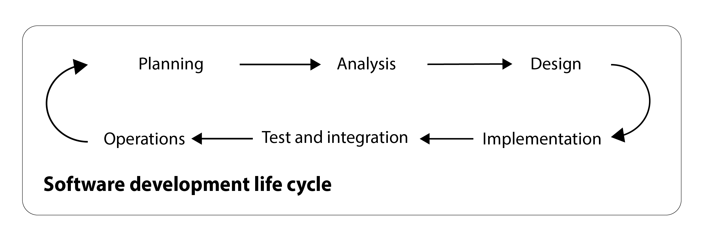
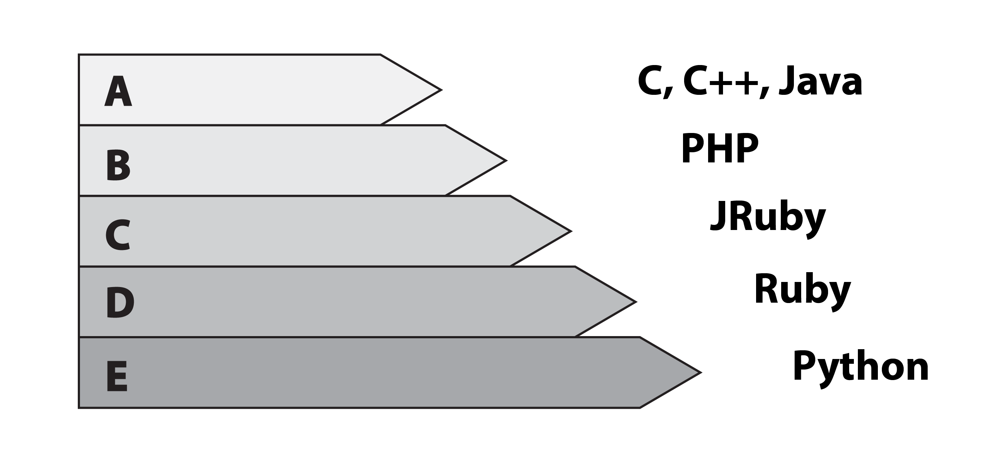

{book: false, sample: false} 
# TODO
- Afsnit om AI 
	- Inkluder denne fra Jesper [AI energy transition oppportunity](https://www.iea.org/news/ai-is-set-to-drive-surging-electricity-demand-from-data-centres-while-offering-the-potential-to-transform-how-the-energy-sector-works) 
	- Og "An_Approach_to_Technical_AGI_Safety_Apr_2025"
	- ![[Pasted image 20250414180450.png]]

# 5. Sustainability as a guiding principle in software development

In the previous chapter, we have seen how digital design is used to conceptualize and develop prototypes and designs for digital products. 

Once digital designers have completed their work in areas such as UX/UI and are ready with the design for new or improved digital systems, there will be documentation on how the solutions should work and the work will move to developers, programmers and software architects. These professionals bring their technical skills into play and program and deploy the desired digital products, digital experiences and/or digital features.

Sustainable software is efficient, long-lasting and has a positive impact on its users, businesses and society in the long term. However, it's not always easy to predict what the consequences of a given software or algorithm will be later on. A good example of unsustainable software is Bitcoin, which was conceived as an alternative, free and decentralized online payment system to challenge the established financial world. It was supposed to make it easy and secure to pay online, but ended up being the preferred means of payment for criminals - which also led to an unparalleled environmental mess.

Bitcoin's negative effects can be traced directly back to the unsustainable choices the developers made when choosing the data structures and algorithms that would make Bitcoin work. First, Bitcoin chose a data structure called _the blockchain_. The blockchain contained a limited number of Bitcoins to begin with, and a proof of work algorithm allowed users to produce (_mine_) new Bitcoins. Each new Bitcoin required more computational capacity than the previous one.

The story goes that Bitcoin's value kept increasing, motivating users to mine more and more Bitcoins, even though it required more and more computing capacity . Eventually, mining new Bitcoins required an outrageous amount of computing power, but building large server farms running on cheap energy from coal power paid off. At one point, the emissions from Bitcoin were equivalent to the entire emissions of Italy. Bitcoin turned out to be a highly unsustainable digital product whose design effectively robbed future generations of opportunity.

Fortunately, data structures and algorithms rarely do as much damage as seen in the Bitcoin example. The production of consumer electronics such as computers and smartphones accounts for the majority of CO2 emissions, while only a small portion of emissions occur while the device is in use. So if we work on sustainable optimization of end-user software to reduce emissions, in many cases we will only adjust the tip of the iceberg.

The situation is different with server systems. These are electronics that need to run day and night, and more of the emissions are linked to the server software. It's also important to keep in mind that good software has the potential to quickly gain global adoption and thus have negative global consequences. Therefore, it's important that software developers focus on their software doing good, also in the long term.

This chapter will help you understand how software can do just that, based on the principles of sustainable software development from the Karlskrona Manifesto.

## Software development life cycle (SDLC)

> Figure 5.1 Software development life cycle (SDLC) is a generic model that describes the typical processes in the development and maintenance of software.

Most well-structured software development projects go through roughly the same phases in their development. The different phases are described in the _software development life cycle (SDLC_) model (Figure 5.1) , which divides the typical software development process into these six phases:

1. Planning and analyzing the problem domain.
2. Design of the digital solution.
3. Implementation, i.e. programming and setup.
4. Test to ensure the quality of the result.
5. Rollout (release), i.e. a commissioning of the solution.
6. Maintenance, bug fixes and usage data collection.

The SDLC model can take shapes other than a circle, and the phases and their order can vary from model to model. Depending on the preferences of the workgroup and the nature of the task, you can jump back and forth between phases. In the _test driven development_ (TDD) methodology you would start by developing tests before deployment, and if you want to create what is called a _minimum viable product_ (MVP) as the basis for the software, you would first implement and deploy a minimal product and then analyze and design the rest of the features based on the experience gained while the MVP is in use.

Common to all software development processes is that when you reach the end of the project and roll out the software to users, the project moves from a development phase to an operations and maintenance phase. This requires very different skills. Now, the focus is on helping users with the product, collecting and correcting any bugs and defects, and understanding and documenting users' wishes for new features for the product. This maintenance phase collects information about how solutions are used and how they work in practice. This information can serve as a starting point for a new version of the software. When you are ready to develop a new version, you start again from the first step of the SDLC, analyze the desired improvements and follow the next phases again.

In the past, it could take many months, even years, to complete an entire cycle from planning to deployment and maintenance. In our connected world, we've become faster at completing these phases because online workflows can automatically test and deploy new versions of software in minutes. This new reality is collectively known as _continuous development/continuous integration (CD/CI_) , which makes it possible to complete an entire SDLC much faster for existing products. You've probably experienced this when your computer updates itself day after day - it's a sign that the developers behind the software have gone through the entire SDLC with new features or fixes.

The CD/CI approach offers great opportunities in terms of sustainability because we can continuously improve the ESG parameters of products and increasingly optimize them with reactive measures. Conversely, this fast pace also poses the danger that there is no time in everyday life to consider the long-term consequences of the various software improvements, so from a sustainability point of view it is important to incorporate ESG metrics into your SDLC.

The software developer has a huge impact on the quality of the final digital product, and it doesn't matter if the algorithms implemented are efficient or inefficient, biased or unbiased, or ethical or unethical. These are crucial choices that programmers, developers and software architects make every day in the course of their work.

## Software energy efficiency

Although all sustainability dimensions are relevant to software development, energy efficiency is often mentioned first in this context. Software should be as energy efficient as possible, both to reduce the environmental impact of using the software, but also to save on energy bills. But how do we know if the software is energy efficient or not? On a general level, we can measure the energy consumption of software in two different ways: during development or during use of the software.

### Trials with accurate energy measurements

The first method is based on a standard computer system where the power consumption is known. By measuring the extra energy consumed when the software is used, you can get an idea of the energy consumption of the software itself. This measurement method is typically carried out in a controlled laboratory environment while the software is being developed and the developers can take the measurements themselves. The results can be used as documentation of the software's energy profile and as a benchmark for further development. The measurement can also be automated and added to the pipeline in the SDLC .

The second method focuses on measuring the energy consumption of systems in production, i.e. systems used in the real world. It is relatively simple to measure the total energy consumption of a system during operation, but much more demanding to isolate how much of this consumption can be attributed to the specific software. On the other hand, this measurement can track the actual energy consumption of the digital solution over time and form the basis for optimization.

As the measurements will often only include the computers that run the software itself and not the devices that interact with the software, there will be many unknowns. As a result, there are very different perceptions of how software plays a role in energy consumption and climate impact.

### Pragmatic energy consumption estimates

On the one hand, it is argued that it is difficult or even impossible to scientifically measure the actual power consumption and CO2 emissions of modern software , because the actual power consumption depends on many different parameters that will always vary in reality. Developers rarely have a say in what hardware their software runs on or what energy sources are used to power the software. Nor do they influence the environment in which the software runs (e.g. which versions of hardware or operating systems are used.) Therefore, attempts to give software a standardized energy label would be misleading because it would only provide very rough (and in practice useless) estimates of energy consumption and emissions.

Roughly speaking, this is the same problem that we know from electric cars. Manufacturers estimate the energy consumption of electric cars using standardized measurements, but the actual energy consumption of the car can turn out to be very different. A car that should be able to travel 400 km on a charge may use twice as much energy on a winter day in headwinds and uphill and have a real range of 200 km. However, the car's energy consumption is still much easier to estimate than the software's because there is only one system - the car itself. Software can run on many different hardware configurations and networks, so it is much harder to estimate accurate consumption and emissions.

On the other hand, there is a more pragmatic approach that believes that environmental impacts can be estimated and reduced by optimizing software code. It is argued that the fewer resources the software itself uses, the less power is needed to run the software and the lower the emissions caused by the software. This assumption will also hold true in the vast majority of cases. As a rule of thumb, the more standardized a software is, the easier it is to determine its actual energy consumption. It can also be said that the more influence we have on how the software runs, the more influence we can have on its energy consumption and greenhouse gas emissions.

### Optimize the environmental impact of software with a lifecycle analysis

So it is difficult to determine the exact energy consumption of a given modern software solution, and there are many different parameters that can be optimized to benefit both the environment and the economy. By performing a _Life Cycle Assessment (LCA_) for the software, informed assumptions can be made about the overall environmental impact of the software throughout its life cycle . The LCA should collect data and estimate the expected energy and resource consumption during the software's life cycle phases: development, distribution, use, maintenance and disposal. You can use dedicated LCA tools, such as openLCA, to assess environmental impacts such as CO2 emissions and resource consumption and identify the most significant environmental impacts (openLCA - the Life Cycle and Sustainability Modeling Suite). Another tool that can be used to measure and reduce the environmental impact of software development and operations is the Green Software Foundation's Impact Framework . By following the framework's guidelines, companies can optimize their energy consumption and minimize CO2 emissions from digital solutions (Green Software Foundation 2024b ).

When it comes to the greenhouse gas emissions of software, _the Software Carbon Intensity (SCI) specification_ is a good place to start. The specification is a tool to calculate the carbon intensity of a software application through a standardized methodology. The specification was developed by the Green Software Foundation, an American non-profit organization, and it achieved ISO standard status in 2024 as a standardized protocol for measuring and reducing the carbon footprint of software (Green Software Foundation 2024a ). SCI is already actively used by several companies to automatically measure software products, among other things. Another solution uses the Green Metrics Tool, which attempts to produce standardized and automated energy metrics for software. You can read about this later in the chapter.

## Ecolabeling of software

In Denmark, we do not have a specific energy classification for software, but Germany already has experience with it. The German Blue Angel is an eco-label that exists for many product groups from textiles to electronic products, including routers and data centers, and not least resource and energy efficient software products (Blauer Engel 2020).

> Figure 5.2 Blue Angel - a German environmental label that can also be awarded to software products. The label signals that the product has been developed with a focus on sustainability and minimal environmental impact. "Good for me. Good for the environment" emphasizes the mutual benefit of the consumer and the environment.

The label, whose logo you can see in figure 5.2, defines energy efficiency in general terms as follows: "A software product should provide its functions with a minimum consumption of resources and a minimum energy demand. The resource and energy efficiency of the software product should be maximized." It is up to developers to interpret and document how their product meets these criteria, and in practice this will vary from project to project. Overall, the Blue Angel label takes a low-level approach to the certification of software products and focuses on three main areas that the software must meet to earn the label:

1. **Resource and energy efficiency**

2. A minimum hardware requirement must be declared for the product.
3. An estimate of energy consumption in sleep mode is defined.
4. An estimate of energy consumption under a typical usage situation is defined.
5. The software must have built-in energy management, which must work optimally with the operating system.

6. **Potential lifetime** **for hardware**

7. Software should not reduce the lifespan of the hardware , but instead continue to function on a given hardware for a long time.
8. Backward compatibility with previous versions must be at least five years.

9. **User autonomy**

a.     Data interoperability - it must be possible to move data to and from the software to other applications.

b.     Transparency of the software product - software APIs must follow open standards and be well documented so that the software can be integrated with or replaced by other solutions.

c.     Continuity of the software product - the software must work securely for at least five years after the time of sale (i.e. it must receive security updates during this period).

d.     Uninstallability - the software must be able to be removed from the computer without a trace.

e.     Offline functionality - the software should remain functional without internet access as far as possible.

f.      Modularity - the software should be modular so that it is possible to turn off unwanted features, for example.

g.     Freedom from advertising - the software must not contain advertising or marketing.

h.     Documentation of the software product, license terms and terms of use.

i.      The software must be provided with documentation of the above conditions, among other things.

The label only looks at the local resource consumption of the computer, so it is only suitable for applications where the vast majority of computing is done on the local computer and not on a remote server. One of the few Blue Angel-labeled software products is the open source program Okular, a desktop application that can display various documents such as PDF, epub and images (Hochschule Trier 2022). Another product that has been certified is the Green Metrics Tool , which helps developers and organizations reduce energy consumption and CO2 emissions from software. It offers automated metrics, dashboards and algorithmic optimization and supports integration into modern workflows with change tracking. The tool is intended to help developers understand and optimize CO2 emissions from digital services.

Ecolabeling and standardization provide developers with good benchmarks in relation to sustainability. We can hope that the future will bring more opportunities to qualify software developers' work with environmental initiatives and sustainability through labeling schemes, standards and best practices. In the meantime, labeling schemes such as the Blue Angel and standards such as the Software Carbon Intensity specification, Web Sustainability Guidelines and SustainableIT Standards can be an inspiration. The latter was developed by a non-profit organization and contains more than 200 guidelines and metrics for sustainable IT, a few of which can also be applied to software development. You can read more about the standard later in this chapter in the section "Optimizing data structures and algorithms".

## Sustainable system development

Systems development is a discipline that uses proven methods such as waterfall, extreme programming or Scrum to develop IT systems. What these methods have in common is that they span all phases of the SDLC and can influence the entire software development process. Therefore, it is essential that we include the aspects from the Karlskrona Manifesto in all phases of the SDLC and reflect on the sustainability aspects of the system development process.

In the first chapter, we have already introduced the five sustainability dimensions of the manifesto, and now we will continue with the manifesto's nine principles for sustainable software engineering (sustainable software engineering). Together, these principles form one of the strongest guidelines available in the field of sustainable software engineering:

_1. sustainability is systemic_. Sustainability is never an isolated phenomenon. Systems thinking must be the starting point for the interdisciplinary common ground for sustainability.

_2. Sustainability has multiple dimensions__.We need to include these dimensions in our analysis if we are to understand the nature of sustainability in a given situation.

_3. Sustainability transcends multiple disciplines_. Working with sustainability means working with people across many disciplines and addressing challenges from multiple perspectives.

_4. Sustainability is a consideration that is independent of the purpose of the system_. Sustainability must be considered even if the primary focus of the system is not sustainability.

_5. Sustainability applies both to a system_ _and its wider contexts_. There are at least two spheres to consider in system design: the sustainability of the system itself, and how it affects the sustainability of the wider system of which it will be a part.

_6. Sustainability requires action on multiple levels_. Some interventions have more impact on a system than others. Whenever we intervene towards sustainability, we should consider alternatives: can action at other levels offer more effective forms of intervention?

_7. System visibility is a necessary precondition that enables sustainability design__._ The status of the system and its context should be visible at different levels of abstraction and perspectives to enable participation and informed, responsible choices.

_8. Sustainability requires long-term thinking_. We should assess benefits and impacts on multiple time scales and include long-term indicators in assessments and decisions.

_9. It is possible to meet the needs of future generations without sacrificing the prosperity of the current generation_. Innovation in sustainability can come from separating the needs of today from the needs of tomorrow. By moving away from conflicting language and tradeoff thinking, we can spot and choose solutions that benefit both the present and the future.

These principles form the foundation of this book's entire approach to sustainable digital development. To support your understanding of the first principle of the manifesto, we have expanded on this in chapter 2 on systems thinking. The five dimensions of sustainability from the second principle of the manifesto were introduced in the first chapter of the book and are used throughout the book. The same goes for the eighth principle, which is taken directly from the Brundtland Report's definition of sustainability. The ninth principle represents the optimistic approach to climate change that we have chosen to follow. The remaining principles have not been given full chapters, but all principles permeate the book's approach to sustainable digitalization.

We recommend that you also use the principles as guidelines for your work. Although originally formulated with a focus on sustainability in software development, they can be applied widely in digital development.

Already in the analysis and planning phase, we can start the work by identifying (or making assumptions about) the sustainability aspects of the system and subsystems. Here you can use the terms and concepts that you read about in chapter 2 on critical systems thinking. Which systems and subsystems can we identify? Where is the boundary between the systems? And how do they interact? What are the inputs and outputs of the systems? What is the context of the systems? What networks can we identify and how do they interact? How will the software and its use evolve over time (decades)? And last but not least: We must also remember to be critical of our own assumptions in order to verify, refine or reject them.

Some of the documents that are typically developed at the start of the SDLC are _requirement specifications_. Here you will typically collect and document functional and non-functional requirements for the digital solution to be developed. Requirements specifications give us a good opportunity to include ESG requirements for the software. For example, you can set requirements that the software must:

- Be written in programming languages and frameworks known for their energy efficiency and low environmental impact.

- Minimize the use of CPU, memory and network resources to reduce overall energy consumption.

- Be optimized to run on servers that use renewable energy.

- Designed to be updated and maintained for many years to minimize the need for new development.

- Run on older hardware and operating systems to extend the lifespan of existing equipment.

- Provide insight into its own energy consumption and environmental impact to enable continuous improvement.

- Encourage its users to make sustainable choices when using the software.

If the software can actually encourage users to make more sustainable choices, it could go a long way. Imagine TikTok being able to suggest that you've watched enough funny videos for today and that you should go for a walk or visit a friend instead (the algorithm should of course suggest a relevant and personalized health-promoting activity that you will enjoy as much as the funny videos). Or imagine that your operating system could have a feature that tracks the lifecycle of your hardware and gives you instructions on how you can actually use your laptop for a few more years or how you can send it for responsible recycling .

Building sustainability into your applications requires careful _ethical considerations_, and often business considerations will overshadow these efforts. TikTok is probably not interested in stopping its users from using the platform, and hardware manufacturers can't sell new devices if we keep using the old ones for too long. Developers also want to monetize their software, and again, only their ethical and moral compass can guide them to balance between economics and sustainability.

You can make a difference in the system development process if you manage to set a sustainability vision for the system or the entire development process. In addition to the topics mentioned above, you can also ask yourself the following questions:

- How do we ensure that the software is viable for a longer period of time?

- How do we ensure security updates far into the future?

- How do we ensure that the system has as little built-in bias as possible and that it does not discriminate against different user groups?

- How do we avoid malfunctioning software?

- How can we ensure that the software is not hacked or misused?

- To what extent can we provide insight into the internal states of the software to better optimize its execution (_observability_)?

- What stories can we tell that show that software is good for the world in the long run?

### Green coding , programming and prompting

After the initial stages of the SDLC, the practical development work, where the solution is programmed, also involves a number of considerations that can promote sustainable digital development. For example, which programming languages to use.

Figure 5.3 Using charts like this (Gordillo et al. 2024), developers can make more sustainable programming language choices based on energy consumption. Low-level languages like C and C++ are the most energy efficient, while higher-level languages like Ruby and Python consume more energy and therefore require extra focus on optimization. Note: Overviews like this are based on estimates and performance can vary significantly depending on language versions and specific implementations.

It doesn't matter which programming language we choose for the purpose. Low-level languages such as C, C++ and Rust are generally the most energy-efficient languages you can work with (see figure 5.3). The widely used multi-platform languages such as C#, Java, JavaScript are less energy efficient, but their energy consumption is not nearly as high as Python and Perl, which in some studies are 70-80 times more energy hungry than C. Measuring the energy efficiency of programming languages is subject to uncertainties, and the various programming languages are optimized and developed very quickly. There are also studies showing that Python is more efficient than C# and Java in some cases (Georgiou et al. 2018).

So don't scrap all Python projects and develop everything in C in the future. Instead, you should seek out current and updated knowledge about the energy consumption of languages and critically evaluate what you find. Nevertheless, the choice of programming language is worth considering, and the same applies when choosing libraries and frameworks for software development, as there can be big differences in the energy consumption of these.

Ole Peder Brandtzæg and his colleagues from Trondheim University have measured the energy consumption of different web frameworks and found that there are significant differences in energy consumption (Brandtzæg et al. 2023). According to the study, the Laravel framework uses three times more energy than ASP.NET Core when set to perform the same tasks. This measurement is also subject to uncertainty and cannot be taken as a general benchmark because frameworks can perform differently depending on setup and usage.

But the rule of thumb applies here too: The smaller the size and complexity of the framework, the more lightweight it is, and the more it is optimized for performance, the less resource consumption you can expect when using the framework. So, as a starting point, it is advantageous to choose optimized lightweight frameworks over larger and more complex solutions. Also in this context, you should seek current and updated knowledge about the specific frameworks you are looking at in order to make assumptions about which frameworks are best for the environment.

### Optimization of data structures and algorithms

Since the early days of computer science, people have had to optimize their code and data to use as few resources as possible, because computing and storage capacity have always been limited resources. In the meantime, the capacity of computers has developed exponentially, and we often have more computing power available than is immediately needed. Nevertheless, it is essential that the developers who program the actual application code optimize the code. Developers also play a key role as they are the only ones who can optimize the data structures and algorithms in the software. Therefore, it is important that they are well trained and have a good knowledge of both current programming practices in general and the specific programming languages they work with.

When it comes to data design, finding the most efficient data formats for the solution, it is important to be disciplined with the amount of data created in the software. Is it really necessary to use a redundant data structure? Do we really need all the data in the software? Research shows that huge amounts of data are created that are not used later and just take up space in the computers. Conversely, you can sometimes create redundant data - just to make it faster and less demanding to retrieve information. In all cases, it is advisable to practice good data hygiene and delete what is no longer needed.

It is also becoming increasingly common for _data to have an expiration time_. It is not only system logs that are deleted after a given time, but personal data should also be removed after a few months if it is not actively in use. It is a good practice to program data structures that have a clear lifecycle with an expiration date and an automated system that cleans up after the expiration date.

The previously mentioned SustainableIT Standards highlight three essential topics data management: data security, data privacy and data utilization (SIT G 210, 220 and 230). For each area, there are specific metrics to measure business performance. _In data security,_ you can look at updating security policies, security incidents and employee training, among other things. _Data protection_ includes control over personal data, complaints about data misuse and stakeholder engagement. _Data usage_ focuses on data usage governance, data breaches and transparency of data usage and its environmental impact. It is important to understand how the software addresses these governance issues.

### The impact of algorithms on user experience

We can develop many different algorithms to solve a given problem, but some algorithms are more demanding than others. _Algorithmic complexity_ can indicate how resource-intensive a given algorithm is. To save resources, programmers should always aim to develop the least complicated algorithms that can still solve the task satisfactorily. _The Big-O notation_ can be used to describe the efficiency of an algorithm, especially in terms of time and space (memory) as a function of input size ( Mala & Ali 2022). Big-O provides an upper bound on how the running time or space consumption of the algorithm grows as the input size becomes large. This knowledge can be used to optimize the algorithms.

However, it's not enough for algorithms to be efficient, they must also be "good and beneficial". Google's old motto, "Don't be evil", also applies to the more complex algorithms. Algorithms should ultimately serve the individuals who use the software. We're not talking about simple sorting algorithms, but more advanced algorithms, such as a _recommendation engine_ in TikTok or Netflix, or a search engine algorithm such as Google or DuckDuckGo's complex search algorithms.

TikTok's algorithm can be optimized to create addiction in its users, but it can also be tuned for more noble purposes, such as educating, motivating and informing its users. A search algorithm can be optimized to highlight certain results with certain agendas or to censor out unwanted content. Algorithms have a lot of power in these cases, which is why they should be developed with the Karlskrona Manifesto and its sustainability dimensions in mind. Algorithms should balance between benefiting the company's economy, the development of society, the environment and the well-being of the individual with the technical possibilities available.

These considerations require thorough discussions during system development - and also during implementation, and unfortunately this aspect of sustainable algorithms cannot be automated. Other, simpler aspects can easily be done automatically in an IDE or a development pipeline. There are several ways to make data and algorithms more sustainable when programming new solutions:

- by raising the knowledge level of developers

- by using development environments that contribute to optimization

- by using pipelines in the SDLC that automate sustainability testing and improvements.

[Link in footnote 25 be active in e-book]

The first is relatively simple. Here, developers need to attend courses or complete online learning programs that target the given technologies. In terms of development environments, developers should use tools in their development environment that can improve code quality in real time while the code is being developed. Finally, you should run your software through customized automatic CD/CI pipelines that automatically add testing, checking and reporting. You can add many different modules to your pipeline, some are commercial, while others are free and open source . For example, you can track how new versions of the software affect resource or energy consumption, how the software complies with certain standards , or what possible security holes there are in the given software version. Automated solutions such as static analysis, automatic code reviews, accessibility testing and model fairness checks (checking for bias in AI models) can ultimately contribute to more efficient and good public good software.

### GREENER - principles of research software

In an article in Nature Computational Science, Loïc Lannelongue and his colleagues from the University of Cambridge have looked at how they can make large and computationally intensive research software tasks more sustainable (Lannelongue et al. 2023). They argue for making environmental sustainability a core element of research that uses large amounts of software resources (HPC , high performance computing). Their work sets out a model for sustainable research software called GREENER .

- _Governance_. All stakeholders have a crucial role in the development of sustainable computing.

- _Responsibility_. Both institutions and individuals should take responsibility for the environmental effects of their research.

- _Estimation_. Environmental impacts need to be estimated in order to spot challenges and make improvements.

- _Energy and embodied impacts_. Calculations should be optimized for both energy consumption and embodied environmental impacts (e.g. water consumption or raw material extraction).

- _New collaborations_. New collaborations to promote low carbon computing and reduce waste.

- _Education_. All stakeholders should be trained to work with sustainability challenges in HPC .

- _Research_. Further targeted research to make research software energy efficient and carbon neutral.

Their argument is that if computer science teams follow the GREENER principles, they can encourage a cultural shift in the research world that will bring the field into a more sustainable practice. In the article "Ten simple rules to make your computing more environmentally sustainable" they propose ten principles that can contribute to Environmentally sustainable computational science (ESCS ), and which to a certain extent can also be transferred to common digital projects:

1. Calculate and document the carbon footprint of your work.
2. Include the carbon footprint in your cost-benefit analysis in software development.
3. Store, repair and recycle devices to minimize electronic waste.
4. Choose your computing facilities wisely.
5. Choose your hardware wisely.
6. Increase the efficiency of the code.
7. Be frugal in your analysis work.
8. Make hardware requirements and carbon footprint clear when releasing new software.
9. Be aware of unexpected consequences of improved software efficiency (such as the rebound effect).
10. Offset (or compensate for) your carbon footprint .

Lannelongue's working group is based in the kind of computationally intensive academic programming discipline where they use high performance computing (HPC ) to run complex calculations on huge amounts of data over long periods of time, so these rules are not necessarily applicable to smaller development projects such as developing simple web solutions or applications. Nevertheless, their ten principles can inspire most software development projects to adopt more sustainable practices - and, who knows, maybe even a cultural shift in the organization in a more future-proof direction.

### Software architecture and design patterns

Software architecture is a discipline that draws the overall lines of larger and more complex software solutions. How should the code be structured? How should the subsystems interact? How can the systems scale? How can the system be made robust, secure and resilient?

Software architects make high-level design decisions and devise how different software components and modules can work together optimally to fulfill the functional and non-functional requirements of software systems. At the end of the day, these design decisions have significant sustainability impacts and should therefore take into account the five dimensions of sustainability. But where is the line between software and hardware platform sustainability? In Figure 5.4, you can see how software sustainability is delineated from infrastructure sustainability.

> Figure 5.4: Responsibility for sustainability is shared between cloud provider and cloud user. The software developer contributes by optimizing code efficiency, deployment, scaling and utilization. At the same time, the cloud provider takes care of "infrastructure sustainability", which includes elements such as electricity, servers, cooling, water and waste. The illustration is from "AWS Well-Architected Framework, Sustainability Pillar", which is Amazon's take on good software architecture. Source: Eisele 2022.

According to Amazon's AWS Well-Architected Framework, good software architecture should be based on expertise, security, reliability, performance efficiency, cost optimization - and new: sustainability (Eisele 2022). The illustration shows the responsibilities of the cloud provider and the cloud user respectively, but it can also be interpreted more generally. One area of focus is the sustainability of the infrastructure itself, which includes power supply, buildings, operations, servers, cooling systems, networks, water supply and waste management. This will often be the responsibility of the data center. The remaining sustainability choices are the responsibility of the software developer and cover topics such as code efficiency, deployment, scaling and software design. AWS' model can help draw a clear division of responsibilities between the data center and its users. Many of the larger cloud providers such as Microsoft Azure or Google Cloud have similar guides for their platform.

One situation that software architects should try to avoid as much as possible is vendor lock-in . If the software architecture is built on a _proprietary technology_ (a unique, branded system ) that only one vendor can provide and this technology turns out to be inappropriate, then you are locked in and cannot switch to other vendors. _Open standards_ and _open source_ can be a solution here, as open technologies make it possible (in theory) to change suppliers and solutions.

_Design patterns_ (software patterns) are another tool in the sustainability toolbox. Design patterns are good, proven solutions to familiar problems that can be reused in similar situations. When a developer or architect says, "Hey, I've seen this technical challenge before and it usually can be solved with...", they are applying a software pattern or design pattern. There are many different design patterns, including design patterns for software architecture (architectural patterns), but in the context of this chapter we are most interested in "green patterns" and design patterns for sustainable software development. The Green Software Foundation is working to collect examples of green software patterns for e.g. web development, cloud and AI in a comprehensive catalog (Green Software Foundation 2024c).

There are a lot of developments happening at the moment when it comes to sustainable software architecture and sustainable software patterns. We encourage you to keep up to date with courses and webinars that focus on green IT and sustainability in software development. Join professional communities and forums where you can share experiences and learn from experts in the field. Read up-to-date blogs and research articles on green software architecture and explore guidelines such as the Web Sustainability Guidelines (WSG) 1.0. Finally, join open source projects focused on sustainability to gain hands-on experience and connect with peers.

### DevOps - where development and operations meet

Developing software and keeping software running requires different skills. Development is about creativity, innovation and the ability to program new solutions, while maintenance focuses on stability, security and continuous monitoring. Where development requires innovation, maintenance requires technical insight and the ability to solve problems quickly. Both roles are essential, but require different skills.

In practice, development and operations have been separate areas in larger organizations, but this is changing_. DevOps_ is a newer approach to software development where development and operations are brought closer together and software developers have more and more influence on the operations of their software and vice versa. This approach is interesting from a sustainability perspective because, in principle, developers can actively choose some of the platforms on which their software runs. With an _infrastructure as code approach_, you can even program your way to the environment on which the code will run. In this mindset, you could imagine writing programs based on guidelines such as

- The program must run in the cloud, close to a given geographical location (so data does not have to be transported far).

- The data center should preferably (or exclusively) run on renewable energy.

- Server instances are precisely and continuously resized to meet current needs based on current and historical usage data.

- The compute-intensive operations should be run at times when compute capacity is cheap (e.g. at night when demand for capacity is low).

- Data that is expected to be used infrequently can be stored on cheaper (but slower) media.

- Certain data elements may have an expiration time after which they are automatically deleted from systems to free up resources.

If developers have influence over operations, they can also demand that the data center compensates for the relevant CO2 emissions (as we saw with Velux in chapter 1). A new and exciting concept to explore further is _energy-aware DevOps_ , which integrates sustainability by creating a _carbon-aware pipeline_ where _builds_ are planned based on the availability of clean energy. This involves adjusting the timing of automated processes to minimize energy consumption and optimize the use of renewable energy sources. By considering energy impact throughout the development lifecycle, DevOps practitioners can contribute to a more sustainable IT infrastructure.

A concrete example of automation that can reduce energy consumption and CO2 emissions from software is the previously mentioned Green Metrics Tool. The tool can be used in software development with automated measurements of energy efficiency, which can help understand how daily code changes affect the software's overall resource consumption. The metrics bring sustainability into the everyday life of the development team.

## Summary: What can you take away from this chapter?

_Sustainable software is_ a difficult concept. How can you even talk about the energy consumption of software when it doesn't use energy itself? Only hardware can use energy, but because it is the software that controls the hardware, software development is well placed to influence the energy consumption of digital solutions through the algorithms and data structures that make up the software. But sustainability is not just about energy consumption, and when it comes to the economic, technological, societal and individual sustainability aspects of software, algorithms play an even more significant role.

The software must "do good" for users, both in the short and long term. The algorithms must not become "evil" and create harmful practices in how the software is used. For example, users expect search engine or AI chat results to be objective and free from errors, untruths or hidden intentions. If this is the case, we can't talk about sustainable software.

System development must promote all dimensions of sustainability - economic, individual, technical and societal - and as a minimum, it must use the ESG criteria to "create good things" and contribute to positive development. The Karlskrona Manifesto's nine principles for sustainable software development can serve as a sustainability guideline for software development work in digital projects.

Sustainable software development is a two-way process where it is important to start with the specific issues that characterize the specific software and the specific SDLC, but it is also advisable to follow proven design patterns for the software architecture and program code.

The standardization and labeling work for digital sustainability is a work-in-progress that is expected to continue over the coming years, and standards and labels such as Blauer Engel, WSG, SCI and SustainableIT are continuously developed to support the work with sustainable software.

When it comes to your work with sustainable software, you can benefit from the approaches you have read in this chapter. In addition, you may also want to refer to the checklists in the book's appendix.

  
{book: false, sample: false} 
# Further notes

[[1]](#_ftnref1) Resources here are _computational resources_, such as computing capacity (CPU, GPU), memory, storage space and network calls.

[[2]](#_ftnref2) Available at

[[3]](#_ftnref3) Find the link to the Green Metrics Tool at [https://github.com/andracs/Sustainable-Digital .](https://github.com/andracs/Sustainable-Digital)

[[4]](#_ftnref4) The five dimensions are: environment, economy, technology, society and individual.

[[5]](#_ftnref5) Integrated development environment (IDE) - an application or collection of applications used to program the software.

[[6]](#_ftnref6) See examples, coding tools and more at https://github.com/andracs/Sustainable-Digital.

[[7]](#_ftnref7) See examples at https://github.com/andracs/Sustainable-Digital.
