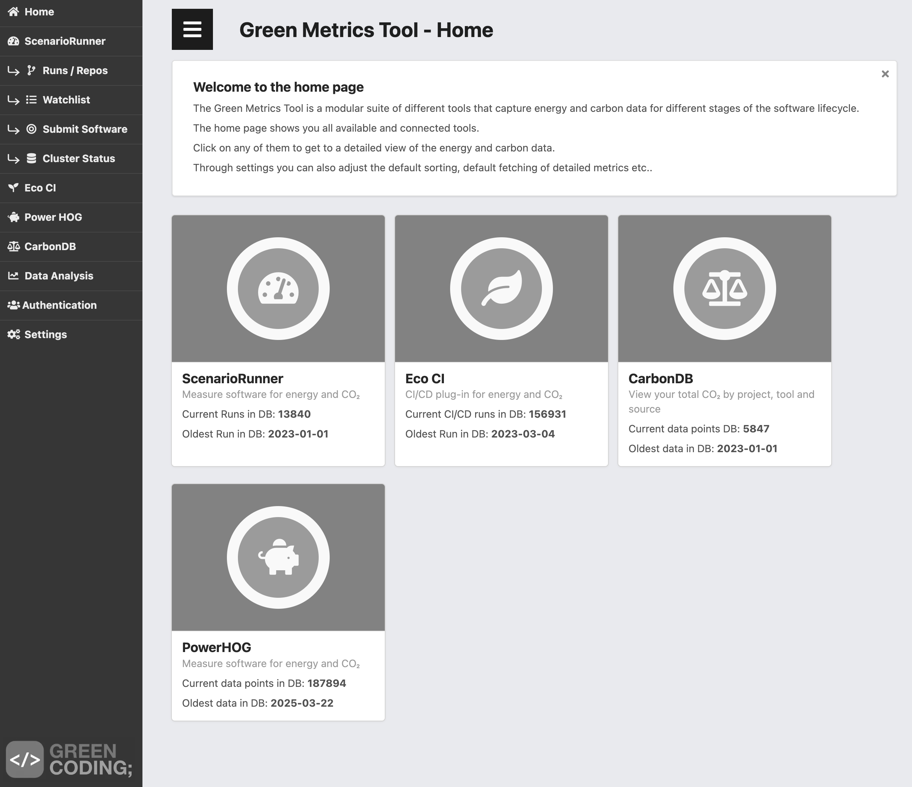
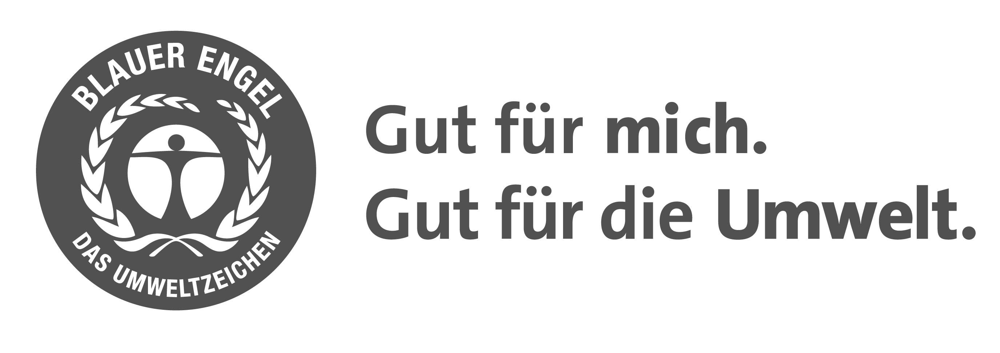
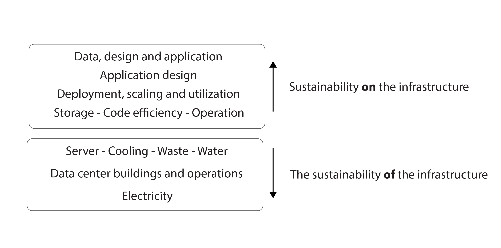

{book: false, sample: false} 
# TODO
- "An_Approach_to_Technical_AGI_Safety_Apr_2025"
	- ![[Pasted image 20250414180450.png]]

# 5. Sustainability as a guiding principle in software development

In the previous chapter, we have discussed, how digital design can be used to conceptualize and develop prototypes and designs for more sustainable digital products. 

Once the digital design work on UX/UI and system specifications is in place, then the focus of the development shifts to developers, programmers, and software architects. These professionals translate design documentation into functional code, deploying the digital products, experiences, and features. Their technical choices, however, carry significant weight far beyond functionality.

Ideally, sustainable software is efficient in its use of resources, designed for longevity and maintainability, and contributes positively to users, society, and the environment over its lifetime (or at least minimizes harm). Predicting the long-term consequences of software and algorithmic choices can be challenging, as illustrated by the example of Bitcoin. Conceived as a decentralized digital payment system to disrupt traditional finance, Bitcoin aimed for ease of use and security. Yet, its trajectory involved widespread use in illicit activities and generated immense environmental damage.

This negative impact stems directly from Bitcoin's initial, fundamentally unsustainable design choices regarding its core algorithms and operational protocols. Bitcoin utilizes the blockchain data structure, and its energy-intensive nature arises primarily from its initial "Proof-of-Work" consensus algorithm combined with a mining process deliberately designed to become increasingly computationally demanding over time. 

As Bitcoin's speculative value rose, the economic incentive to "mine" new coins by solving these computational puzzles intensified, despite escalating energy requirements. This led to the proliferation of vast server farms dedicated to mining, often located where electricity (frequently fossil-fuel based) was cheapest. At its peak, Bitcoin's energy consumption and associated carbon footprint rivaled that of entire countries. Bitcoin's history thus serves as a cautionary tale of how design decisions, amplified by economic incentives, can lead to profoundly unsustainable outcomes with intergenerational consequences.

Fortunately, few applications reach Bitcoin's extreme level of inefficiency. However, understanding where software *does* have a significant operational impact is crucial. For typical end-user devices (computers, smartphones), the manufacturing phase often dominates the lifecycle carbon footprint, meaning software optimizations during use, while beneficial, might address *only a portion of the device's total climate impact.*

The situation differs significantly for server-side software and large-scale systems. These systems run continuously, making the efficiency of the software controlling them a major factor in overall operational energy consumption. Furthermore, successful software can achieve global scale rapidly; if inherently inefficient or designed with negative externalities, its widespread adoption can amplify harm exponentially. This underscores the critical responsibility of software developers *to prioritize long-term positive impact and sustainability in their work.*

Let's delve into how developers can achieve truly sustainable software, exploring practical principles and techniques for sustainable software development, guided by frameworks such as the Karlskrona Manifesto.
## Software development life cycle (SDLC)

 is a generic model that describes the typical processes in the development and maintenance of software.")
As seen on the illustration above, well-structured software development projects follow a similar sequence of phase: the _software development life cycle (SDLC)_ model. The model breaks the software development process into six key stages:

1.  Planning - Defining goals and analyzing the problem domain.
2.  Design - Architecting the digital solution.
3.  Implementation - Writing code and setting up systems.
4.  Testing - Verifying quality and functionality.
5.  Deployment - Releasing the solution for users (rollout).
6.  Maintenance - Providing ongoing support, fixing bugs, and gathering usage data.

While often depicted as a straightforward process, the SDLC isn't always linear; phases can overlap or iterate. Depending on your team's preferences and the project's needs, you might jump between phases. Methodologies like _Test-Driven Development_ (TDD) alter the sequence by having you write tests *before* implementation. Similarly, creating a _Minimum Viable Product_ (MVP) involves deploying a basic version first, then using feedback from real-world use to inform the analysis and design of subsequent features.

Regardless of the specific model, a crucial transition occurs after deployment: the project shifts from active development to operations and maintenance. This phase demands different skills, focusing on user support, bug resolution, and gathering user feedback for future improvements. Insights gained during maintenance often fuel the start of a new SDLC cycle for the next version. When you are ready to develop that new version, you can return to the planning phase, analyze the desired enhancements, and proceed through the cycle again.

Historically, completing a full SDLC could take months or years. Today, automation has dramatically accelerated this, especially for updates. Practices collectively known as _Continuous Development/Continuous Integration (CD/CI)_ enable automated testing and deployment, allowing new software versions or fixes to be released much more rapidly – sometimes multiple times a day. You've likely seen this with frequent updates on your own devices; each update often represents developers completing an SDLC iteration.

This accelerated CD/CI approach presents both opportunities and challenges for sustainability. On one hand, it allows for continuous improvement of a product's Environmental, Social, and Governance (ESG) parameters through ongoing, reactive optimizations. Conversely, this rapid development pace also carries the risk that daily pressures leave insufficient time to fully consider the long-term consequences of software changes. From a sustainability perspective, this makes it crucial to proactively incorporate ESG metrics and considerations into the SDLC.

Ultimately, the choices made by software developers, programmers, and architects profoundly shape the final digital product's quality and impact. It matters immensely whether the algorithms you implement are efficient ← or → wasteful, fair ← or → biased, ethically sound ← or → problematic. These are critical decisions made daily, carrying significant responsibility for the software's broader consequences.

## Energy efficiency of software

While all five sustainability dimensions are relevant to software, energy efficiency often receives primary attention. Ideally, software should consume as little energy as possible, reducing both its environmental impact during use and operational energy costs. But how can we determine if software is energy efficient? Generally, measurement approaches fall into two categories: those performed during development and those tracking software in real-world use.

### Method 1: Controlled energy measurement during development

One method involves running the software on a standardized hardware system with known baseline power consumption. By meticulously measuring the additional energy drawn while the software performs specific tasks, developers can isolate and quantify the software's direct energy profile under controlled conditions. 

This approach is typically conducted in a lab environment during the development phase. The results provide valuable documentation, establish benchmarks for improvement, and can even be automated within a Continuous Integration pipeline as part of the SDLC.

 
Concrete examples of tools aiming to address these measurements include the [_Green Metrics Tool_](https://metrics.green-coding.io/). This is conceived as a collection of tools designed to capture energy and carbon data across different stages of the software lifecycle. As of now, the suite includes several modules:

* _ScenarioRunner_: Measures software energy consumption and related CO₂ estimates for specific execution scenarios.
* _Eco CI_: A plug-in designed for CI/CD pipelines to integrate energy/CO₂ checks into the development workflow.
* _CarbonDB_: Aims to provide a consolidated view of CO₂ emissions broken down by project, tool, or source.
* _Power Hog_: A tool focused on tracking the energy consumption of the local computer running software.
* _Cloud Energy_: Utilizes machine learning models to estimate energy usage specifically for cloud-based workloads.

Other tools in this evolving space are also worth mentioning, such as:

* [_Greenframe_](https://greenframe.io/): A platform often used for measuring the environmental footprint of frontend web applications during development.
* [_Scaphandre_](https://github.com/hubblo-org/scaphandre): An open-source agent primarily focused on measuring server-side energy consumption based on CPU activity (notable for its French origins).
* [_Kepler_ (Kubernetes-based Efficient Power Level Exporter)](https://github.com/sustainable-computing-io/kepler): An open-source project focused on estimating the energy consumption of workloads running within Kubernetes clusters.

### Method 2: Measuring energy consumption in production

Alternatively, monitoring can focus on the energy consumption of systems after deployment, tracking their real-world energy use. While measuring the total energy consumption of operational hardware (like a server) is relatively straightforward, accurately attributing portions of that consumption back to a *specific* piece of software running alongside others remains highly challenging. However, this method offers the advantage of tracking the solution's actual energy footprint over time in its real environment, providing data for ongoing optimization efforts.

### Challenges in measurement and standardization

Both approaches face limitations. Measurements often focus solely on the primary computers running the software, potentially excluding the energy used by interacting client devices or intermediary network components, leading to an incomplete picture. These difficulties in obtaining comprehensive and attributable energy data contribute to widely differing perceptions of software's precise role in overall energy consumption and climate impact.

Furthermore, significant debate exists regarding the feasibility and utility of standardized software energy measurements or labels. One perspective argues that scientifically accurate measurement of real-world software energy use is difficult, perhaps even impossible. This is because actual consumption depends heavily on variable factors outside the developer's control: the specific hardware it runs on (CPU, memory, peripherals), the energy mix of the local grid supplying the power, and the runtime environment (operating system versions, other running processes). Attempting to create a standardized energy label under these conditions, this argument suggests, could be misleading, providing only rough estimates that may not reflect actual usage patterns accurately.

This challenge mirrors, to some extent, the known discrepancies in energy consumption ratings for electric vehicles. Standardized tests provide a baseline energy consumption of the vehicle, but real-world energy use can vary dramatically based on driving style, weather, terrain, and load. However, estimating a car's energy use is arguably simpler than software's, as the car is a relatively self-contained system. Software's variability across countless hardware configurations and network paths makes precise, universal energy estimation far more complex.
### Practical ways to improve software energy efficiency

Since precisely measuring software energy use everywhere is difficult, practical steps are essential to make software use less electricity. A good approach combines two main strategies: monitoring energy use when possible, and continuously focusing on efficient code and resource use.

First, measuring a starting point (an energy baseline) and tracking usage over time can be very helpful. Checking energy consumption during development or testing allows developers to see if new software versions perform better or worse and spot any unintended increases in energy use. Energy measurement tools, which can be built into the regular continuous development workflow (like a CI/CD pipeline), can automate these checks and guide ongoing efforts to save energy.

Second, and perhaps the most practical approach for everyone, is focusing on using fewer computer resources, because this usually means using less energy. Optimizing the software code itself is a key way to reduce environmental impact. The basic principle is solid: software that needs less processing power (fewer CPU cycles, less memory use, fewer data operations, less network activity) often (but not always) requires less electricity to run. This holds true in many real-world situations.

Therefore, 
- actively writing efficient, optimized code,
- minimizing data processing,
- reducing the amount of data transferred,
- and selecting lightweight software frameworks and libraries 
are direct ways to lower energy consumption and emissions. 

Even if it's hard to know the exact energy savings (because software runs differently in different situations), these good development habits consistently lead to less power-hungry software. As a rule of thumb, the more standardized a software is, the easier it is to determine its actual energy consumption. It can also be said that the more influence we have on how the software runs, the more influence we can have on its energy consumption and greenhouse gas emissions.

Recent advancements in AI-based software solutions, like large language models (LLM's) are game-changing for the energy-usage of software. Training AI-models require so much energy, and the AI-industry became so energy-hungry, that new powerplants are built or reopened exclusively for training AI-models. These developments are still evolving when writing this book, but if you want to be updated on how AI-energy usage can be optimised sustainability wise, then try following relevant news outlets, as for example the newsletter or podcast from the [Green Software Foundation](https://greensoftware.foundation/), which often covers new developments in the field. 
### Assessing Software's Impact: LCA and Carbon Intensity
Given the difficulty in precisely measuring the real-world energy consumption of modern software solutions, broader assessment methodologies have to be considered to understand and optimize their environmental footprint. Some key approaches for this are Life Cycle Assessment (LCA) and measuring Software Carbon Intensity (SCI).

_Life Cycle Assessment (LCA)_ provides a holistic view by estimating the overall environmental impact of software across its entire lifecycle. An LCA typically collects data and models expected energy and resource consumption during all phases: development, distribution, use, maintenance, and eventual disposal. 

While complex, this allows for identifying environmental hotspots throughout the software's life. Dedicated LCA software tools, such as the open-source [openLCA](https://www.openlca.org/) platform, can assist in modeling impacts like CO2 emissions and resource depletion based on available data and established methodologies. Complementing LCA, frameworks like the Green Software Foundation's Impact Framework offer structured guidance specifically for reducing the environmental impact during software development and operations ([Green Software Foundation 2024b](https://if.greensoftware.foundation/)).

For a specific focus on operational greenhouse gas emissions, _the Software Carbon Intensity (SCI) specification_ offers a standardized methodology. Developed by the Green Software Foundation (GSF), SCI calculates the rate of carbon emissions produced per functional unit of a software application (e.g., per user, per API call). This focus on *intensity* allows for comparing the relative carbon efficiency of different software solutions or versions performing the same task. Significantly, the SCI specification achieved international recognition as ISO/IEC 23896 in 2024, providing a standardized protocol for measuring software's carbon footprint ([Green Software Foundation 2024a](https://greensoftware.foundation/articles/sci-specification-achieves-iso-standard-status)). Several companies are actively implementing SCI, often integrating its calculation into automated development and monitoring workflows.

## Ecolabeling of software
Formal certifications and ecolabels offer one way to assess and communicate the sustainability attributes of software. The German Blue Angel (Blauer Engel) is a well-established ecolabel covering numerous product groups, from textiles to electronics, and significantly, it also includes criteria for resource and energy-efficient software products ([Blauer Engel 2020](https://www.blauer-engel.de/en/productworld/software)).

The label, whose logo is shown in the previous figure, defines its energy efficiency requirement in broad terms: *"A software product should provide its functions with a minimum consumption of resources and a minimum energy demand. The resource and energy efficiency of the software product should be maximized."* Developers seeking the label must interpret and document how their product fulfills specific criteria, acknowledging that practical implementation will vary. Overall, the Blue Angel certification for software focuses on three main areas:

1.  **Resource and energy efficiency**
    * A minimum hardware requirement must be declared.
    * Energy consumption estimates must be defined for both sleep mode and typical usage scenarios.
    * The software must feature built-in energy management that integrates effectively with the operating system.

2.  **Potential hardware lifetime**
    * Software operation should not prematurely shorten hardware lifespan; it should function effectively on supported hardware for an extended period.
    * Backward compatibility with previous hardware/OS versions should be maintained for at least five years.

3.  **User autonomy**
    * *Data interoperability:* Users must be able to move their data into and out of the software.
    * *Transparency:* APIs should follow open standards and be well-documented, allowing integration or replacement with other solutions.
    * *Continuity:* The software must function reliably and receive necessary security updates for at least five years post-purchase.
    * *Uninstallability:* Users must be able to completely remove the software without leaving residual traces.
    * *Offline functionality:* Core functionality should remain accessible without internet connectivity where feasible.
    * *Modularity:* Users should ideally be able to disable unwanted features or modules.
    * *Freedom from advertising:* The software must not contain embedded advertising.
    * *Documentation:* Clear documentation regarding the software, license terms, usage, and fulfillment of these autonomy criteria must be provided.

A key limitation of this label is its primary focus on the local resource consumption on the end-user's computer. Therefore, it is most suitable for applications where the majority of computation occurs locally, rather than relying heavily on remote servers or extensive network communication.

Illustrating this, one of the few software products certified with the Blue Angel is _Okular_, an open-source desktop document viewer (PDF, epub, etc.) where data  processing only happens on the local computer and not the network ([Hochschule Trier 2022](https://www.umwelt-campus.de/en/forschung/projekte/green-software-engineering/news-details/first-blue-angel-for-software)). Intriguingly, the previously mentioned _Green Metrics Tool_ has also achieved certification; while it analyzes broader system impacts, its own efficient local operation likely meets the criteria. The tool, offering automated metrics and dashboards, aims to help developers understand and optimize CO2 emissions from digital services.

Ecolabeling and standardization provide valuable benchmarks for developers striving for sustainability. While the landscape is still evolving, it is hoped that more opportunities will emerge to formally recognize sustainable software development through robust labeling schemes, standards, and shared best practices. In the meantime, existing schemes like the Blue Angel, alongside standards such as the _Software Carbon Intensity (SCI) specification_, the _Web Sustainability Guidelines (WSG)_, and the _SustainableIT Standards_, serve as important sources of inspiration and guidance. The latter, developed by a non-profit, offers over 200 guidelines for sustainable IT, many applicable to software development (read more about further details on relevant standardslater in this chapter).
## Sustainable system development
Systems development is a discipline that uses proven methods such as the waterfall method, extreme programming or scrum to develop IT systems. What these methods have in common is that they span all phases of the SDLC and can influence the entire software development process. Therefore, it is essential that we include the aspects from the Karlskrona Manifesto in all phases of the SDLC and reflect on the sustainability aspects of the system development process.

In the first chapter, we have already introduced the five sustainability dimensions of the manifesto, and now we will continue with the manifesto's nine principles for sustainable software engineering (sustainable software engineering). Together, these principles form one of the strongest guidelines available in the field of sustainable software engineering:

1. *Sustainability is systemic. Sustainability is never an isolated property. Systems thinking has to be the starting point for the transdisciplinary common ground of sustainability.*
   
2. *Sustainability has multiple dimensions. We have to include those dimensions into our analysis if we are to understand the nature of sustainability in any given situation.*

3. *Sustainability transcends multiple disciplines. Working in sustainability means working with people from across many disciplines, addressing the challenges from multiple perspectives.*

4. *Sustainability is a concern independent of the purpose of the system. Sustainability has to be considered even if the primary focus of the system under design is not sustainability.*

5. *Sustainability applies to both a system and its wider contexts. There are at least two spheres to consider in system design: the sustainability of the system itself and how it affects sustainability of the wider system of which it will be part.*

6. *Sustainability requires action on multiple levels. Some interventions have more leverage on a system than others. Whenever we take action towards sustainability, we should consider opportunity costs: action at other levels may offer more effective forms of intervention.*

7. *System visibility is a necessary precondition and enabler for sustainability design. The status of the system and its context should be visible at different levels of abstraction and perspectives to enable participation and informed responsible choice.*

8. *Sustainability requires long-term thinking. We should assess benefits and impacts on multiple timescales, and include longer-term indicators in assessment and decisions.*

9. *It is possible to meet the needs of future generations without sacrificing the prosperity of the current generation. Innovation in sustainability can play out as decoupling present and future needs. By moving away from the language of conflict and the trade-off mindset, we can identify and enact choices that benefit both present and future.* ([The Karlskrona Manifesto for Sustainable Design](https://sustainabilitydesign.org/karlskrona-manifesto/))

These principles form the foundation of this book's entire approach to sustainable digital development:

- To support your understanding of the first principle of the manifesto, we have expanded on this in chapter 2 on *systems thinking.* 
- The *five dimensions of sustainability* from the second principle of the manifesto were introduced in the first chapter of the book and are used throughout the book. 
- The same goes for the eighth principle, which is taken directly from the Brundtland Report's definition of sustainability. 
- The ninth principle represents the *optimistic approach to climate change* that we have chosen to follow throughout the book. 
- The remaining principles have not been given full chapters, but all principles permeate the book's approach to sustainable digitalization.

We recommend that you also use the principles as guidelines for your work. Although originally formulated with a focus on sustainability in software development, they can be applied widely in digital development.

We can address sustainability early in system development by identifying factors and formulating assumptions for the system and its subsystems during the planning phase. Here we can use the terms and concepts that you read about in chapter 2 on critical systems thinking. Which systems and subsystems can we identify? Where is the boundary between the systems? And how do they interact? What are the inputs and outputs of the systems? What is the context of the systems? What networks can we identify and how do they interact? How will the software and its use evolve over time (decades)? And last but not least: We must also remember to be critical of our own assumptions in order to verify, refine or reject them.

Some of the documents that are typically developed at the start of the SDLC are _requirement specifications_. Here you will typically collect and document functional and non-functional requirements for the digital solution to be developed. Requirements specifications give us a good opportunity to include ESG requirements for the software. For example, one can set requirements that the software must:

- Be written in programming languages and frameworks known for their energy efficiency and low environmental impact.

- Minimize the use of CPU, memory and network resources to reduce overall energy consumption.

- Be optimized to run on servers that use renewable energy.

- Designed to be updated and maintained for many years to minimize the need for new development.

- Run on older hardware and operating systems to extend the lifespan of existing equipment.

- Provide insight into its own energy consumption and environmental impact to enable continuous improvement.

- Encourage its users to make sustainable choices when using the software.

If the software can actually encourage users to make more sustainable choices, it could go a long way. Imagine TikTok being able to suggest that you've watched enough funny videos for today and that you should go for a walk or visit a friend instead (the algorithm should of course suggest a relevant and personalized health-promoting activity that you will enjoy as much as the funny videos). Or imagine that your operating system could have a feature that tracks the lifecycle of your hardware and gives you instructions on how you can actually use your laptop for a few more years or how you can send it for responsible recycling .

Building sustainability into your applications requires careful _ethical considerations_, and often business considerations will overshadow these efforts. TikTok is probably not interested in stopping its users from using the platform, and hardware manufacturers can't sell new devices if we keep using the old ones for too long. Developers also want to monetize their software, and again, only their ethical and moral compass can guide them to balance between economics and sustainability.

You can make a difference in the system development process, if you manage to set a sustainability vision for the system or the entire development process. In addition to the topics mentioned above, you can also ask yourself the following questions:

- How do we ensure that the software is viable for a longer period of time?

- How do we ensure security updates far into the future?

- How do we ensure that the system has as little built-in bias as possible and that it does not discriminate against different user groups?

- How do we avoid malfunctioning software?

- How can we ensure that the software is not hacked or misused?

- To what extent can we provide insight into the internal states of the software to better optimize its execution (_observability_)?

- What stories can we tell that show that software is good for the world in the long run?

### Green coding , programming and prompting
After the initial stages of the SDLC, the practical development work, where the solution is programmed, also involves a number of considerations that can promote sustainable digital development. For example, which programming languages to use.

, developers can make more sustainable programming language choices based on energy consumption. Low-level languages like C and C++ are the most energy efficient, while higher-level languages like Ruby and Python consume more energy and therefore require extra focus on optimization. Note: Overviews like this are based on estimates and performance can vary significantly depending on language versions and specific implementations.")

It do matter which programming language we choose for a given development task. Low-level languages such as C, C++ and Rust are generally the most energy-efficient languages you can work with (see figure above). The widely used multi-platform languages such as C#, Java, JavaScript are less energy efficient, but their energy consumption is not nearly as high as Python and Perl, which in some studies are 70-80 times more energy hungry than C. Measuring the energy efficiency of programming languages is subject to uncertainties, and the various programming languages are optimized and developed further continuously. Python is not an overall-bad-choice energy-wise, because there are also studies showing that Python is more efficient than C# and Java in some cases (Georgiou et al. 2018).

So don't scrap all Python projects and develop everything in C in the future. Instead, you should seek out current and updated knowledge about the energy consumption of languages and critically evaluate what you find. Nevertheless, the choice of programming language is worth considering, and the same applies when choosing libraries and frameworks for software development, as there can be big differences in the energy consumption of these.

Ole Peder Brandtzæg and his colleagues from Trondheim University have measured the energy consumption of different web frameworks and found that there are significant differences in energy consumption (Brandtzæg et al. 2023). According to the study, the Laravel framework uses three times more energy than ASP.NET Core when set to perform the same tasks. This measurement is also subject to uncertainty and cannot be taken as a general benchmark because frameworks can perform differently depending on setup and usage.

But the rule of thumb applies here too: The smaller the size and complexity of the framework, the more lightweight it is, and the more it is optimized for performance, the less resource consumption you can expect when using the framework. So, as a starting point, it is *advantageous to choose optimized lightweight frameworks over larger and more complex solutions*. Also in this context, you should seek current and updated knowledge about the specific frameworks you are looking at in order to make assumptions about which frameworks are best for the environment.

### Benchmarking algorithms and AI
There is a growing number of software benchmarks, which aims to test comparable software solutions. Especially the advent of LLM's has brought a lot of benchmark tools to light, which are helping to compare the models to each other in terms of functionality. These benchmarks can provide a current view on how a given software solutions compares to the available competition.

To measure environmental impact of code and algorithms, tools like [CodeCarbon](https://codecarbon.io/) and [Green Algorithms]() can help to calculate the energy efficiency and carbon footprint of AI models rather than just their performance. Regarding the social and safety aspects are evaluated through benchmarks like [SafetyBench](https://github.com/thu-coai/SafetyBench) and [AccessEval](https://arxiv.org/abs/2509.22703), which test for medical accuracy, harm reduction, and inclusivity toward users with disabilities or different dialects. Finally, ethical alignment is assessed using datasets like [TruthfulQA](https://github.com/sylinrl/TruthfulQA) and [Stanford’s HELM framework](https://crfm.stanford.edu/helm/), which measure a model’s resistance to stereotypes, bias, and misinformation to protect freedom of thought.

### Optimization of data structures and algorithms
Since the early days of computer science, people have had to optimize their code and data to use as few resources as possible, because computing and storage capacity have always been limited resources. In the meantime, the capacity of computers has developed exponentially, and we often have more computing power available than is immediately needed (unless we are working with advanced algorithms like AI/ML or scientific research, which often requires more computing power than available).

Either way, it is essential that the developers who program the actual application code optimize their code. Developers play a key role as they are the only ones who can optimize the data structures and algorithms in the software. Therefore, it is important that they are well trained and have a good knowledge of both current programming practices in general and the specific programming languages they work with.

When it comes to data design, finding the most efficient data formats for the solution, it is important to be disciplined with the amount of data created in the software. Is it really necessary to use a redundant data structure? Do we really need all the data in the software? Research shows that huge amounts of data are created that are not used later and just take up space in the computers. Conversely, we can sometimes create redundant data - just to make things faster and less demanding to retrieve information. In all cases, it is advisable to practice good data hygiene and delete what is no longer needed.

It is also becoming increasingly common for _data to have an expiration time_. It is not only system logs that are deleted after a given time, but personal data should also be removed after a few months if it is not actively in use (as per the General Data Protection Regulation in EU). It is a good practice to program data structures that have a clear lifecycle with an expiration date and an automated system that cleans up after the expiration date.

The previously mentioned SustainableIT Standards highlight three essential topics data management: *data security, data privacy and data utilization* (SIT G 210, 220 and 230). For each area, there are specific metrics to measure business performance. _In data security,_ you can look at updating security policies, security incidents and employee training, among other things. _Data protection_ includes control over personal data, complaints about data misuse and stakeholder engagement. _Data usage_ focuses on data usage governance, data breaches and transparency of data usage and its environmental impact. It is important to understand how our software addresses these governance issues.
### The impact of algorithms on sustainability
We can develop many different algorithms to solve a given problem, but some algorithms will be more efficient than others. _Algorithmic complexity_ can indicate how resource-intensive a given algorithm is. 

To be frugal with resources, programmers should always aim to develop the least complicated algorithms that can still solve the task satisfactorily. The _Big-O notation_ can be used to describe the efficiency of an algorithm, especially in terms of time and space (memory) as a function of input size ([Mala & Ali 2022](https://www.hillpublisher.com/ArticleDetails/831)). Big-O provides an upper bound on how the running time or space consumption of the algorithm grows as the input size becomes large. This knowledge can be used to optimize the algorithms.

However, it's not enough for algorithms to be efficient, they must also be "good and beneficial". Google's old motto, "Don't be evil", also applies to the more complex algorithms. Algorithms should ultimately serve the individuals who use the software. We're not talking about simple sorting algorithms, but more advanced algorithms, such as a _recommendation engine_ in TikTok or Netflix, the *AI-model* in ChatGPT or DeepSeek or a search engine algorithm such as Google or DuckDuckGo's search algorithms.

TikTok's algorithm can be optimized to create addiction in its users, but it can also be tuned for more noble purposes, such as educating, motivating and informing its users. A search algorithm can be optimized to highlight certain results with certain agendas or to censor out unwanted content. A generative AI-model like an LLM can shield users from destructive use cases by applying appropriate safeguards, or it can also give the responsibility for the users to safeguard themselves against malicious results from the LLM.  Algorithms have a lot of power in these cases, which is why they should be developed with the Karlskrona Manifesto and its sustainability dimensions in mind. Algorithms should balance between benefiting the company's economy, the development of society, the environment and the well-being of the individual with the technical possibilities available.

These considerations require thorough discussions during system development - and also during implementation, and unfortunately this aspect of sustainable algorithms cannot be automated. Other, simpler aspects can easily be done automatically in an IDE or a development pipeline. There are several ways to make data and algorithms more sustainable when programming new solutions:

- by raising the knowledge level of developers,
- by using development environments that contribute to optimization,
- by using pipelines in the SDLC that automate sustainability testing and improvements,
- and by using vetted datasets for AI-development .

The first is relatively simple. Here, developers need to attend courses or complete online learning programs that target the given technologies. In terms of development environments, developers should use tools in their development environment that can improve code quality in real time while the code is being developed. Finally, you should run your software through customized automatic CD/CI pipelines that automatically add testing, checking and reporting. You can add many different modules to your pipeline, some are commercial, while others are free and open source. For example, you can track how new versions of the software affect resource or energy consumption, how the software complies with certain standards , or what possible security holes there are in the given software version. Automated solutions such as static analysis, automatic code reviews, accessibility testing and model fairness checks (checking for bias in AI models) can ultimately contribute to more efficient and good public good software.

### GREENER - principles of research software

In an article in Nature Computational Science, Loïc Lannelongue and his colleagues from the University of Cambridge have looked at how they can make large and computationally intensive research software tasks more sustainable ([Lannelongue et al. 2023](https://doi.org/10.1038/s43588-023-00461-y)). They argue for making environmental sustainability a core element of research that uses large amounts of software resources (HPC , high performance computing). Their work sets out a model for sustainable research software called GREENER .

- _Governance_. All stakeholders have a crucial role in the development of sustainable computing.

- _Responsibility_. Both institutions and individuals should take responsibility for the environmental effects of their research.

- _Estimation_. Environmental impacts need to be estimated in order to spot challenges and make improvements.

- _Energy and embodied impacts_. Calculations should be optimized for both energy consumption and embodied environmental impacts (e.g. water consumption or raw material extraction).

- _New collaborations_. New collaborations to promote low carbon computing and reduce waste.

- _Education_. All stakeholders should be trained to work with sustainability challenges in HPC .

- _Research_. Further targeted research to make research software energy efficient and carbon neutral.

Their argument is that if computer science teams follow the GREENER principles, they can encourage a cultural shift in the research world that will bring the field into a more sustainable practice. In the article "Ten simple rules to make your computing more environmentally sustainable" they propose ten principles that can contribute to Environmentally sustainable computational science (ESCS ), and which to a certain extent can also be transferred to common digital projects:

1. Calculate and document the carbon footprint of your work.
2. Include the carbon footprint in your cost-benefit analysis in software development.
3. Store, repair and recycle devices to minimize electronic waste.
4. Choose your computing facilities wisely.
5. Choose your hardware wisely.
6. Increase the efficiency of the code.
7. Be frugal in your analysis work.
8. Make hardware requirements and carbon footprint clear when releasing new software.
9. Be aware of unexpected consequences of improved software efficiency (such as the rebound effect).
10. Offset (or compensate for) your carbon footprint .

Lannelongue's working group is based in the kind of computationally intensive academic programming discipline where they use high performance computing (HPC) to run complex calculations on huge amounts of data over long periods of time, so these rules are not necessarily applicable to smaller development projects such as developing simple web solutions or applications. Nevertheless, their ten principles can inspire most software development projects to adopt more sustainable practices - and, who knows, maybe even a cultural shift in the organization in a more future-proof direction.

### Software architecture and design patterns
Software architecture is a discipline that draws the overall lines of larger and more complex software solutions. How should the code be structured? How should the subsystems interact? How can the systems scale? How can the system be made robust, secure and resilient?

Software architects make high-level design decisions and devise how different software components and modules can work together optimally to fulfill the functional and non-functional requirements of software systems. At the end of the day, these design decisions have significant sustainability impacts and should therefore take into account the five dimensions of sustainability. But where is the line between software and hardware platform sustainability? In the figure below, you can see how software sustainability is delineated from infrastructure sustainability.

According to Amazon's AWS Well-Architected Framework, good software architecture should be based on expertise, security, reliability, performance efficiency, cost optimization - and new: sustainability ([Eisele 2022](https://www.redhat.com/en/blog/sustainable-software-architecture-architects)). The illustration shows the responsibilities of the cloud provider and the cloud user respectively, but it can also be interpreted more generally. One area of focus is the sustainability of the infrastructure itself, which includes power supply, buildings, operations, servers, cooling systems, networks, water supply and waste management. This will often be the responsibility of the data center. The remaining sustainability choices are the responsibility of the software developer and cover topics such as code efficiency, deployment, scaling and software design. AWS' model can help draw a clear division of responsibilities between the data center and its users. Many of the larger cloud providers such as Microsoft Azure or Google Cloud have similar guides for their platform.

One situation that software architects should try to avoid as much as possible is vendor lock-in. If the software architecture is built on a _proprietary technology_ (a unique, branded system) that only one vendor can provide and this technology turns out to be inappropriate, then you are locked in and cannot switch to other vendors. _Open standards_ and _open source_ can be a solution here, as open technologies make it possible (in theory) to change suppliers and solutions.

_Design patterns_ (software patterns) are another tool in the sustainability toolbox. Design patterns are good, proven solutions to familiar problems that can be reused in similar situations. When a developer or architect says, "Hey, I've seen this technical challenge before and it usually can be solved with...", they are applying a software pattern or design pattern. There are many different design patterns, including design patterns for software architecture (architectural patterns), but in the context of this chapter we are most interested in "green patterns" and design patterns for sustainable software development. The Green Software Foundation is working to collect examples of green software patterns for e.g. web development, cloud and AI in a comprehensive catalog ([Green Software Foundation 2024c](https://patterns.greensoftware.foundation/)).

There are a lot of developments happening at the moment when it comes to sustainable software architecture and sustainable software patterns. We encourage you to keep up to date with courses and webinars that focus on green IT and sustainability in software development. Join professional communities and forums where you can share experiences and learn from experts in the field. Read up-to-date blogs and research articles on green software architecture and explore guidelines such as the Web Sustainability Guidelines (WSG) 1.0. Finally, join open source projects focused on sustainability to gain hands-on experience and connect with peers.

### DevOps - where development and operations meet
Developing software and keeping software running are two different things, and hence the two different tasks requires different skills. Development is about creativity and the ability to program new solutions, while maintenance focuses on stability, security and continuous monitoring. Both roles are essential, but require different skills.

In practice, development and operations have been separate areas in larger organizations, but this is changing. _DevOps_ is a newer approach to software development where development and operations are brought closer together and software developers have more and more influence on the operations of their software and vice versa. This approach is interesting from a sustainability perspective because, in principle, developers can actively choose some of the platforms on which their software runs. With an _infrastructure as code approach_, you can even program your way to the environment on which the code will run. In this mindset, you could imagine writing programs based on guidelines such as:

- The program must run in the cloud, close to a given geographical location (so data does not have to be transported far).
- The data center should preferably (or exclusively) run on renewable energy.
- Server instances are precisely and continuously resized to meet current needs based on current and historical usage data.
- The compute-intensive operations should be run at times when compute capacity is cheap (e.g. at night when demand for capacity is low).
- Data that is expected to be used infrequently can be stored on cheaper (but slower) media.
- Certain data elements may have an expiration time after which they are automatically deleted from systems to free up resources.

If developers have influence over operations, they can also demand that the data center compensates for the relevant CO2 emissions (as we saw with Velux in chapter 1). A new and exciting concept to explore further is _energy-aware DevOps_ , which integrates sustainability by creating a _carbon-aware pipeline_ where builds are planned based on the availability of clean energy. This involves adjusting the timing of automated processes to minimize energy consumption and optimize the use of renewable energy sources. By considering energy impact throughout the development lifecycle, DevOps practitioners can contribute to a more sustainable IT infrastructure.

A concrete example of automation that can reduce energy consumption and CO2 emissions from software is the previously mentioned Green Metrics Tool. The tool can be used in software development with automated measurements of energy efficiency, which can help understand how daily code changes affect the software's overall resource consumption. The metrics bring sustainability into the everyday life of the development team.

## Summary: What can you take away from this chapter?

_Sustainable software is a difficult concept_. How can you even talk about the energy consumption of software when it doesn't use energy itself? Only hardware can use energy, but because it is the software that controls the hardware, software development is well placed to influence the energy consumption of digital solutions through the algorithms and data structures that make up the software. 

According to a [major new IEA report](https://www.iea.org/news/ai-is-set-to-drive-surging-electricity-demand-from-data-centres-while-offering-the-potential-to-transform-how-the-energy-sector-works), global electricity demand from data centers is projected to more than double by 2030, driven by the rapid expansion of artificial intelligence. This could be very harmful for the climate, but at the same this development has a significant potential to revolutionize the energy sector by optimizing grid efficiency, enhancing security, and accelerating the transition to renewable energy.

But sustainability is not just about energy consumption, and when it comes to the economic, technological, societal and individual sustainability aspects of software, algorithms play an even more significant role.

The software must "do good" for users, both in the short and long term. The algorithms must not become "evil" and create harmful practices in how the software is used. For example, users expect search engine or AI chat results to be objective and free from errors, untruths or hidden intentions. If this is the case, we can't talk about sustainable software.

System development must promote all dimensions of sustainability - economic, individual, technical and societal - and as a minimum, it must use the ESG criteria to "create good things" and contribute to positive development. The Karlskrona Manifesto's nine principles for sustainable software development can serve as a sustainability guideline for software development work in digital projects.

Sustainable software development is a two-way process where it is important to start with the specific issues that characterize the specific software and the specific SDLC, but it is also advisable to follow proven design patterns for the software architecture and program code.

The standardization and labeling work for digital sustainability is a work-in-progress that is expected to continue over the coming years, and standards and labels such as Blauer Engel, WSG, SCI and SustainableIT are continuously developed to support the work with sustainable software. Benchmarks and comparisons can guide us for choosing sustainable technologies for our soultions. 

When it comes to your work with sustainable software, you can benefit from the approaches you have read in this chapter. In addition, you may also want to refer to the checklists in the book's appendix.

{book: false, sample: false} 
# Further notes

[[1]](#_ftnref1) Resources here are _computational resources_, such as computing capacity (CPU, GPU), memory, storage space and network calls.

[[2]](#_ftnref2) Available at

[[3]](#_ftnref3) Find the link to the Green Metrics Tool at [https://github.com/andracs/Sustainable-Digital .](https://github.com/andracs/Sustainable-Digital)

[[4]](#_ftnref4) The five dimensions are: environment, economy, technology, society and individual.

[[5]](#_ftnref5) Integrated development environment (IDE) - an application or collection of applications used to program the software.

[[6]](#_ftnref6) See examples, coding tools and more at https://github.com/andracs/Sustainable-Digital.

[[7]](#_ftnref7) See examples at https://github.com/andracs/Sustainable-Digital.
