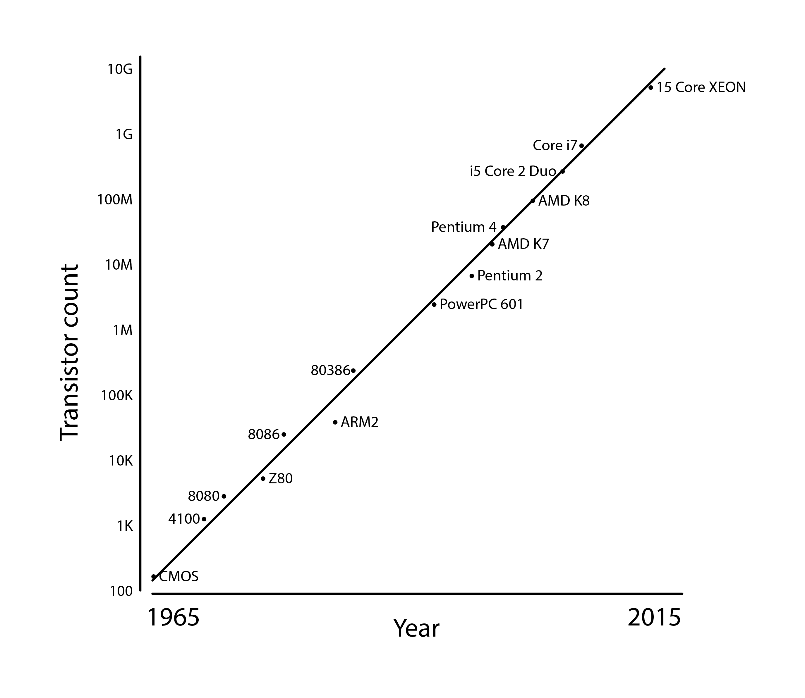
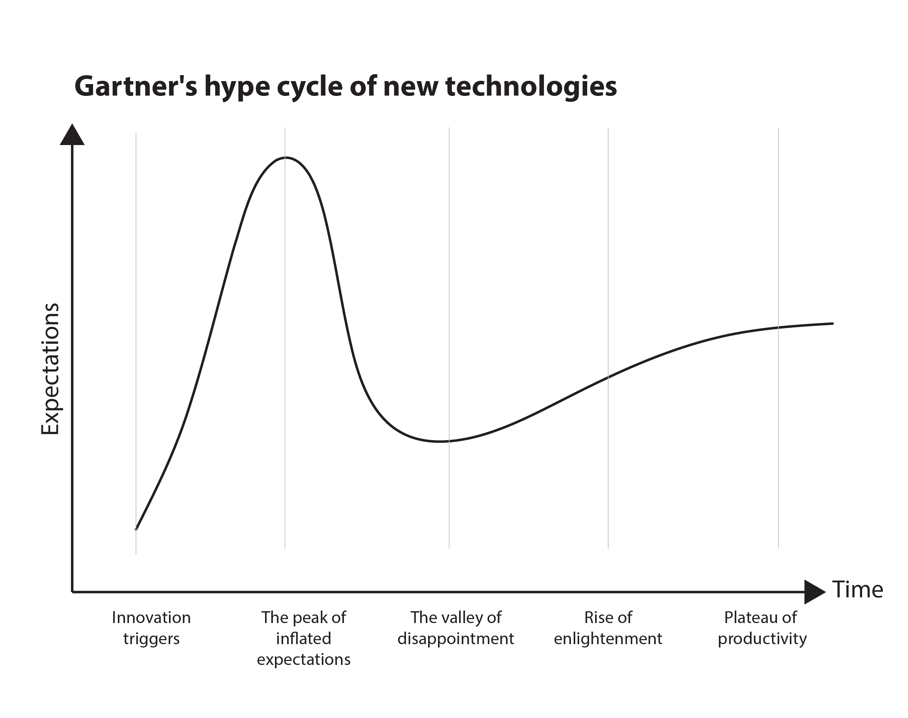
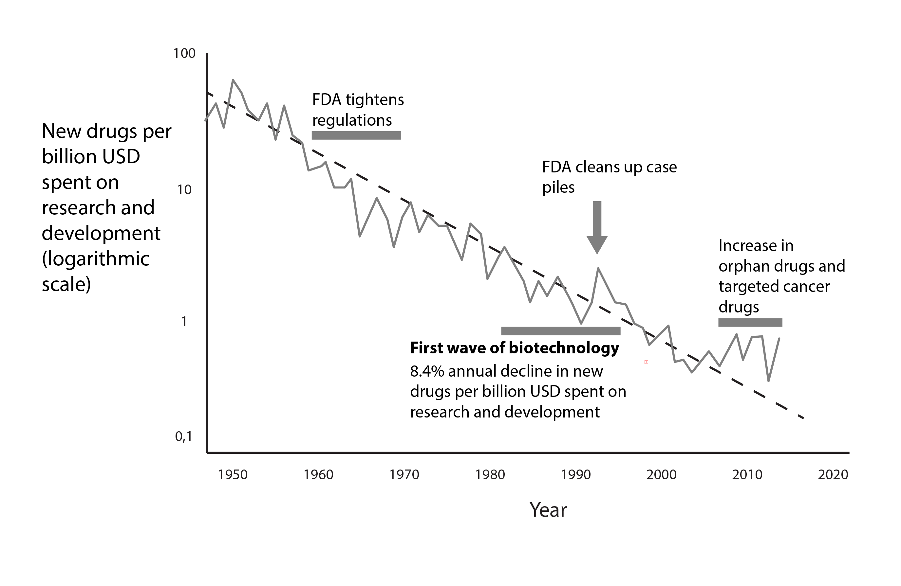

{book: false, sample: false} 
# TODO
- [ ] Sustainability data /opdatere med europæiske low-tech alternativer 
- [ ] Esroom → Plus singularity

{book: true, sample: false} 
# 8. Digital degrowth
It is common for visions of the future of IT to be framed within a growth narrative, i.e. the idea of a constantly increasing access to financial resources, materials for digital production and innovative ideas. Scenarios for the future of IT are based on two very central notions (and figures of thought), both of which are based on an assumed increase in digital potential. Either in the form of expectations of *increased computing power* or in the form of *expectations of increased innovation*, understood as the number of new products, new services, new technologies that the competitive market of the future will produce. 

Both scenarios contribute to the perception that future computing power will be faster, more efficient and will surprise us with new solutions that we currently have only limited and poor ideas about. Both are based on historical development and a correspondingly valid experience that the development curve in IT has been moving steeply upwards for many decades. In the following, we focus on different approaches to IT development that think alongside, outside or against that narrative, or that think IT development independently of those logics. We gather these alternative approaches under the umbrella of *degrowth*. Degrowth or counter-growth is the umbrella category for a number of sustainability initiatives in different domains, such as recycling, permaculture, upcycling, etc. In IT, these approaches share a focus on repairing existing equipment, on minimal use of energy and processing power and apply principles that are compatible with being an ethical consumer or producer - a perspective explored at book length in Neil Selwyn's *Digital Degrowth* ([Selwyn 2025](https://www.politybooks.com/bookdetail?book_slug=digital-degrowth-radically-rethinking-our-digital-futures--9781509563272)).

The discussion of IT's own sustainability - i.e. its carbon footprint and resource consumption - has been overshadowed by notions of the sustainability benefits that IT is thought to be a precondition for, or a facilitator of. Digitization is often an important component in notions of *green growth*, a term that refers to contributing to the green transition while securing new jobs, wealth and growth. This notion gained momentum during COVID-19, with 2020 seeing the largest global drop in CO2 emissions since World War II ([Le Quéré et al. 2020](https://www.nature.com/articles/s41558-020-0797-x)). This has created optimism that digitalization - such as virtual workspaces that don't require traveling to meet - can help achieve sustainability goals. 

Green growth has gained considerable popularity among many politicians and in global institutions. For example, the OECD describes the following: "The increased digitalisation of energy-intensive sectors holds promise to increase the energy efficiency and sustainability of many economic and social activities. At the same time, digital technologies may increase energy and resource demands associated with ICT production and use, offsetting some of the environmental gains they can bring." ([OECD](https://www.oecd.org/en/topics/sub-issues/inclusive-green-and-digital-transformation.html))

The EU also sees digitalization as an important tool to reduce our carbon footprint: "Bringing digital into our lives helps us reduce our carbon footprint. We can participate in video conferences instead of traveling to meetings, monitor how much energy our homes use, and even increase the sustainability of agriculture." ([European Commission 2024a](https://digital-strategy.ec.europa.eu/en/policies/green-digital))

Critics of green growth, however, point to a problem with this approach: by always focusing on "green" technological solutions that are not yet fully developed to reach the set climate goals, politicians can opt out of unpopular, expensive and potentially system-changing measures to solve the ecological crises, nationally and internationally. Reviewing the empirical evidence, Hickel and Kallis conclude that an absolute decoupling of economic growth from resource use is unlikely to happen fast enough - and that green growth may be a misguided objective altogether ([Hickel & Kallis 2020](https://doi.org/10.1080/13563467.2019.1598964)).

In this chapter, we discuss different directions in IT and computer science that focus on the sustainability of IT itself. There are many terms for movements that have this focus - these are what we call lo-fi directions. But before we delve into the different approaches that don't rely on optimistic projections of developments observed in the past, let's take a look at two incredibly influential models that are often used to interpret IT development: *Moore's Law* and *Gartner's Hype Cycle*.

 
Moore's law, shown in the figure above, stems from Gordon Moore's 1965 observation that the number of transistors in microchips doubles at a regular pace - roughly every two years in the commonly cited version ([Britannica 2024](https://www.britannica.com/technology/Moores-law)). Moore's law is therefore often summarized as computing power doubling every couple of years. This leads many to assume that the current trend of ever-increasing production and consumption will continue. This assumption is perhaps not surprising as computers as we know them have only been around for 80 years, during a period of remarkable industrial and technological development. But humanity has already crossed some boundaries on a planetary level. 

Moore's Law has for decades fueled imaginative notions and speculation about what computers will look like in the future and what we can do with them - driving visions of "Smart Cities", "Smart Buildings" and "Smart Homes" - which rely on smart things (IoT). While there are significant sustainability gains to be made in some of these solutions, they rely on notions of intense use of microchips on an exponentially larger scale than is currently the case - and often to support various forms of 'consumer convenience' rather than to solve problems to achieve the Paris goals. In addition, there are significant environmental issues associated with extracting materials, cooling data centers, and consuming clean energy that could replace black energy consumption in the transportation sector, for example.

 

Moore's Law looks at a development within a historical context and elevates it to a law that determines the future - it is an expression of technodeterminism, the idea that the future will almost certainly be far more digital than it is today. Another model that does the same, but in a different way, is Gartner's Hype Cycle ([Gartner 2024](https://www.gartner.com/en/research/methodologies/gartner-hype-cycle)), shown in the figure above. Gartner's model interprets all technology in light of its position on a curve containing the following points: Innovation trigger - Peak of inflated expectations - Trough of disillusionment - Slope of enlightenment - Plateau of productivity. The message of the model is that technologies will always excite us until the hype dies down. Then there comes a time when we get smarter until the technology stabilizes at a productive level. In this sense, one could say that blockchain technology is currently in the trough of disillusionment, but that we are getting smarter and that blockchain will eventually become a productive technology. 

The problem is that the model doesn't account for all the technologies that died instantly (even if they contained interesting innovation), those that were rejected, or those that were adopted and loved by everyone from the beginning (the radiator for example). Gartner's Hype Cycle is thus also a deterministic model, and although it is widely used, it is not very useful when you want to take a sober look at technology development. Perhaps it's time to start cultivating non-growth-related future scenarios and explore how to address technical challenges in computing research and practice that are not based on ideas of constant growth.

## Eroom's law
Sometimes Eroom's law ("Moore" spelled backwards) is brought up as an example of how technology investment does not necessarily create growth: as you can see in the figure below, the number of new drugs approved per billion dollars of research and development spending has halved roughly every nine years since 1950, despite more and more investment (including in digital technology) being allocated to the field ([Scannell et al. 2012](https://doi.org/10.1038/nrd3681)). So there is not necessarily a causal link between technology investment and increased output of innovative products. There are many good reasons for this: problems are solved, treatments become more effective and patients become healthier. Similarly, digitalization may have already "solved" a number of problems that further digitalization cannot make more efficient, no matter how great the processing power becomes.
 

The opposite figure of thought is the *technological singularity*: the idea, popularized by futurists such as Ray Kurzweil, that exponential growth in computing will eventually produce self-improving artificial intelligence and a runaway acceleration of progress that solves our problems for us - including, presumably, the climate crisis. The current AI boom has given this narrative new momentum. From a degrowth perspective, the singularity deserves the same skepticism as Moore's law, of which it is essentially the eschatological version: it treats an extrapolated curve as destiny. In nature and in technology, exponential curves tend to turn out to be S-curves that flatten when they meet physical, economic or social limits - and Eroom's law reminds us that more investment does not automatically buy more breakthroughs. Perhaps most importantly, the singularity narrative is used to justify very real resource claims today - gigawatt data centers, chip factories, water and minerals - in exchange for speculative abundance tomorrow. A sustainability practitioner should treat such promissory notes with care.

## Low carbon and sustainable computing
A research group in Glasgow called "LOCOS" - short for "Low Carbon and Sustainable Computing" - is focusing on how to reduce computer-related CO2 emissions ([University of Glasgow 2024](https://www.gla.ac.uk/schools/computing/research/researchthemes/lowcarbon/)). According to them, there is a risk that by 2040, computers alone will generate more than half of the emissions acceptable to keep global warming below 1.5°C. This growth from computers is of course unsustainable. That's why we need frugal computing, an approach that aims to achieve the same results with less energy.

Emissions from computer production exceed the emissions from operating them, so even if devices become more energy efficient, producing more of them will exacerbate the emissions problem. Therefore, the argument goes, the lifetime of computers must be extended. The research team presents visions for low-carbon and sustainable computing that are simple but ambitious:

- Extending the lifetime of devices and increasing their capacity - without increasing energy consumption and solely through advances in computer science, i.e. better algorithms, better software design, better programming languages and compilers etc.
- In the meantime: Developing the science and technology for the next generation of devices designed for energy efficiency and longevity through pervasive hardware-software co-design.
- Extending each subsequent cycle to develop computing resources that last virtually forever and use very little energy. ([Vanderbauwhede 2023](https://arxiv.org/abs/2303.06642))

For that vision to be realized, various barriers must be overcome:
- Software must be designed to support long-life devices.
- Software engineering strategies are needed to deal with extended software lifecycles and especially technical debt.
- Longer lifespan means more opportunities to exploit vulnerabilities, creating a need for better cybersecurity.
- New approaches need to be developed to reduce the overall energy consumption of the entire system.

## Computing within Limits
One group that shares the Glasgow group's vision is "Computing within Limits" (LIMITS) - an international research community and workshop series, running since 2015, that explores how computing can support human and ecological well-being within real-world limits on energy, materials and a stable climate.

Important literature for the LIMITS group is Eli Blevis' "Sustainable Interaction Design" ([Blevis 2007](https://doi.org/10.1145/1240624.1240705)), which focuses on the material consequences of interaction design. Other early articles that sparked interest among LIMITS researchers were Jeff Wong's "Prepare for Descent: Interaction Design in Our New Future" (Wong 2009) and Silberman and Tomlinson's "Precarious Infrastructure and Postapocalyptic Computing" (Silberman & Tomlinson 2010). These articles drew attention to the challenges of sustainability and the lack of focus on physical, material and energy limits in interaction design. The LIMITS group emphasizes the activation of long-term returns and seeks to align its efforts with the science documenting global climate-related change. LIMITS seeks to explore ways in which digitalization can support long-term well-being ([Nardi et al. 2018](https://dl.acm.org/doi/10.1145/3183582)). 

## Permacomputing
Permacomputing asks the question: "Is there room for computing and networking technology where humans contribute to the well-being of the biosphere, instead of its destruction? If so, how?" ([Permacomputing 2024](https://permacomputing.net/permacomputing/)).

As the name suggests, the group is inspired by permaculture (from "permanent agriculture"), a set of principles of agriculture that defines itself in opposition to industrial agriculture. Permaculture focuses on regenerative agriculture, rewilding, social resilience and a holistic systemic approach. It is not clear if the answer to the above question is a resounding yes, but it appears that the path there is through radical reduction of wastefulness and a change in attitudes. Permacomputing has no desire to return to the past, but to explore the aesthetics and culture that could make digitalization a transformative force.

Permacomputing tries to translate principles from agriculture to computers, and this results in the following advice:

- Take care of life.
- Take care of the chips.
- Keep it small.
- Hope for the best, prepare for the worst.
- Keep it flexible.
- Build on solid ground.
- Amplify awareness.
- Expose everything.
- Respond to changes.
- Everything has a place.
  
The following characterize systems built according to permacomputing principles. They are:

- Accessible: well documented and adaptable to individual needs.
- Compatible: works on a variety of architectures.
- Efficient: uses as few resources (power, memory, etc.) as possible.
- Flexible: modular, portable and adaptable to different use cases.
- Resilient: repairable, descent-friendly, offline-first, low maintenance, designed for disassembly and planned for longevity.

Whether digital technology can play a role in the society of the future is for the people behind Permacomputing both a practical and a utopian question. The practical focus is about thinking wisely with materials, power consumption, etc. The utopian part of the project is about exploring whether it is possible to apply principles of digitalization that require fundamentally new perspectives, methods and ideas.

"Freewheeling apps" is a project developed in the spirit of permacomputing and is described as a sustainable platform for the future of software. They are small programs that are: "Easy to download. Easy to run. Easy to modify. Easy to share" (Freewheeling Apps n.d.). They are also apps that are free, open source and rarely need updating. The programs do not require an installation process but can be run directly and their source code is transparent - you can always peek into the running app. The programs available for download are small word processing and image editing programs.
## A solar-powered website
Another example of a low-tech and minimalistic approach is described in Roel Roscam Abbing's article "This is a solar-powered website, which means it sometimes goes offline" ([Abbing 2021](https://doi.org/10.21428/bf6fb269.e78d19f6)). In the article, he describes how counter-growth principles can be used as a design guide for ICT systems with limited energy resources. The website doubles as the online home of Low-tech Magazine, whose founder and editor Kris De Decker explores the intersection of new and old technologies. De Decker believes that "interesting opportunities arise when we combine old technology with new knowledge and materials, or when we apply old concepts and traditional knowledge to modern technology" ([Low-tech Magazine](https://solar.lowtechmagazine.com/about/)).

In the article, Abbing walks through the process of building a solar-powered website (and the challenges associated with spreading the kind of sustainability that the site exemplifies), an innovation project that uses energy scarcity as a creative challenge - and which Abbing describes as a "design provocation". The website (which is also the Lowtech Magazine site) was developed in 2018 and is online at the time of writing. It has approximately one million unique visits per year and is built on available web server technologies. Knowledge about the techniques needed to build the solution was found on the open internet (e.g. blogs and websites). The research phase aimed to find a "holistic strategy to radically reduce website energy consumption through a combination of graphical, technical and conceptual approaches" ([solar.lowtechmagazine.com](https://solar.lowtechmagazine.com/)).

The resulting design is a static website (where the conditions under which the website is developed are a central part of the communication) hosted on low-power hardware with a low-power chipset originally developed for smartphones. It consumes a maximum of 2.5 Wh. The system is powered by an off-grid solar system in Barcelona and the solar array consists of a 30W solar panel and a 168 Wh lead-acid battery. At maximum power consumption, the battery is discharged after three days. If it's been cloudy for a week, the system shuts down until the sun returns.

The website content itself has been made as lightweight as possible. Images are only loaded when they are actively downloaded, are duotone (in two colors) and rasterized - meaning pixels are removed from them. But what is Abbing's overall conclusion of the project?

- Building this kind of website requires expert technical knowledge.
- It scales poorly - the more users, the more energy it uses, the more often it will be unavailable.
- The website does not use a database, which makes interaction with users difficult.

But: It opens up new ideas on how to create technical systems that are designed to become inaccessible when certain energy thresholds are exceeded.

## Convivial computing
Convivial computing is inspired by philosopher and educational thinker Ivan Illich (1926-2002). In his 1973 book *Tools for Conviviality*, he calls for people to limit themselves in their technology development. That is, they focus on making technology less sophisticated, so that not just a few experts can operate, develop and repair it - in other words, make the operating principles of technology understandable and simple for the user. When repairing technology requires expert knowledge, it necessarily leads to a social imbalance in who has power and who is dependent on others. This requires a willingness to rethink programming and make programming activities more inclusive and collaborative - for example, by involving people with different technical backgrounds ([Kato & Shimakage 2020](https://dl.acm.org/doi/10.1145/3397537.3397544)). 

In other words, it is an approach to digitalization that will give control back to citizens and consumers instead of storing algorithmic processes in black boxes that only a minority have insight into and can control. Digital technologies becoming convivial and welcoming enables repair and increases the sense of autonomy and authority - as opposed to the powerlessness and disconnection citizens can experience when they come into contact with large, bureaucratic and centralized IT systems. Thus, there is both a green and a socially sustainable aspect to convivial computing.

## Junkyard computing
The concept of junkyard computing ([Switzer et al. 2023](https://dl.acm.org/doi/10.1145/3575693.3575710)) relates to a number of other recycling approaches (a "junkyard" is a scrapyard). An article from 2023 sheds light on the resource of unused smartphones lying in drawers: "1.5 billion smartphones are sold every year and most are taken out of use less than two years later. The majority of these unwanted smartphones are neither discarded nor recycled, but are lying around in drawers and storage units." This computational stockpile represents significant wasted potential: Modern smartphones have increasingly efficient and energy-efficient processors, extensive networking capabilities and reliable built-in power supplies.

At the University of California, San Diego, researchers are working on junkyard computing in a project that aims to recycle unwanted smartphones ([Switzer et al. 2023](https://dl.acm.org/doi/10.1145/3575693.3575710)). The data warehouse of unused smartphones represents enormous potential. The group's research focus is to find out how to transform a user-optimized, interactive device into a reliable device capable of long-term, unattended operation, for example in the form of web servers, wildlife monitoring sensors or small mobile data centers. The group is developing methods to measure production and operational costs, linking these to economic models and creating a roadmap with old electronic devices. The project tests the ideas on a large scale to empirically establish how to use phones as computers and phones as sensors.

## European alternatives: open source and digital sovereignty

Degrowth thinking in IT is not only about hardware and energy - it is also about who controls the digital infrastructure we depend on. Most of the services that dominate European digital life are operated by a handful of non-European hyperscalers, whose business models are built on the growth logic and attention economy criticized throughout this book. In recent years, *digital sovereignty* - the ability of individuals, organizations and states to control their own digital destiny - has therefore become a sustainability argument in its own right: dependencies are fragile, and fragile systems are not sustainable.

A growing ecosystem of European, open source alternatives shows what a more sufficient digital infrastructure can look like. *Mastodon* and the wider Fediverse offer decentralized social media without engagement-optimizing algorithms or advertising - servers are run by communities and institutions, and the underlying protocol is an open standard. *Nextcloud*, developed in Germany, provides self-hosted file sharing, documents and calendars as an alternative to the American office clouds, and is used by public administrations across Europe precisely for sovereignty reasons. Both run happily on modest, even refurbished hardware - which connects them directly to the junkyard and permacomputing ideas above.

These alternatives embody several degrowth virtues at once: they are convivial in Illich's sense (understandable, repairable, community-governed), they avoid the attention economy that chapter 7 criticized, and they decouple useful digital services from the imperative of endless scale. They are not always as polished as their commercial counterparts - but as with the fair mouse in chapter 6, the point is not perfection. The point is demonstrating that another digital infrastructure is possible.

## Degrowth and the AI boom

No contemporary technology embodies the growth narrative more completely than artificial intelligence. The "scaling laws" of AI - the observation that models become more capable as compute, data and parameters grow - function rhetorically as a new Moore's law: an extrapolated curve treated as destiny, justifying an unprecedented buildout of data centers, chips and energy infrastructure (see chapters 3 and 6). Where Moore's law promised more transistors, the AI growth narrative promises more intelligence - and asks societies to pay the resource bill up front.

A degrowth-informed practice does not have to reject AI, but it replaces maximization with *sufficiency*. In practice this means preferring the smallest model that solves the task, running models locally on existing hardware where possible, reusing and fine-tuning open models rather than training from scratch, and treating compute as the finite, precious resource that frugal computing says it is. The Jevons paradox from chapter 1 looms over every efficiency gain: cheaper inference invites more inference, so efficiency must be paired with restraint.

Before adding AI to a product or workflow, the degrowth questions are the familiar ones from the 7 R's: *Rethink* - does this solve a real problem, or does it add capability for its own sake? *Refuse* - can we simply not do it? *Reduce* - can a simpler method (a database query, a heuristic, a human) achieve the same? Asking these questions is not technophobia; it is the same engineering discipline that this chapter's lo-fi pioneers apply to hardware, extended to the most resource-hungry software of our time.

## Bringing it together: Key insights from this chapter
We've shared a number of examples of sustainable digitalization that tend to fly under the radar in the big, broad public debates about the role of technology in the green transition. Critics will say that the aforementioned directions and groups represent a naive approach, as major climate challenges must be solved with major technology solutions, and repairing and extending old hardware doesn't count in that picture. 

The answer to this criticism could be that there is a need to find solutions to digitalization's problem of waste, redundancy and e-waste and the tendency for IT to grow so big that the industry itself loses control over it. In addition, it is clear that much of the criticism that has come from this low-tech sphere actually tends to be taken up by the big global players and become the starting point for improvements in usability and accessibility. 

Another reason why we have taken the time to describe the directions is that they provide an excellent introduction to basic computational principles for new generations. There are a lot of interesting hands-on exercises in developing lo-fi solutions using existing hardware and legacy programming languages. These kinds of exercises are also great for developing an analytical eye for how complicated and opaque IT systems have become - and for starting discussions about alternatives.
